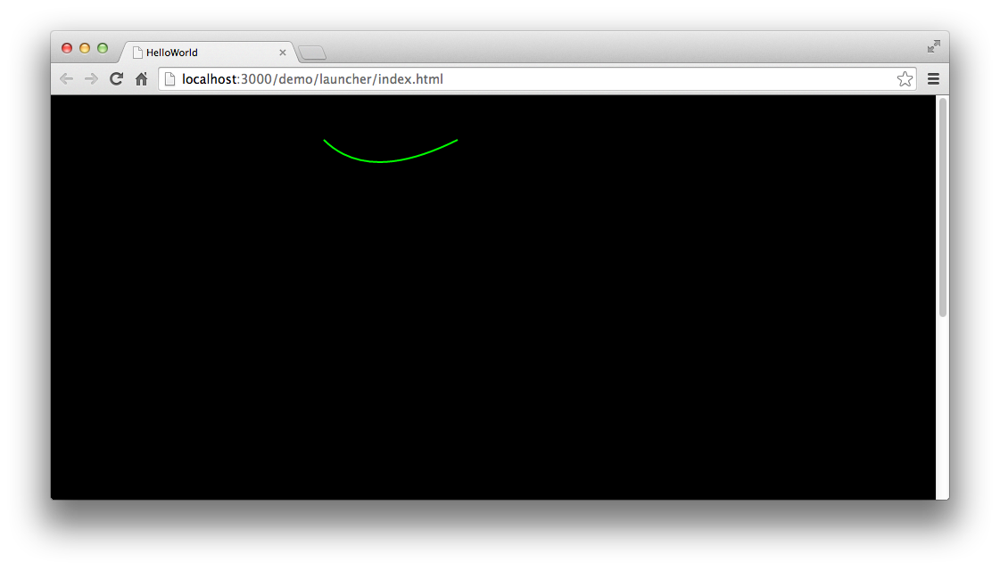

绘制曲线需要一点点技巧，因为曲线的绘制不会像直线这么容易理解。 Egret中提供的曲线绘制是一个二次贝塞尔曲线，绘图方法为 `Graphics` 中的 `curveTo` 。 执行绘图时，我们先需要使用 `moveTo` 指定曲线的起始点，然后使用 `curveTo` 指定曲线的控制点和终点。

下图是一张二次贝塞尔曲线的结构图。


我们在 curveTo 中设置的四个参数中，前两个参数是设置图中 P1 点的位置。后两个参数是设置 P2 点的位置。 在程序进行绘图时，起绘制过程如图：


我们来看一下具体示例代码：

```
class GraphicsTest extends egret.DisplayObjectContainer
{
    public constructor()
    {
        super();
        this.addEventListener(egret.Event.ADDED_TO_STAGE,this.onAddToStage,this);
    }
    private onAddToStage(event:egret.Event)
    {
        var shp:egret.Shape = new egret.Shape();
        shp.graphics.lineStyle( 2, 0x00ff00 );
        shp.graphics.moveTo( 50, 50);
        shp.graphics.curveTo( 100,100, 200,50);
        shp.graphics.endFill();
        this.addChild( shp );
    }
}
```

编译后运行，效果如图：




