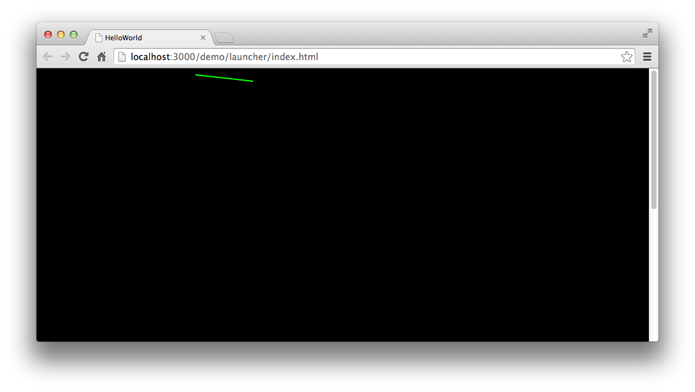
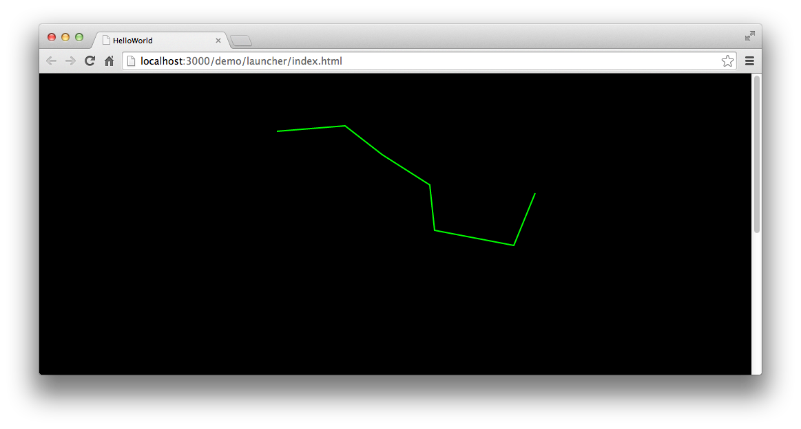

使用Graphics绘制直线需要使用两个方法，这两个方法一个负责绘制直线的起始点，一个负责绘制直线的终点。

在使用绘图函数前，我们先制定线条的样式，设置 `lineStyle` 方法，将线条宽度设置为 2，颜色设置为 0x00ff00 。 然后执行绘图。

```
shp.graphics.moveTo( 10,10 ); shp.graphics.lineTo( 100, 20 );
```

使用 `moveTo` 来设定线条的起始点，使用 `lineTo` 来设定线条的终点。完整代码如下：

```
class GraphicsTest extends egret.DisplayObjectContainer
{
    public constructor()
    {
        super();
        this.addEventListener(egret.Event.ADDED_TO_STAGE,this.onAddToStage,this);
    }
    private onAddToStage(event:egret.Event)
    {
        var shp:egret.Shape = new egret.Shape();
        shp.graphics.lineStyle( 2, 0x00ff00 );
        shp.graphics.moveTo( 10,10 );
        shp.graphics.lineTo( 100, 20 );
        shp.graphics.endFill();
        this.addChild( shp );
    }
}
```

编译后运行，效果如图：



我们可以看到舞台上绘制出一条绿色的直线。

我们修改代码，连续绘制多条直线，使其首尾相接，形成一条折线。

```
var shp:egret.Shape = new egret.Shape();

shp.graphics.lineStyle( 2, 0x00ff00 );

shp.graphics.moveTo( 68, 84 );

shp.graphics.lineTo( 167, 76 );

shp.graphics.lineTo( 221, 118 );

shp.graphics.lineTo( 290, 162 );

shp.graphics.lineTo( 297, 228 );

shp.graphics.lineTo( 412, 250 );

shp.graphics.lineTo( 443, 174 );

shp.graphics.endFill();

this.addChild( shp );
```

绘制收尾相接的直线，无需多次使用 moveTo 方法，后面可以连续使用 lineTo。这样绘制出的直线都会自动收尾相接，形成折线。

编译后运行，效果如图：



哈哈！我们的北斗七星被绘制出来了。

