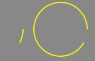

在 egret2.5 的版本中，graphics 引入一个新的 api drawArc，一个画弧的功能，那它到底能做些什么呢，下面我们来介绍下它的一些用法。

## api 说明

这里就不多做介绍，和注释内容一致，需要注意是传入的 startAngle 和 endAngle 均为弧度而不是角度。

* drawArc(x: number, y: number, radius: number, startAngle: number, endAngle: number, anticlockwise?: boolean)

~~~
	绘制一段圆弧路径。圆弧路径的圆心在 (x, y) 位置，半径为 r ，根据 anticlockwise （默认为顺时针）指定的方向从 startAngle 开始绘制，到 endAngle 结束。
	* @param x 圆弧中心（圆心）的 x 轴坐标。
	* @param y 圆弧中心（圆心）的 y 轴坐标。
	* @param radius 圆弧的半径。
	* @param startAngle 圆弧的起始点， x轴方向开始计算，单位以弧度表示。
	* @param endAngle 圆弧的重点， 单位以弧度表示。
	* @param anticlockwise 如果为 true，逆时针绘制圆弧，反之，顺时针绘制。
~~~ 

> 2.5.3 以及之前，画弧有一个bug，就是不管设置 anticlockwise 为 true 还是 false 都是同一个弧，2.5.3 之前版本若想实现下面介绍的这些功能，只需要在 anticlockwise 为 true 时，将 startAngle 和 endAngle 对调即可。

## 使用

### 画弧

~~~
var shape:egret.Shape = new egret.Shape();
shape.graphics.lineStyle(2, 0xffff00);
shape.graphics.drawArc(50, 50, 50, 0, Math.PI / 180 * 30, false);
shape.graphics.endFill();
~~~

### 画拱形

~~~
var shape:egret.Shape = new egret.Shape();
shape.graphics.beginFill(0xff0000);
shape.graphics.drawArc(50, 50, 50, 0, Math.PI / 180 * 60, false);
shape.graphics.endFill();
~~~

> 大家从上面2块代码段中应该不难发现，其实画拱和画弧的区别就是一个需要填充一个不需要填充图形。

### 画扇形

扇形其实就是圆心跟弧的2个端点连接后的一个封闭区域。

~~~
var r:number = 50;
var shape:egret.Shape = new egret.Shape();
shape.graphics.beginFill(0xff0000);
shape.graphics.moveTo(r, r);//绘制点移动(r, r)点
shape.graphics.lineTo(r * 2, r);//画线到弧的起始点
shape.graphics.drawArc(50, 50, 50, 0, 260 * Math.PI / 180, false);//从起始点顺时针画弧到终点
shape.graphics.lineTo(r, r);//从终点画线到圆形。到此扇形的封闭区域形成
shape.graphics.endFill();
~~~

### 画弧形进度条

~~~
private getArcProgress():egret.Shape {
    var shape:egret.Shape = new egret.Shape();
    var angle:number = 0;
    egret.startTick(function (timeStamp:number):boolean {
        angle += 1;
        changeGraphics(angle);
        angle = angle % 360;

        return true;
    }, this);

    function changeGraphics(angle) {
        shape.graphics.clear();

        shape.graphics.lineStyle(2, 0x0000ff, 1);
        shape.graphics.drawArc(50, 50, 50, 0, angle * Math.PI / 180, false);
        shape.graphics.endFill();
    }
}
~~~

### 画扇形进度条

~~~
private getSectorProgress():egret.Shape {
    var shape:egret.Shape = new egret.Shape();

    var angle:number = 0;
    egret.startTick(function (timeStamp:number):boolean {
        angle += 1;
        changeGraphics(angle);
        angle = angle % 360;

        return true;
    }, this);
    
    return shape;

    function changeGraphics(angle) {
        shape.graphics.clear();

        shape.graphics.beginFill(0xff0000);
        shape.graphics.moveTo(50, 50);
        shape.graphics.lineTo(100, 50);
        shape.graphics.drawArc(50, 50, 50, 0, angle * Math.PI / 180, false);
        shape.graphics.lineTo(50, 50);
        shape.graphics.endFill();
    }
}
~~~

### 画不规则边框进度条

上面介绍了如何使用 graphics 的 drawArc 来绘制圆形进度条。那如何实现一个边框的进度条呢，在2.5版本中，egret 加入了一个特殊的 mask，显示对象 mask。这里介绍一个通过结合 mask 和 扇形进度条来模拟边框的进度显示，当然如果你直接通过 graphics 一个点一个点的画也能完成需求。

* 首先，你的提供一个只有边框的全封闭的图形。比如

* 使用上面介绍的扇形进度条，并确保扇形确定的圆的区域可以完整覆盖边框图。记得将扇形的圆心对准边框中。

* 将边框的 mask 设置成扇形进度条，至此一个简单的边框进度条已完成。大家可以通过修改被遮罩图形，来做成适合自己项目的进度条，比如图形不是一个边框，而是一个灰色的框的填充图。

* 代码

~~~
private drawBorderProgress():egret.DisplayObjectContainer {
    var container:egret.DisplayObjectContainer = new egret.DisplayObjectContainer();
    var w:number = 100;
    var h:number = 100;
    var r:number = Math.max(w, h) / 2 * 1.5;
    var bitmap = new egret.Bitmap(RES.getRes(key));
    container.addChild(bitmap);
    bitmap.width = w;
    bitmap.height = h;

    var shape:egret.Shape = new egret.Shape();
    shape.x = bitmap.width / 2;
    shape.y = bitmap.height / 2;

    bitmap.mask = shape;
    container.addChild(shape);

    var angle = 0;
    egret.startTick(function (timeStamp:number):boolean {
        angle += 1;
        changeGraphics(angle);
        angle = angle % 360;

        return true;
    }, this);

    return container;

    function changeGraphics(angle) {
        shape.graphics.clear();

        shape.graphics.beginFill(0x00ffff, 1);
        shape.graphics.lineTo(r, 0);
        shape.graphics.drawArc(0, 0, r, 0, angle * Math.PI / 180, true);
        shape.graphics.lineTo(0, 0);
        shape.graphics.endFill();
    }
}
~~~

* 效果图

   

> 虽然这种方式非常好的实现进度条，但是由于 mask 本身不停的修改，会导致极大的消耗 cpu，导致性能不佳，因此建议大家请少用此种方式做 mask（少用不停修改 mask 的方式来做动画）。
