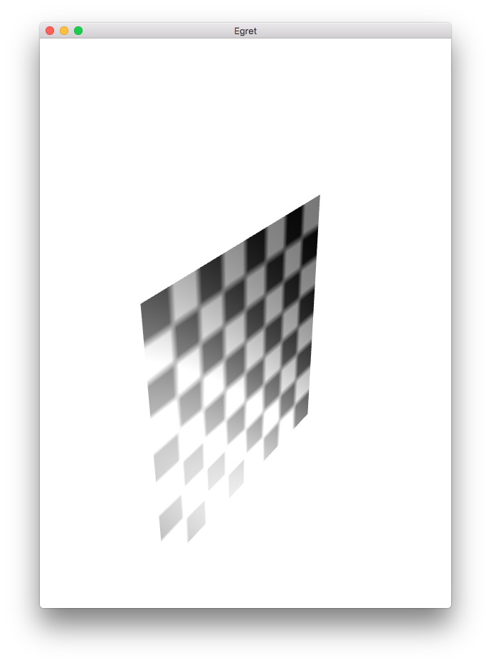
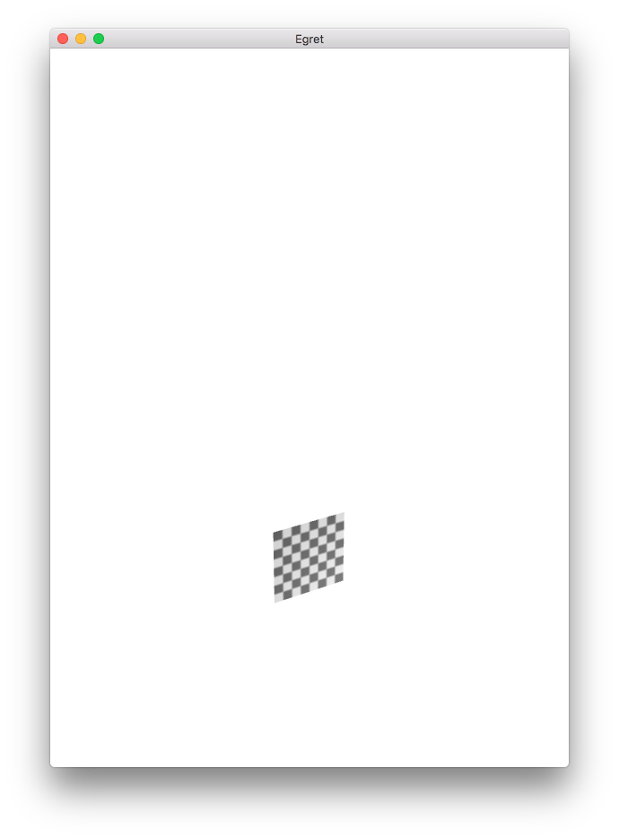
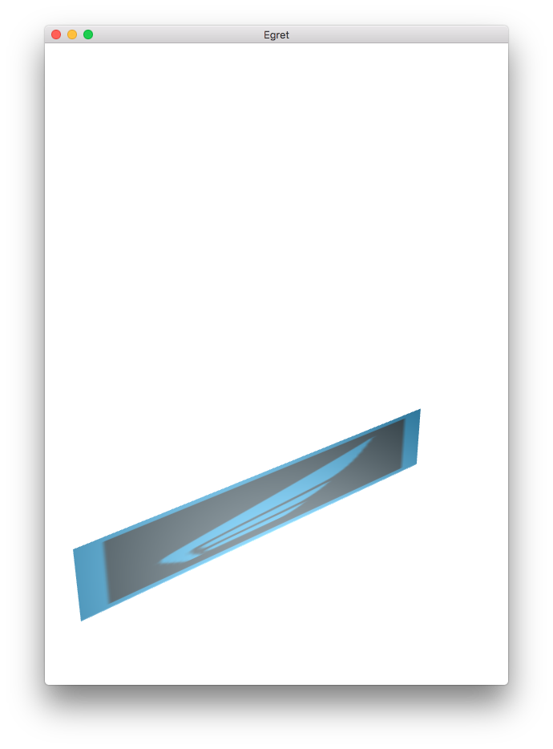
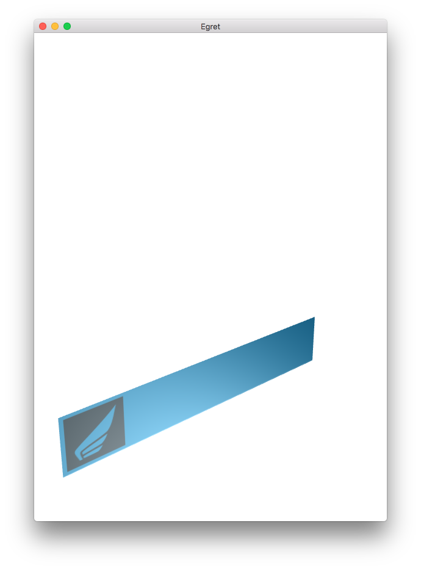

Egret3D中的几何体中的平面几何体由`PlaneGeometry`类实现。通过`PlaneGeometry`可以快速创建一个默认边长为500的正方形平面。下面的代码，展示了如何创建一个正方形平面。


```
class PlaneDemo extends LoadingUI {
    /**
     * Canvas操作对象
     * @version Egret 3.0
     * @platform Web,Native
     */
    protected _egret3DCanvas: egret3d.Egret3DCanvas;
    /**
    * View3D操作对象
    * @version Egret 3.0
    * @platform Web,Native
    */
    protected _view3D: egret3d.View3D;
    /**
    * look at 摄像机控制器 。</p>
    * 指定摄像机看向的目标对象。</p>
    * 1.按下鼠标左键并移动鼠标可以使摄像机绕着目标进行旋转。</p>
    * 2.按下键盘的(w s a d) 可以摄像机(上 下 左 右)移动。</p>
    * 3.滑动鼠标滚轮可以控制摄像机的视距。</p>
    * @version Egret 3.0
    * @platform Web,Native
    */
    private cameraCtl: egret3d.LookAtController;
    /**
    * 灯光组
    * @version Egret 3.0
    * @platform Web,Native
    */
    private lights: egret3d.LightGroup = new egret3d.LightGroup();
    /**
    * 模型对象
    * @version Egret 3.0
    * @platform Web,Native
    */
    private model: egret3d.Mesh;
    /**
    * 待机动画
    * @version Egret 3.0
    * @platform Web,Native
    */
    private idle: egret3d.SkeletonAnimationClip;
    /**
    * 跑步动画
    * @version Egret 3.0
    * @platform Web,Native
    */
    private run: egret3d.SkeletonAnimationClip;
    /**
    * 攻击动画
    * @version Egret 3.0
    * @platform Web,Native
    */
    private attack: egret3d.SkeletonAnimationClip;
    /**
     * @language zh_CN
     * 当前动画
     */
    public currentAnim: string;


    public constructor() {
        

        super();

        ///创建Canvas对象。
        this._egret3DCanvas = new egret3d.Egret3DCanvas();
        ///Canvas的起始坐标，页面左上角为起始坐标(0,0)。
        this._egret3DCanvas.x = 0;
        this._egret3DCanvas.y = 0;
        ///设置Canvas页面尺寸。
        this._egret3DCanvas.width = window.innerWidth;
        this._egret3DCanvas.height = window.innerHeight;
        ///创建View3D对象,页面左上角为起始坐标(0,0),其参数依次为:
        ///@param x: number 起始坐标x,
        ///@param y: number 起始坐标y
        ///@param  width: number 显示区域的宽
        ///@param  height: number 显示区域的高
        this._view3D = new egret3d.View3D(0,0,window.innerWidth,window.innerHeight);
        ///当前对象对视位置,其参数依次为:
        ///@param pos 对象的位置
        ///@param target 目标的位置
        this._view3D.camera3D.lookAt(new egret3d.Vector3D(0,0,1000),new egret3d.Vector3D(0,0,0));
        ///View3D的背景色设置
        this._view3D.backColor = 0xffffffff;
        ///将View3D添加进Canvas中
        this._egret3DCanvas.addView3D(this._view3D);

        ///创建平行光
        var dirLight: egret3d.DirectLight = new egret3d.DirectLight(new egret3d.Vector3D(-0.5,0.6,0.2));
        dirLight.diffuse = 0xffffff;
        this.lights.addLight(dirLight);

        this.InitCameraCtl();

        ///启动Canvas。
        this._egret3DCanvas.start();
        this._egret3DCanvas.addEventListener(egret3d.Event3D.ENTER_FRAME,this.update,this);

        this.OnInitLoadingView(5);


        ///设置window resize事件
        egret3d.Input.addEventListener(egret3d.Event3D.RESIZE,this.OnWindowResize,this);
        
        this.createPlane();
    }

    /**
    * @language zh_CN        
    * 窗口尺寸变化事件
    * @version Egret 3.0
    * @platform Web,Native
    */
    private OnWindowResize(e: egret3d.Event3D): void {
        ///重置ui大小
        this._egret3DCanvas.width = window.innerWidth;
        this._egret3DCanvas.height = window.innerHeight;
        this._view3D.width = window.innerWidth;
        this._view3D.height = window.innerHeight;
    }

    /**
    * @language zh_CN        
    * 初始化相机控制
    * @version Egret 3.0
    * @platform Web,Native
    */
    private InitCameraCtl() {
        ///摄像机控制类
        this.cameraCtl = new egret3d.LookAtController(this._view3D.camera3D,new egret3d.Object3D());
        ///设置目标和相机的距离
        this.cameraCtl.distance = 500;
        ///设置相机x轴旋转
        this.cameraCtl.rotationX = 0;
    }

    /**
    * @language zh_CN        
    * 模型加载回调
    * @param e: egret3d.URLLoader 加载器对象
    * @version Egret 3.0
    * @platform Web,Native
    */
    protected createPlane() {
        this.OnLoadFinished();
        this.CloseLoadingView();

        ///创建纹理材质
        var mat = new egret3d.TextureMaterial();
        ///创建模型基类
        var ge: egret3d.PlaneGeometry = new egret3d.PlaneGeometry();
        ///生成mesh
        this.model = new egret3d.Mesh(ge,mat);
        this.model.material.lightGroup = this.lights;
        this.model.y = -100;
        ///插入model
        this._view3D.addChild3D(this.model);

    }


    public update(e: egret3d.Event3D) {
        this.cameraCtl.update();
    }
}     
```

编译并运行，效果如图：



创建平面时，你可以设置平面的宽度与高度。同时可以设置默认的分段数，分段数越大，平面网格被切分的越多，图像也相对会变得细腻。

将上面的代码进行修改：

```
var ge: egret3d.PlaneGeometry = new egret3d.PlaneGeometry(50,50,10,10);
```

编译并且运行，效果如下：



最后我们还可以通过其中的UV缩放来调整贴图纹理的样式。将代码进行修改，通过网络加载一张贴图纹理，并设置其中UV缩放值，代码如下：

```
class PlaneDemo extends LoadingUI {
    /**
     * Canvas操作对象
     * @version Egret 3.0
     * @platform Web,Native
     */
    protected _egret3DCanvas: egret3d.Egret3DCanvas;
    /**
    * View3D操作对象
    * @version Egret 3.0
    * @platform Web,Native
    */
    protected _view3D: egret3d.View3D;
    /**
    * look at 摄像机控制器 。</p>
    * 指定摄像机看向的目标对象。</p>
    * 1.按下鼠标左键并移动鼠标可以使摄像机绕着目标进行旋转。</p>
    * 2.按下键盘的(w s a d) 可以摄像机(上 下 左 右)移动。</p>
    * 3.滑动鼠标滚轮可以控制摄像机的视距。</p>
    * @version Egret 3.0
    * @platform Web,Native
    */
    private cameraCtl: egret3d.LookAtController;
    /**
    * 灯光组
    * @version Egret 3.0
    * @platform Web,Native
    */
    private lights: egret3d.LightGroup = new egret3d.LightGroup();
    /**
    * 模型对象
    * @version Egret 3.0
    * @platform Web,Native
    */
    private model: egret3d.Mesh;
    /**
    * 待机动画
    * @version Egret 3.0
    * @platform Web,Native
    */
    private idle: egret3d.SkeletonAnimationClip;
    /**
    * 跑步动画
    * @version Egret 3.0
    * @platform Web,Native
    */
    private run: egret3d.SkeletonAnimationClip;
    /**
    * 攻击动画
    * @version Egret 3.0
    * @platform Web,Native
    */
    private attack: egret3d.SkeletonAnimationClip;
    /**
     * @language zh_CN
     * 当前动画
     */
    public currentAnim: string;


    public constructor() {
        

        super();

        ///创建Canvas对象。
        this._egret3DCanvas = new egret3d.Egret3DCanvas();
        ///Canvas的起始坐标，页面左上角为起始坐标(0,0)。
        this._egret3DCanvas.x = 0;
        this._egret3DCanvas.y = 0;
        ///设置Canvas页面尺寸。
        this._egret3DCanvas.width = window.innerWidth;
        this._egret3DCanvas.height = window.innerHeight;
        ///创建View3D对象,页面左上角为起始坐标(0,0),其参数依次为:
        ///@param x: number 起始坐标x,
        ///@param y: number 起始坐标y
        ///@param  width: number 显示区域的宽
        ///@param  height: number 显示区域的高
        this._view3D = new egret3d.View3D(0,0,window.innerWidth,window.innerHeight);
        ///当前对象对视位置,其参数依次为:
        ///@param pos 对象的位置
        ///@param target 目标的位置
        this._view3D.camera3D.lookAt(new egret3d.Vector3D(0,0,1000),new egret3d.Vector3D(0,0,0));
        ///View3D的背景色设置
        this._view3D.backColor = 0xffffffff;
        ///将View3D添加进Canvas中
        this._egret3DCanvas.addView3D(this._view3D);

        ///创建平行光
        var dirLight: egret3d.DirectLight = new egret3d.DirectLight(new egret3d.Vector3D(-0.5,0.6,0.2));
        dirLight.diffuse = 0xffffff;
        this.lights.addLight(dirLight);

        this.InitCameraCtl();

        ///启动Canvas。
        this._egret3DCanvas.start();
        this._egret3DCanvas.addEventListener(egret3d.Event3D.ENTER_FRAME,this.update,this);

        this.OnInitLoadingView(5);


        ///设置window resize事件
        egret3d.Input.addEventListener(egret3d.Event3D.RESIZE,this.OnWindowResize,this);
        
        var loader:egret3d.URLLoader = new egret3d.URLLoader();
        loader.addEventListener(egret3d.LoaderEvent3D.LOADER_COMPLETE,this.createPlane,this);
        loader.load("resource/wing.png");
    }

    /**
    * @language zh_CN        
    * 窗口尺寸变化事件
    * @version Egret 3.0
    * @platform Web,Native
    */
    private OnWindowResize(e: egret3d.Event3D): void {
        ///重置ui大小
        this._egret3DCanvas.width = window.innerWidth;
        this._egret3DCanvas.height = window.innerHeight;
        this._view3D.width = window.innerWidth;
        this._view3D.height = window.innerHeight;
    }

    /**
    * @language zh_CN        
    * 初始化相机控制
    * @version Egret 3.0
    * @platform Web,Native
    */
    private InitCameraCtl() {
        ///摄像机控制类
        this.cameraCtl = new egret3d.LookAtController(this._view3D.camera3D,new egret3d.Object3D());
        ///设置目标和相机的距离
        this.cameraCtl.distance = 500;
        ///设置相机x轴旋转
        this.cameraCtl.rotationX = 0;
    }

    /**
    * @language zh_CN        
    * 模型加载回调
    * @param e: egret3d.URLLoader 加载器对象
    * @version Egret 3.0
    * @platform Web,Native
    */
    protected createPlane(evt:egret3d.LoaderEvent3D) {
        this.OnLoadFinished();
        this.CloseLoadingView();

        ///创建纹理材质
        var mat = new egret3d.TextureMaterial(evt.loader.data);
        ///创建模型基类
        var ge: egret3d.PlaneGeometry = new egret3d.PlaneGeometry(300,50,10,10,1,1);
        ///生成mesh
        this.model = new egret3d.Mesh(ge,mat);
        this.model.material.lightGroup = this.lights;
        this.model.y = -100;
        ///插入model
        this._view3D.addChild3D(this.model);

    }


    public update(e: egret3d.Event3D) {
        this.cameraCtl.update();
    }
}     
```

编译并运行，效果如图：



我们稍微修改一下其中的UV参数，重新编译查看效果，将U缩放参数设置为5。

```
var ge: egret3d.PlaneGeometry = new egret3d.PlaneGeometry(300,50,10,10,5,1);
```

运行效果如下：

