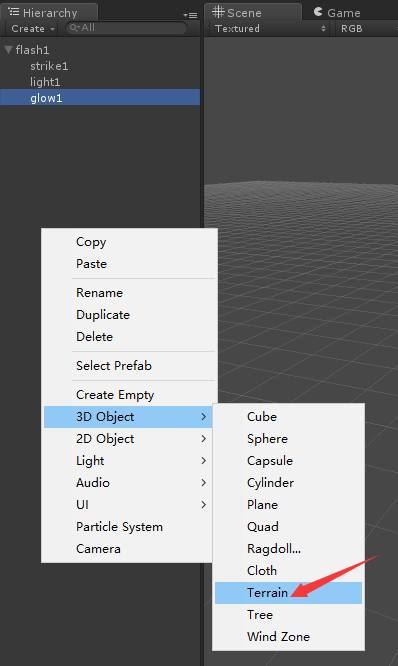
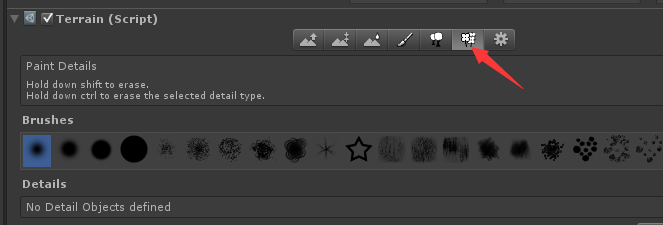
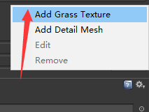
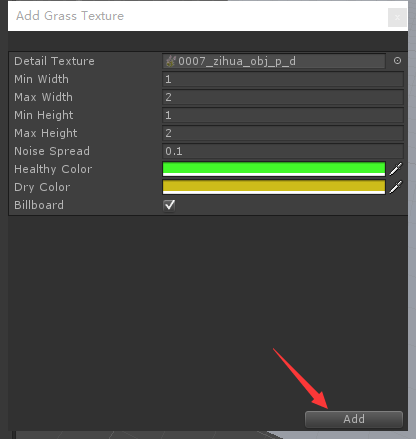
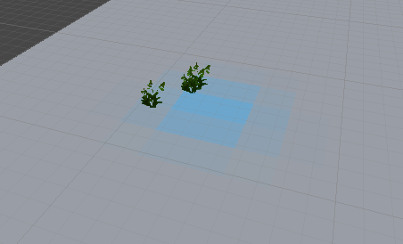
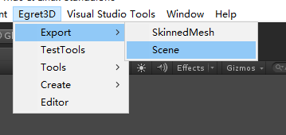

* 草动画(GrassMesh)
	* 用来模拟实现风吹草动的效果；
	* 加入受角色对草产生的挤压效果；
	* 结合Egret3D的地形数据，可以通过Unity4导出场景中的草模型；
	* GrassMethod由GrassMesh自动生成，不建议您在外部创建这个对象。
	
----------

	module egret3d {
	    export class Class_GrassMesh extends Class_View3D {
	
	        protected view1: View3D;
	        protected cameraCrl: LookAtController;
	
	        private _grass: GrassMesh;
	        private _lightFromBall: Mesh;
	        private _lightVector: Vector3D;
	
	        constructor() {
	            super();
	            this._egret3DCanvas.addEventListener(Event3D.ENTER_FRAME, this.update, this);
	
	            this.view1 = new View3D(0, 0, window.innerWidth * window.devicePixelRatio, window.innerHeight * window.devicePixelRatio);
	
	            this.view1.backColor = 0xff000000;
	            this._egret3DCanvas.addView3D(this.view1);
	
	            var bgImg: HTMLImageElement = <HTMLImageElement>document.getElementById("bg");
	            var tex: ImageTexture = new ImageTexture(bgImg);
	
	            this.cameraCrl = new LookAtController(this.view1.camera3D, new Object3D());
	            this.cameraCrl.distance = 600;
	            this.cameraCrl.rotationX = 60;
	
	
	            this._lightFromBall = new Mesh(new SphereGeometry(20));
	            this.view1.addChild3D(this._lightFromBall);
	
	            this.initGrass();
	        }
	
	
	        private parseDistribution(image:ImageData): Vector3D[] {
	            var width: number = image.width;
	            var height: number = image.height;
	
	            var color: number;
	            var offset: number;
	            var ratio: number = 1 / 16;
	            var positions: Vector3D[] = [];
	
	            for (var i: number = 0; i < width; i++) {
	                for (var j: number = 0; j < height; j++) {
	                    offset = i * width + j;
	                    offset *= 4;
	                    color = image.data[offset] * ratio;
	                    color = Math.round(color);
	                    if (color > 0) {
	                        this.getPosition(i, j, color, positions);
	                    }
	                }
	            }
	
	            return positions;
	        }
	
	
	        private getPosition(i: number, j: number, count: number, positions: Vector3D[]): void {
	            var pos: Vector3D;
	            for (var i: number = 0; i < count; i++) {
	                //随机一个值
	                pos = new Vector3D(i, 0, j);
	                positions.push(pos);
	            }
	        }
	
	        private initGrass(): void {
	            var positions: Vector3D[] = this.createPositions();
	
	            var mat: TextureMaterial = new TextureMaterial();
	            mat.ambientColor = 0xffffff;
	            mat.blendMode = BlendMode.NORMAL;
	            mat.cutAlpha = 0.4;
	
	            var data: GrassData = new GrassData();
	            data.minWidth = 30;
	            data.maxWidth = 70;
	            data.minHeight = 30;
	            data.maxHeight = 70;
	            data.noiseSpread = 1;
	            data.billboard = false;
	            data.healthyColor = "0x00ff00";
	            data.dryColor = "0xff8000";
	
	            this._grass = new GrassMesh(positions, mat, data);
	            this._grass.y = 20;
	            this.view1.addChild3D(this._grass);
	
	            var loadtex: URLLoader = new URLLoader("resource/scene/plant/leaf.png");
	            loadtex.addEventListener(LoaderEvent3D.LOADER_COMPLETE, this.onLoadTexture, this);
	            loadtex["mat"] = mat;
	
	
	        }
	
	
	        private createPositions(): Vector3D[] {
	            var plane: PlaneValueShape = new PlaneValueShape();
	            plane.width = 1000;
	            plane.height = 1000;
	            var positions: Vector3D[] = plane.calculate(1000);
	
	            return positions;
	        }
	
	        protected onLoadTexture(e: LoaderEvent3D) {
	            e.loader["mat"].diffuseTexture = e.loader.data;
	        }
	
	        private anlge: number = 0;
	        private dirLight: DirectLight;
	        private position: Vector3D = new Vector3D();
	        public update(e: Event3D) {
	            this.cameraCrl.update();
	
	            this.anlge += 0.01;
	            this.position.setTo(Math.sin(this.anlge) * 300, 10, Math.cos(this.anlge) * 300);
	            this._lightFromBall.position = this.position;
	            if (this._grass) {
	                this._grass.method.updateSqueezeData(this.position, true, 60, 1);
	            }
	        }
	
	    }
	} 
            
示例展示为草动画受小球的挤压影响效果

----------

* Unity中导出草的步骤：
	
* 创建地形对象

* 使Terrain处于选中状态，点击草的图标，获得当前为刷草模式

* 点击Edit Details进入草动画详细编辑模式

* 点击Add Grass Texture获得新建一组草的动画

* 在弹开的编辑草详细内容界面中，编辑贴图，调整各个属性，完成后点击Add按钮，草动画详细信息确认成功

* 于场景中地形区域，按住鼠标不放松，然后滑动鼠标，开始执行刷草

* 编辑完毕后，使用Egret3D提供的场景导出插件，导出当前场景。

* 最后用Egret3D的UnitLoader加载这个场景，查看草的动画。
