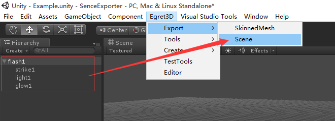
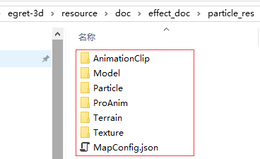
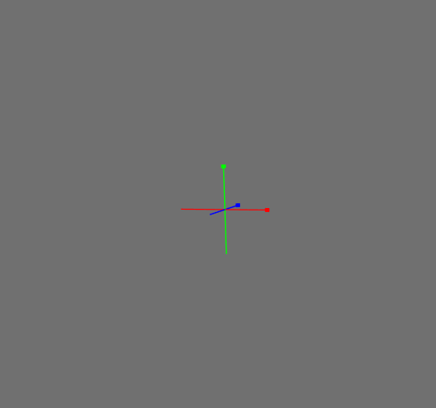
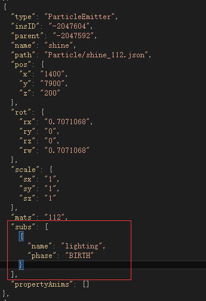
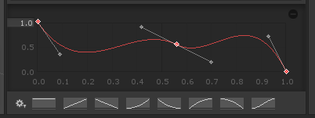

* 使用插件导出粒子特效：您可以通过在Unity中编辑好一个粒子或者一组粒子特效，然后使用Egret3D提供的插件导出，放入到Egret3D中播放。

在Unity中准备您的素材资源后，按照以下方式导出粒子组。

导出后获得文件包：

然后使用以下代码加载该特效组：

----------
	private loadParticle():void{
		this._particleLoader = new UnitLoader("resource/doc/effect_doc/particle_res/MapConfig.json");
        this._particleLoader.addEventListener(LoaderEvent3D.LOADER_COMPLETE, this.onParticleLoad, this);
	}
    
    private onParticleLoad(e: LoaderEvent3D): void {
        this._view3D.addChild3D(this._particleLoader.container);
    }

----------

导出的特效组示例：

使用Unity插件导出素材资源的注意事项：

* 需要版本Unity4，其他版本尚未支持;
* 子发射器仅支持在Birth阶段触发的情况;
* 建立子发射器和母发射器之间的关联，目前需要您手动在MapConfig中编辑，例如，一个ParticleEmitter需要绑定命名为lighting的子发射器，触发阶段为BIRTH，则可如下图配置：

* 其中Emission和Shape为必备的节点，请确保该节点处于勾选中的状态；
* 一些未被支持的属性：Color by Speed/Size by Speed/Rotation by Speed/External Forces/Collision;
* 控制粒子的最大数量，控制粒子的顶点数据在webgl中不超过支持的上限，否则会出现显示不正常的情况。导致顶点超过webgl上限的内容有，粒子的最大数量/数据节点总数/使用外部模型的情况下模型的顶点个数;
* 编辑贝塞尔曲线的时候，曲线不要超过两段。下图为举例说明2段贝塞尔曲线的情况;

* 谨慎使用world类型的粒子，这种类型的粒子会使用CPU检测更新顶点数据，导致渲染效率下降。

----------

