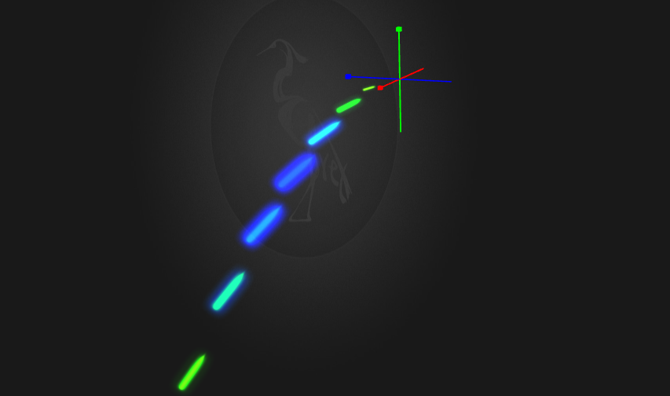

特效
===============

本教程主要介绍了在egret3d引擎中使用自定义粒子

粒子特效：粒子由ParticleData和MaterialBase两个数据生成，我们可以自定义一个粒子，或者通过插件来导出Unity中的粒子特效。

* 自定义ParticleData，即手动编写代码生成一个粒子（注：你需要准备好一个材质球数据）

----------
	//创建一个粒子特效
	private createParticle():void{
        var material: MaterialBase = this.createMaterial();
        var particleData: ParticleData = this.createParticleData();
        this.particle = new ParticleEmitter(particleData, material);
        this.particle.play();
        this.view1.addChild3D(this.particle);
	}

	//创建一个粒子数据
    private createParticleData(): ParticleData {
        var data: ParticleData = new ParticleData();
        data.geometry.planeW = data.geometry.planeH = 30;

        var life: ParticleDataLife = data.life;
        life.max = 6;
        life.min = 6;
        life.duration = 5;
        life.delay = 0.5;
        life.loop = true;

        var emission: ParticleDataEmission = data.emission;
        emission.rate = 2;

        var property: ParticleDataProperty = data.property;
        property.particleCount = 100;
        property.renderMode = ParticleRenderModeType.StretchedBillboard;
        property.colorConst1.setTo(255, 255, 255, 255);
        property.colorConst2.setTo(255, 255, 255, 255);
        property.gravity = 5;

        var speed: ParticleDataMoveSpeed = data.moveSpeed;
        speed.max = 50;
        speed.min = 50;

        var velocityOver: VelocityOverLifeTimeData = new VelocityOverLifeTimeData();
        speed.velocityOver = velocityOver;
        speed.velocityOver.type = ParticleValueType.OneBezier;

        var xBezier: BezierData = new BezierData();
        xBezier.posPoints.push(new Point(0, 0));
        xBezier.posPoints.push(new Point(0.5, 20));
        xBezier.posPoints.push(new Point(0.5, 20));
        xBezier.posPoints.push(new Point(1.0, 8));

        xBezier.ctrlPoints.push(new Point(0, 10));
        xBezier.ctrlPoints.push(new Point(0.55, 20));
        xBezier.ctrlPoints.push(new Point(0.55, 20));
        xBezier.ctrlPoints.push(new Point(1.0, 8));

        speed.velocityOver.xBezier1 = xBezier;

        var yBezier: BezierData = new BezierData();
        yBezier.posPoints.push(new Point(0, 0));
        yBezier.posPoints.push(new Point(0.7, 40));
        yBezier.posPoints.push(new Point(0.7, 40));
        yBezier.posPoints.push(new Point(1.0, 16));

        yBezier.ctrlPoints.push(new Point(0, 10));
        yBezier.ctrlPoints.push(new Point(0.75, 40));
        yBezier.ctrlPoints.push(new Point(0.76, 40));
        yBezier.ctrlPoints.push(new Point(1.0, 20));
        speed.velocityOver.yBezier1 = yBezier;

        var zBezier: BezierData = new BezierData();
        zBezier.posPoints.push(new Point(0, 0));
        zBezier.posPoints.push(new Point(1, 0));
        zBezier.ctrlPoints.push(new Point(0, 0));
        zBezier.ctrlPoints.push(new Point(1, 0));
        speed.velocityOver.zBezier1 = zBezier;

        var colorOffset: ParticleDataColorOffset = new ParticleDataColorOffset();
        data.colorOffset = colorOffset;
        colorOffset.data.colors.push(new Color(255.0, 0.0, 0.0, 255.0));
        colorOffset.data.colors.push(new Color(0.0, 255.0, 0.0, 255.0));
        colorOffset.data.colors.push(new Color(0.0, 0.0, 255.0, 255.0));
        colorOffset.data.colors.push(new Color(0.0, 255.0, 0.0, 255.0));
        colorOffset.data.colors.push(new Color(255.0, 0.0, 0.0, 128.0));
        colorOffset.data.colors.push(new Color(255.0, 0.0, 0.0, 0.0));
        colorOffset.data.times.push(0.0);
        colorOffset.data.times.push(0.2);
        colorOffset.data.times.push(0.4);
        colorOffset.data.times.push(0.6);
        colorOffset.data.times.push(0.7);
        colorOffset.data.times.push(1.0);

        var sizeBezier: ParticleDataScaleBezier = new ParticleDataScaleBezier();
        data.scaleBezier = sizeBezier;

        sizeBezier.data.posPoints.push(new Point(0, 0));
        sizeBezier.data.posPoints.push(new Point(0.4, 2));
        sizeBezier.data.posPoints.push(new Point(0.4, 2));
        sizeBezier.data.posPoints.push(new Point(1.0, 0.2));

        sizeBezier.data.ctrlPoints.push(new Point(0, 1));
        sizeBezier.data.ctrlPoints.push(new Point(0.3, 2));
        sizeBezier.data.ctrlPoints.push(new Point(0.6, 2));
        sizeBezier.data.ctrlPoints.push(new Point(1.0, 0.2));

        data.validate();
        return data;
    }

	//创建一个材质球
    private createMaterial(): MaterialBase {
        var mat: TextureMaterial = new TextureMaterial();
        mat.bothside = true;
        mat.ambientColor = 0xffffff;
        mat.blendMode = BlendMode.ADD;
        return mat;
    }

显示结果如图：

----------

