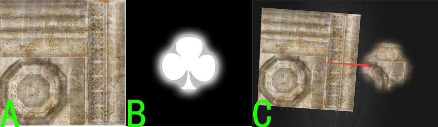
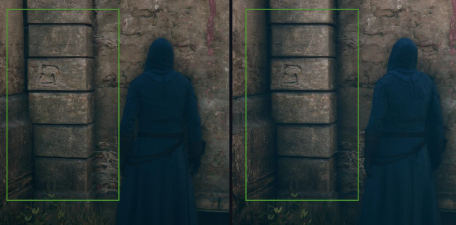
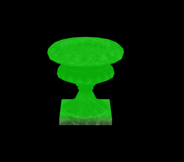
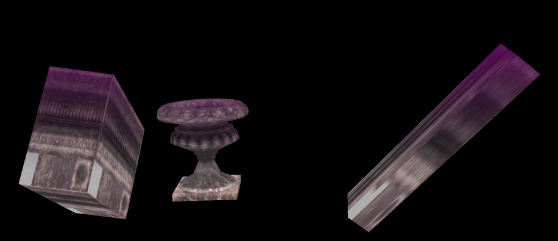
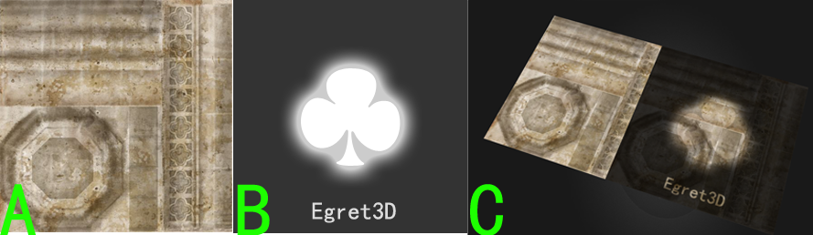
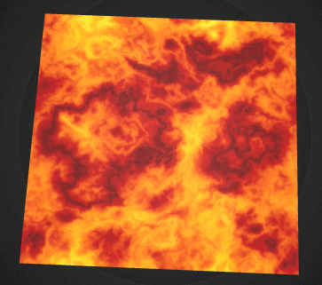
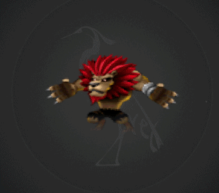
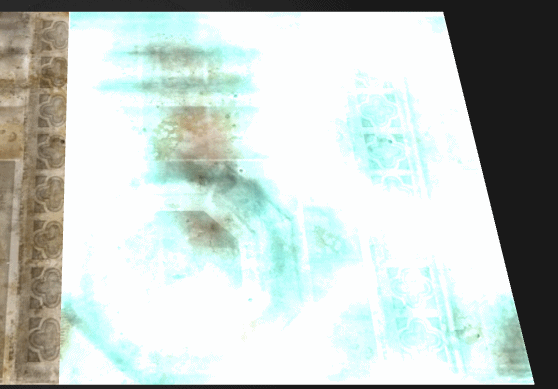

* AlphaMaskMethod的使用：
	* 通过采样贴图中的red的数值r，将这个r值作为最终输出像素颜色值的alpha相乘，获得alpha通道的遮罩效果。
	* 你可以继续追加一个uv滚动效果在这个alpha遮罩上面，获得具有流动效果的alpha遮罩。
	* 可以用于水流/天光等类型效果的模拟实现。
 
----------

    class AlphaMaskMethod {
	    protected _material: egret3d.TextureMaterial;
	    protected onInit3D(): void {
	
	        this._material = new egret3d.TextureMaterial();
	        var maskmapMethod: egret3d.AlphaMaskMethod = new egret3d.AlphaMaskMethod();
	        this._material.diffusePass.addMethod(maskmapMethod);
	        maskmapMethod.maskTexture = egret3d.CheckerboardTexture.texture;
	    }
	}

	
示例展示为贴图A叠加以贴图B为alphaMask后得到运行结果C：

----------

* AOMapMethod的使用：
	* 采样aoTexture中的rgb的数值，将这个颜色值和最终输出像素颜色值的相乘。AO贴图为通过第三方渲染工具渲染出的素材。
	* 主要用于模拟自然环境遮挡效果，增强真实感。
 
----------

    class AOMapMethod {
	    protected _material: egret3d.TextureMaterial;
	    protected onInit3D(): void {
	
	        //注：AOMapMethod使用到了另外一个uv数据，该数据为第三方软件中预渲染好的。
	        this._material = new egret3d.TextureMaterial();
	        var maskmapMethod: egret3d.AOMapMethod = new egret3d.AOMapMethod();
	        this._material.diffusePass.addMethod(maskmapMethod);
	        maskmapMethod.lightTexture = egret3d.CheckerboardTexture.texture;
	    }
	}

摘自网络的一张环境光遮蔽效果图，你可以对比左右两张图片查看AOMapMethod带来的不同效果

----------

 
* 颜色渐变叠加（ColorGradientsMethod）的使用：
	* 通过参数控制相对屏幕位置的高度min和max和颜色color，获得渐变效果；
	* 小于min的部分保持原来的颜色，介于min和max之间的部分，用渐变过度改变颜色，高于max的部分，使用颜色和原来的颜色值做alpha混合；
	* 该功能可用于在模型上面展示进度条的更新效果。

----------
    class ColorGradientsMethod {
	    protected _material: egret3d.TextureMaterial;
		protected method:egret3d.ColorGradientsMethod;
		protected color:egret3d.Color;
		protected span:number = 10;

	    protected onInit3D(): void {
	
	        this.method = new ColorGradientsMethod();
            this.color = new Color(0, 1, 0, 0.8);
            this.method.setStartData(-this.span, this.span, this.color);

			this._material = new egret3d.TextureMaterial();
            _material.diffusePass.addMethod(this.method);
	    }
	}
           

            

----------

* 雾，在场景中加入雾效使环境更加逼真，增加带入感
	* 3D渲染中，雾有很多种，多用为距离雾和高度雾。
	* 通过设定雾的颜色，透明度，最远最近距离，强度等属性控制雾的实时效果。

----------
    class FogMethod {
	    
	    protected onInit3D(): void {
			var material: egret3d.TextureMaterial = new egret3d.TextureMaterial();
	        var method: egret3d.FogMethod = new egret3d.FogMethod();
	        material.diffusePass.addMethod(method);
	
	        method.fogAlpha = 0.5;
	        method.fogColor = 0xff00ff;
	        method.fogHeight = 1000;
	        method.fogStartDistance = 500;
	        method.globalDensity = 1;
	       
	    }
	}

           

示例图片为高度雾在场景中物件上生效后的显示。
            

----------

* 光照贴图（LightMap）的使用
   	* 在三维软件里布置好灯光，调整完参数后，将场景各表面的光照信息输出到贴图上，于引擎中还原光照效果。
   	* 导出的素材中包含有光照贴图第二UV，叠加上其他颜色信息，还原三维软件中的灯光效果。
   	* 该类型的灯光为静态光，即不适合具有动态信息的光源，以及场景中能够自由缩放/旋转/位移功能的对象，不推荐在使用了灯光贴图之后，继续添加其他动态灯光。
   	* 需要在场景中加入灯光的时候，使用该功能相比动态灯光效率更高，合理的使用能大大提升您的程序性能。
   	* 扩展：你可以使用HDR贴图获得范围更广的灯光渲染效果。

----------

    class LightmapMethod {
		private view1: View3D;
		private texture:Itexture;
		private lightTexture:ITexture;
	    protected onInit3D(): void {
	
            var material: TextureMaterial = new TextureMaterial(texture);
            material.diffuseTexture = texture;
            var plane: Mesh = new Mesh(new PlaneGeometry(), material);
            var method: LightmapMethod = new LightmapMethod();
            material.diffusePass.addMethod(method);
            method.lightTexture = lightTexture;

            plane.material.blendMode = BlendMode.ALPHA;
            plane.material.cutAlpha = 0;
            this.view1.addChild3D(plane);
	    }
	}

示例展示为平面模型使用贴图A，叠加以贴图B为灯光图后的结果，图C：

----------

* UV动画：逻辑循环内，通过渐进式改变uv坐标来实现动画的效果；
	* 设置材质球的repeat参数为true，使uv取值到0-1范围之外的时候，能够强制重新归到有效范围之内；
	* 使用4方连续的贴图，能够实现uv平滑无限滚动。

----------

	class uvRollMethod {
		private view1: View3D;
		private texture:Itexture;

	    protected onInit3D(): void {
	
            var material: TextureMaterial = new TextureMaterial();
            material.diffuseTexture = texture;

            material.repeat = true;
            material.blendMode = BlendMode.ADD; 
            this.plane = new Mesh(new PlaneGeometry(1000,1000,100,100,1,1), material);
            this.view1.addChild3D(this.plane);

            var uvRollMethod: UVRollMethod = new UVRollMethod();
            material.diffusePass.addMethod(uvRollMethod);
            uvRollMethod.start(true);
            uvRollMethod.speedU = 0.0005;
            uvRollMethod.speedV = 0.0;

            plane.material.blendMode = BlendMode.ALPHA;
            plane.material.cutAlpha = 0;
            this.view1.addChild3D(plane);
	    }
	}
            
示例展示为uv滚动动画

----------

* 序列帧动画：逻辑循环内，跳跃式改变uv坐标来实现动画的效果；
	* 相比UV动画，该功能为跳跃式的改变uv坐标到指定的起始位置和范围，达到用一张贴图，实现了逐帧播放的效果；
	* 需要预先处理多个贴图帧至同一张贴图中，引擎根据行数和列数动态计算uv坐标和范围

----------

	class UVSpriteSheetMethod {
		private view1: View3D;
		private texture:Itexture;

	    protected onInit3D(): void {
	
            var material: TextureMaterial = new TextureMaterial();
            material.diffuseTexture = texture;

            material.repeat = true;
            material.blendMode = BlendMode.ADD; 
            this.plane = new Mesh(new PlaneGeometry(1000,1000,100,100,1,1), material);
            this.view1.addChild3D(this.plane);

            var uvSpriteSheetMethod: UVSpriteSheetMethod = new UVSpriteSheetMethod(34,6,6,3.0);
			uvSpriteSheetMethod.start();
            material.diffusePass.addMethod(uvSpriteSheetMethod);

            plane.material.blendMode = BlendMode.ALPHA;
            plane.material.cutAlpha = 0;
            this.view1.addChild3D(plane);
	    }
	}
            
示例展示为uv序列帧动画

----------

* 流光特效(StreamerMethod)
	* 用来实现UV流光滚动效果的渲染方法；
	* 在3D游戏中用来制作物体/装备流光的特效显示，比如《奇迹》中的装备流光；
	* 需要预先准备一张用于UV滚动的贴图，为了突出UV滚动效果，该贴图的明暗区间对比明显。

----------

	class UVSpriteSheetMethod {
		private view1: View3D;
		private texture:Itexture;

	    protected onInit3D(): void {
	
            var material: TextureMaterial = new TextureMaterial();
            material.diffuseTexture = texture;

            material.repeat = true;
            material.blendMode = BlendMode.ADD; 
            this.plane = new Mesh(new PlaneGeometry(1000,1000,100,100,1,1), material);
            this.view1.addChild3D(this.plane);

            var method: StreamerMethod = new StreamerMethod();
			method.start();
            material.repeat = true;
            method.steamerTexture = texture;
            material.diffusePass.addMethod(method);

            plane.material.blendMode = BlendMode.ALPHA;
            plane.material.cutAlpha = 0;
            this.view1.addChild3D(plane);

	    }
	}
            
示例展示为uv流光滚动效果

----------

	