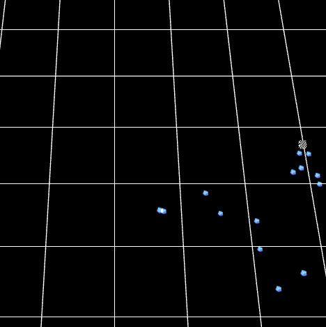
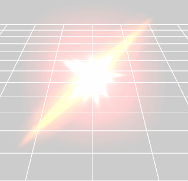

粒子动画
----------

    // 创建一个粒子动画 手动创建粒子
    protected createParticle() {

        var mat: egret3d.TextureMaterial = new egret3d.TextureMaterial();
        mat.ambientColor = 0xffffff;

        // 获取资源 这张贴图不是透明贴图 
        mat.diffuseTexture = this.queueLoader.getAsset("resource/doc/ice_0001.png");

        // 设置渲染模式  颜色叠加渲染出来的效果会受背景影响
        mat.blendMode = egret3d.BlendMode.ADD;

        var particle: egret3d.ParticleEmitter;
        var data: egret3d.ParticleData = new egret3d.ParticleData();
        data.followTarget = new egret3d.ParticleDataFollowTarget();

        // 设置最大粒子数量 
        data.property.particleCount = 1000;
        // 
        data.shape.type = egret3d.ParticleDataShapeType.Point;

        var moveSpeed: egret3d.ParticleDataMoveSpeed = new egret3d.ParticleDataMoveSpeed();
        moveSpeed.min = 80;
        moveSpeed.max = 100;
        data.moveSpeed = moveSpeed;

        var lifeData: egret3d.ParticleDataLife = data.life;
        lifeData.duration = 20;
        lifeData.min = lifeData.max = 2;

        var emission: egret3d.ParticleDataEmission = data.emission;
        emission.rate = 10;

        // 爆发的粒子数据
        emission.bursts = [];

        emission.bursts.push(new egret3d.Point(2.0, 25));
        emission.bursts.push(new egret3d.Point(4.0, 20));
        emission.bursts.push(new egret3d.Point(6.0, 45));

        // 数据矫正
        data.validate();

        // 创建跟随的cube
        this.cube = new egret3d.Mesh(new egret3d.CubeGeometry(10, 10, 10));
        this.view.addChild3D(this.cube);

        // 数据准备好后创建粒子
        particle = new egret3d.ParticleEmitter(data, mat);

        // 设置跟随的对象
        particle.followTarget = this.cube;

        // 播放粒子
        particle.play();

        // 加入场景 
        this.view.addChild3D(particle);
    }

    // 特效组加载完成 使用插件导出粒子然后加载
    protected createEffect() {
		// 特效资源加载完成后，把特效加入场景中
        var effect: egret3d.EffectGroup = this.queueLoader.getAsset("resource/doc/effect/MapConfig.json");
        this.view.addChild3D(effect);
    }

----------
