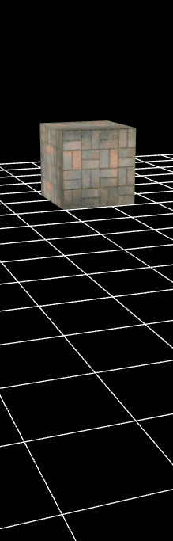

属性动画
----------
指定相应的动画数据，然后控制物体或者摄像机做一些有规律的动画。 可自定义动画数据，也可以用插件编辑导出。

物体动画 和 摄像机动画
----------
这两种动画的驱动方式是一样的 

    // 自定义数据动画
    protected createObjectAnimation() {
        var cube: egret3d.Mesh = new egret3d.Mesh(new egret3d.CubeGeometry(100, 100, 100));
        cube.material.diffuseTexture = this.queueLoader.getAsset("resource/doc/materail/FLOOR_1.png");
        this.view.addChild3D(cube);

        // 创建一个动画对象
        var proAnim: egret3d.PropertyAnim = new egret3d.PropertyAnim();

        // 指定动画曲线
        var animCurves: egret3d.AnimCurve[] = [];

        var c0: egret3d.AnimCurve = new egret3d.AnimCurve();
        c0.start.x = 0;
        c0.start.y = 0;

        c0.end.x = 3000;
        c0.end.y = 300;

        c0.c1.x = 0;
        c0.c1.y = 0;

        c0.c2.x = 10;
        c0.c2.y = 10;

        var c1: egret3d.AnimCurve = new egret3d.AnimCurve();
        c1.start.x = 3000;
        c1.start.y = 8;

        c1.end.x = 6000;
        c1.end.y = -500;

        c1.c1.x = 30;
        c1.c1.y = 30;

        c1.c2.x = 50;
        c1.c2.y = 10;

        animCurves.push(c0);
        animCurves.push(c1);

        proAnim.addAnimCurve("y", animCurves);

        var proAnimation: egret3d.PropertyAnimController = new egret3d.PropertyAnimController();
        proAnimation.addPropertyAnim(proAnim);
        // 给cube 创建属性动画控制器
        
        cube.proAnimation = proAnimation;

        // 播放
        proAnimation.play();
    }

    // 导入有动画的场景
    protected importObjectAnimationScene() {
        // 特效资源加载完成后，把特效加入场景中
        var scene: egret3d.Scene3D = this.queueLoader.getAsset("resource/doc/animation/MapConfig.json");
        this.view.scene = scene;
        // 找到导出场景中的主摄像机  设置为当前摄像机
        this.view.camera3D = <egret3d.Camera3D>scene.findObject3D("Camera");

        //// 找到场景中的水晶对象 然后播放动画  如果动画没有自动播放需要查找节点proAnimation.play()
        //var Crystal: egret3d.Object3D = scene.findObject3D("Crystal");
        //Crystal.proAnimation.play();
    }

----------

