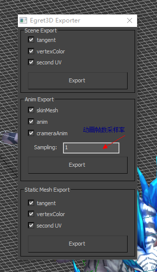

在需要角色动画的场景中，骨骼动画是必不可少的。       
在Egret3D中，骨骼动画是由静态模型和动画数据组成的。这一点容易理解。在骨骼动画的使用教程中，我们就这两点来分别讲解。然后讲如何用两者来共同完成一个骨骼动画。     
本部分骨骼动画的教程所举例代码取自于Egret3D的官方例子库中：[骨骼动画例子](https://github.com/egret-labs/egret-3d/blob/master/Sample-wing/src/SampleAnimation.ts)，可以运行`Sample-wing`项目，并修改`Main.ts`中的`sample`所在行为`var sample = new SampleAnimation;`即可。        

### 骨骼动画组成      
一个完整的角色，有可能是一个人物角色或者某种宠物、野兽或者奇特形状的怪物。     
这个角色大体由头、躯干、四肢若干部分组成，每一部分又可以分为几个小的骨骼组成。   
那么若干骨骼组成的一个相互有关节物理关系的整体就是一套骨架，若干套骨架可以组合成为更大的骨架。
一个完整的角色拥有一套独立的骨架。    

### 骨骼动画的导出    
目前Egret3D骨骼动画是从3DSMax或Unity导出的，3DSMax使用量更大。     
[这里](https://github.com/egret-labs/egret-3d/tree/master/ExportTools/3Dmax%20Export%20tool)有插件安装和使用的说明。       
以 3DSMax 为例来说，最后导出的界面是：    
    
下文中，统称为3D创作工具。

### 骨骼静态模型          
3D创作工具导出的静态模型的文件格式为 `*.esm`。这是 Egret3D 所特有的文件格式。意即 `Egret Static Model`，`Egret静态模型`。    
就像显示一张图片首先要加载图片资源一样 ，要渲染骨骼模型，也要首先加载 `esm`文件资源：
```
////创建加载类
var load: egret3d.URLLoader = new egret3d.URLLoader();
///设置加载完成回调
load.addEventListener(egret3d.LoaderEvent3D.LOADER_COMPLETE,this.onLoad,this);
///开始加载
load.load("resource/LingTong/Bonezero.esm");
```     
在加载完成事件处理函数中，加载的 `esm` 文件数据从参数传入的事件对象获得，如事件对象为`evt`，则其数据为`evt.loader.data`，这个数据在Egret3D中对应的类型为：`Geometry`，即骨架几何数据：     
`var ge: egret3d.Geometry = evt.loader.data;`      
骨架几何数据在程序调用时有两个地方用到。第一个地方是创建网格模型。         
除了骨架几何数据，还需要材质数据，有这两者可以创建一个骨架的网格模型：   
```
///创建纹理材质
var mat = new egret3d.TextureMaterial();
///生成mesh   private model: egret3d.Mesh;
this.model = new egret3d.Mesh(ge,mat);
```       
在从 `esm` 文件获得的骨架几何数据另外一个用到的地方就是从中获得骨架数据，用来创建骨骼动画对象：   
```
///设置骨骼动画
this.model.animation = new egret3d.SkeletonAnimation(ge.skeleton);
```     
从代码可以看到，这个骨骼动画对象创建后作为刚刚创建的网格模型的`animation`属性存在。这个属性将管理该骨架涉及的所有动画功能。    
到这里骨骼动画的静态部分准备工作已经完成。接下，来加载其所对应的骨骼动画数据并做相应设置，就可以播放骨骼动画了！     

### 骨骼动画剪辑      
一套骨骼动画可以有若干不同的动画。就像本例中的武士角色，可以在原地静待，也可以跑，以及发动攻击。   
每一套骨骼动画数据的加载跟骨架数据的加载完全一样，都是使用`URLLoader`，以攻击动画为例：
```
var loadAniattack: egret3d.URLLoader = new egret3d.URLLoader();
///注册动画读取完成回调
loadAniattack.addEventListener(egret3d.LoaderEvent3D.LOADER_COMPLETE,this.onAnimationattack,this);
///开始读取动画
loadAniattack.load("resource/LingTong/Attack1.eam");
```
`eam` 文件数据是一个单独的骨骼动画运动数据，如事件对象为`evt`，则其数据为`evt.loader.data`，这个数据将直接作为`SkeletonAnimationClip`对象存在：     
`this.attack = evt.loader.data;`      
代码中的`attack`即为`egret3d.SkeletonAnimationClip`类型。为与之前的骨骼动画对象`SkeletonAnimation`区分，这个类型称为骨骼动画剪辑。一个骨架只有一个骨骼动画对象，其可以管理若干骨骼动画剪辑。骨骼动画对象之前已经创建好，而且也有了创建完成的骨骼动画剪辑，接下来要做的就是，将两者关联起来。     
显然，这个`animation`在之前被赋值为`SkeletonAnimation`类型，这里需要注意的是：`animation`是一个动画接口，名为`IAnimation`，在Egret3D里，目前有两种形式的动画，一种是本部分教程所述的骨骼动画，还有一种是粒子动画。所以`IAnimation`接口中提供了相应的动画控制器属性：`this.model.animation.skeletonAnimationController`。
为骨架添加一个骨骼动画的工作即由该控制器来完成：         
```
///添加clip
this.model.animation.skeletonAnimationController.addSkeletonAnimationClip( this.attack );
```
为了区分不同的动画剪辑，每一个骨骼动画剪辑在创建完成后需要指定一个唯一标示的名称，可以用类似变量命名的方式，用自解释比较强的单词组成：   
`this.attack.animationName = "attack";`    
指定动画剪辑的名称不仅为了区分，也是播放该动画剪辑所需要用到的参数。播放指定的动画剪辑：   
```
///执行动画
this.model.animation.skeletonAnimationController.play(clip.animationName);
```    
其中的`clip`即为所需播放的骨骼动画剪辑`SkeletonAnimationClip`对象。

