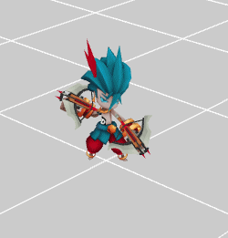

骨骼动画
----------

骨骼动画资源需要用导出插件导出，导出之后可以用以下方式进行使用
 	
    // 按1 2 3 4键 切换动画
    protected onKeyDown(e: egret3d.KeyEvent3D) {
        switch (e.keyCode) {
            case egret3d.KeyCode.Key_1:
                if (this.role) {
                    this.role.animation.play("Idle");
                }
                break;
            case egret3d.KeyCode.Key_2:
                if (this.role) {
                    this.role.animation.play("Run");
                }
                break;
            case egret3d.KeyCode.Key_3:
                if (this.role) {
                    this.role.animation.play("Attack1");
                }
                break;
            case egret3d.KeyCode.Key_4:
                if (this.role) {
                    this.role.animation.play("Death");
                }
                break;
        }
    }

    // 加载资源完成后 创建骨骼动画
    protected createSkeletonAnimation() {
        // 加载完成后用url查找资源 
        var geo: egret3d.Geometry = this.queueLoader.getAsset("resource/doc/ganning/Ganning.esm");
        var clip0: egret3d.SkeletonAnimationClip = this.queueLoader.getAsset("resource/doc/ganning/Idle.eam");
        var clip1: egret3d.SkeletonAnimationClip = this.queueLoader.getAsset("resource/doc/ganning/Run.eam");
        var clip2: egret3d.SkeletonAnimationClip = this.queueLoader.getAsset("resource/doc/ganning/Attack1.eam");
        var clip3: egret3d.SkeletonAnimationClip = this.queueLoader.getAsset("resource/doc/ganning/Death.eam");
        var textures: egret3d.ITexture[] = [];

        textures[0] = this.queueLoader.getAsset("resource/doc/ganning/Ganning.png");
        textures[1] = this.queueLoader.getAsset("resource/doc/ganning/Ganning_f.png");
        textures[2] = this.queueLoader.getAsset("resource/doc/ganning/Ganning_Weapon.png");

        // 给每个动画指定名字 用于动画切换使用
        clip0.animationName = "Idle";
        clip1.animationName = "Run";
        clip2.animationName = "Attack1";
        clip3.animationName = "Death";

        // 创建Mesh
        var mesh: egret3d.Mesh = new egret3d.Mesh(geo, new egret3d.TextureMaterial());
        this.role = mesh;
        for (var i: number = 0; i < geo.subGeometrys.length; ++i) {
            var mat: egret3d.MaterialBase = mesh.getMaterial(i);
            if (!mat) {
                mat = new egret3d.TextureMaterial();
                mesh.addSubMaterial(i, mat);
            }

            mat.diffuseTexture = textures[i];
        }

        mesh.animation.skeletonAnimationController.addSkeletonAnimationClip(clip0);
        mesh.animation.skeletonAnimationController.addSkeletonAnimationClip(clip1);
        mesh.animation.skeletonAnimationController.addSkeletonAnimationClip(clip2);
        mesh.animation.skeletonAnimationController.addSkeletonAnimationClip(clip3);
        mesh.animation.play("Idle");

        this.view.addChild3D(mesh);
        // 监听动画播放完成事件 
        mesh.animation.skeletonAnimationController.addEventListener(egret3d.AnimationEvent3D.EVENT_PLAY_COMPLETE, this.onPlayComplete, this);
        mesh.animation.skeletonAnimationController.addEventListener(egret3d.AnimationEvent3D.EVENT_FRAME_CHANGE, this.onPlayChange, this);

    }

    // 播放完成事件 如果是循环动画 完成一次会触发一次
    protected onPlayComplete(e: egret3d.AnimationEvent3D) {
        var skeletonAnimation: egret3d.SkeletonAnimation = e.target;
        console.log("onPlayComplete:" + skeletonAnimation.currentAnimName);
    }

    // 换帧事件
    protected onPlayChange(e: egret3d.AnimationEvent3D) {
        var skeletonAnimation: egret3d.SkeletonAnimation = e.target;
        //console.log("onPlayChange:" + skeletonAnimation.currentAnimName);
    }

----------