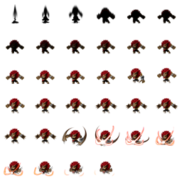
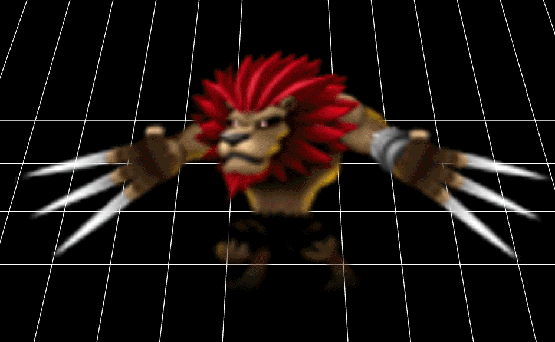

     
## 精灵表   
精灵表是2D常用的一种切帧动画形式。大概来说，就是将动画的每一帧作为一个完整的图像，将所有不同的帧集中到一个大的透明图像中，每一帧都有其对应的起始坐标点及其宽度、高度，这张大的透明图像称为精灵表纹理集。这样在播放动画时，只需要在不同的时间帧，在精灵表纹理集中，取该时间帧对应的动画帧纹理，并显示出来。      

## 呈现UV精灵表动画      
    // 使用uv 帧动画 
    protected uvSpriteAnimation() {
        var mat: egret3d.TextureMaterial = new egret3d.TextureMaterial();
        mat.repeat = true;
        var plane: egret3d.Mesh = new egret3d.Mesh(new egret3d.PlaneGeometry(1000, 1000, 10, 10, 1, 1), mat);
        this.view.addChild3D(plane);
        plane.y = 10;
        var uvSpriteSheetMethod: egret3d.UVSpriteSheetMethod = new egret3d.UVSpriteSheetMethod(34, 6, 6, 3.0);
        mat.diffusePass.addMethod(uvSpriteSheetMethod);
        uvSpriteSheetMethod.start(true);
        mat.diffuseTexture = this.queueLoader.getAsset("resource/doc/test1.png");

    }
          
本例所用的精灵表纹理集图片为：   
    

