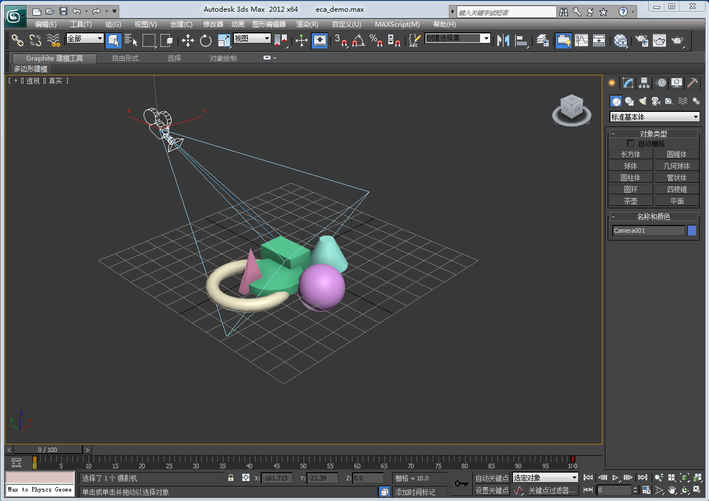
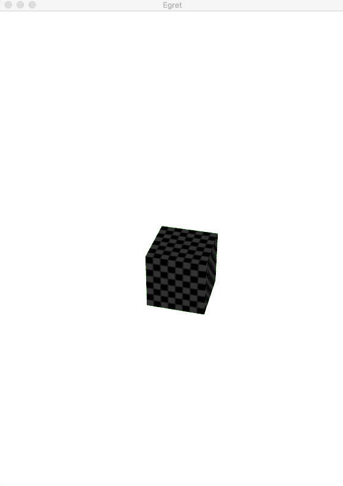
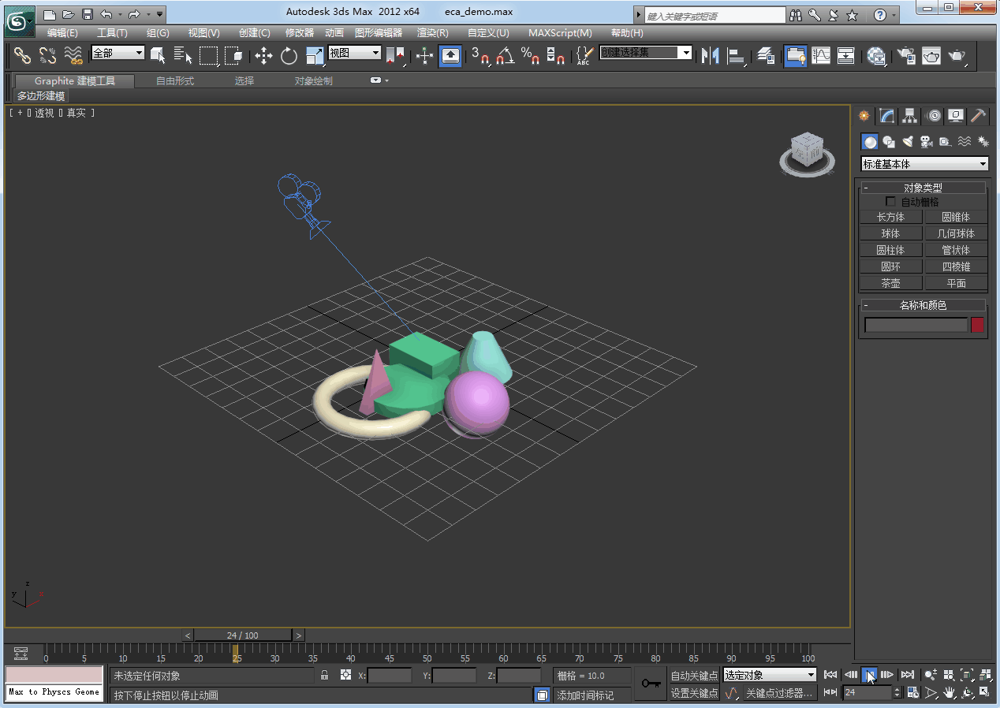

在3D Max中可以通过时间轴制作摄像机动画，你可以通过Egret3D所提供得插件将制作好的摄像机动画导出为`eca`格式文件，并通过在程序中对该文件的解析，生成摄像机动画。

为了方便查看效果，我们首先在3D MAX中制作一个简单的摄像机动画。3D MAX中，场景如下：



摄像机运动轨迹如下：



我们以摄像机视角，查看整个场景运行效果如图：


通过Egret3D插件导出其动画文件，名称为`Camera001.eca`，由于当前场景中摄像机名称为`Camera001`，所有导出文件保留其元素命名。

你需要借助`URLLoader`类来加载`Camera001.eca`文件，当文件加载完成后，得到的数据`evt.target.data`其数据类型为`egret3d.CameraAnimationController`。

在Egret3D中，控制摄像机的动画类由`CameraAnimationController`实现，每一帧中的数据由`CameraAnimationFrame`实现。

当你的数据加载并解析完成后，你就可以使用这个`CameraAnimationController`。当在使用之前，你需要通过其中的`bindCamera`方法绑定要控制的摄像机。

具体编码步骤如下：

1、加载`eca`文件

```
var load:egret3d.URLLoader = new egret3d.URLLoader();
        load.addEventListener(egret3d.LoaderEvent3D.LOADER_COMPLETE,this.com,this);
load.load("resource/Camera001.eca");
```

```
private ani:egret3d.CameraAnimationController;
private com(evt:egret3d.LoaderEvent3D)
{
	this.ani = evt.target.data;
}
```

2、绑定摄像机

```
this.ani.bindCamera(this._view.camera3D);
```

3、注册刷新

```
this.canvas.addEventListener(egret3d.Event3D.ENTER_FRAME,this.update,this);
```

```
private update(evt:egret3d.Event3D)
{
	this.ani.update(10,16);
}
```

每一次调用`CameraAnimationController`的`update`方法，才会更新一次摄像机动画。每一次更新，`update`方法需要两个参数。第一个参数为当前时间，第二个参数为每帧时间间隔。

4、播放动画

```
this.ani.play(true);
```

`play`方法中，参数如果为`true`，则摄像机动画循环播放。

5、暂停动画

```
this.ani.stop();
```

6、监听动画播放完毕事件

```
this.ani.addEventListener(egret3d. CameraAnimationController.EVENT_CAMERA_COMPLETE,this.AniComplete,this);
```

摄像机动画的事件直接封装到了`CameraAnimationController`中，并没有单独放置于独立的事件类中。

上述示例完整代码如下：

```
class CameraAni extends LoadingUI
{

    private _view:egret3d.View3D;
    protected canvas:egret3d.Egret3DCanvas;
    public constructor()
    {
        super();
        this.CloseLoadingView();

        this.canvas = new egret3d.Egret3DCanvas();
        this.canvas.x = 0;
        this.canvas.y = 0;
        this.canvas.width = window.innerWidth;
        this.canvas.height = window.innerHeight;
        this.canvas.start();
        
        this._view = new egret3d.View3D(0,0,window.innerWidth,window.innerHeight);
        this.canvas.addView3D(this._view);
        this._view.backColor = 0x00ff00;

        this.createCub();

        this._view.camera3D.lookAt(new egret3d.Vector3D(300, 500, -1000), new egret3d.Vector3D(0, 0, 0));

        var load:egret3d.URLLoader = new egret3d.URLLoader();
        load.addEventListener(egret3d.LoaderEvent3D.LOADER_COMPLETE,this.com,this);
        load.load("resource/Camera001.eca");
    }

    private cube:egret3d.Mesh;
    private mat:egret3d.TextureMaterial;
    private createCub()
    {
        var mat:egret3d.TextureMaterial = new egret3d.TextureMaterial();
        var go:egret3d.CubeGeometry = new egret3d.CubeGeometry(10,10,10);
        var cube:egret3d.Mesh = new egret3d.Mesh(go, mat);
        this._view.addChild3D(cube);
    }

    private ani:egret3d.CameraAnimationController;
    private com(evt:egret3d.LoaderEvent3D)
    {
        this.ani = evt.target.data;
        this.ani.bindCamera(this._view.camera3D);
        this.ani.play(true);
        
         this.canvas.addEventListener(egret3d.Event3D.ENTER_FRAME,this.update,this);
    }
    
    private update(evt:egret3d.Event3D)
    {
        this.ani.update(10,16);
    }
}
```

编译并运行，效果如图：



## 摄像机帧数据

由于摄像机动画相对比较简单，不涉及变形等信息，只包含了时间和摄像机在三维空间中的运动轨迹于姿态。你可以通过`CameraAnimationController`类中的`cameraAnimationFrames`属性获取当前摄像机动画的全部帧数据。每个帧数据的内容可参考`CameraAnimationFrame`类的API内容。


