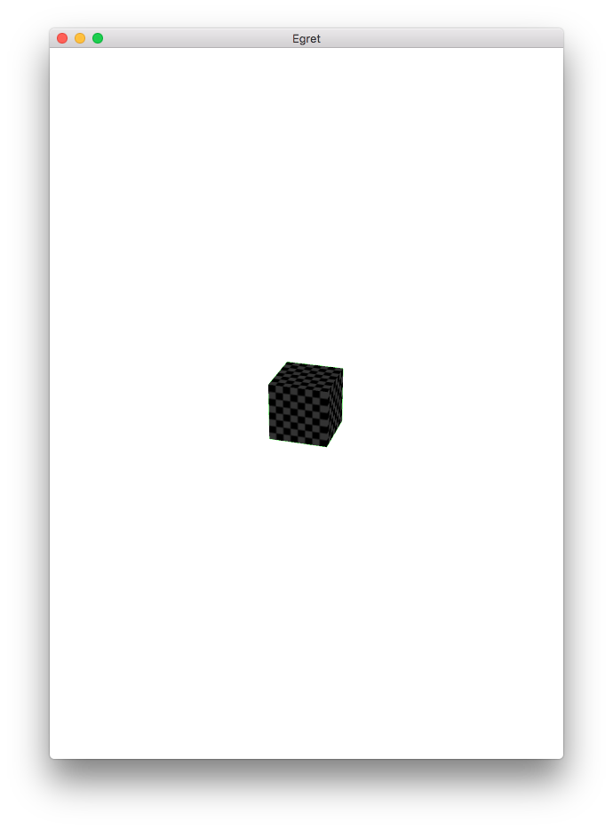
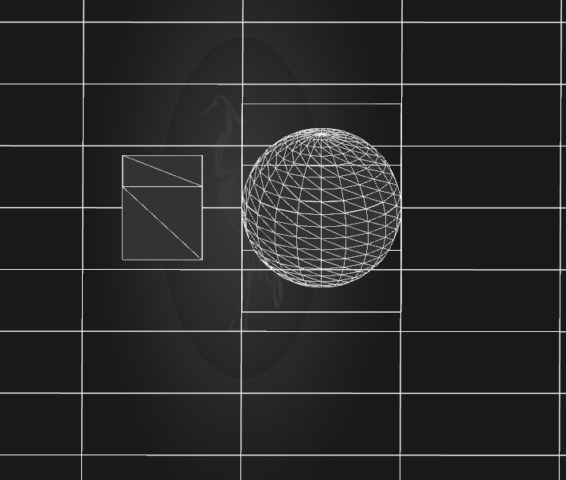

## 透视投影

透视投影属于中心投影，它是从某个投射中心将物体投射到单一投影面上所得到的图形。透视图与人们观看物体时所产生的视觉效果非常接近。

透视投影符合人们心理习惯，即离视点近的物体大，离视点远的物体小，远到极点即为消失，成为灭点。它的视景体类似于一个顶部和底部都被切除掉的凌锥，也就是棱台。

默认摄像机所采用的投影为透视投影。下面示例中，创建一个立方体，并使用透视投影，代码如下：

```
class CameraDemo extends LoadingUI
{

    private _view:egret3d.View3D;
    protected canvas:egret3d.Egret3DCanvas;
    public constructor()
    {
        super();
        this.CloseLoadingView();

        this.canvas = new egret3d.Egret3DCanvas();
        this.canvas.x = 0;
        this.canvas.y = 0;
        this.canvas.width = window.innerWidth;
        this.canvas.height = window.innerHeight;
        this.canvas.start();
        
        this._view = new egret3d.View3D(0,0,window.innerWidth,window.innerHeight);
        this.canvas.addView3D(this._view);
        this._view.backColor = 0x00ff00;

        this.createCub();

        this._view.camera3D.lookAt(new egret3d.Vector3D(300, 500, -1000), new egret3d.Vector3D(0, 0, 0));
        this._view.camera3D.cameraType = egret3d.CameraType.perspective;
    }

    private cube:egret3d.Mesh;
    private mat:egret3d.TextureMaterial;
    private createCub()
    {
        var mat:egret3d.TextureMaterial = new egret3d.TextureMaterial();
        var go:egret3d.CubeGeometry = new egret3d.CubeGeometry();
        var cube:egret3d.Mesh = new egret3d.Mesh(go, mat);
        this._view.addChild3D(cube);
    }

}
```

默认可以不设置相机投影类型，但设置其`cameraType`属性即可设置，设置透视投影方法如下：

```
this._view.camera3D.cameraType = egret3d.CameraType.perspective;
```

编译后运行效果如下：



## 正交投影

正交投影也称为平行投影，其投影线垂直于投影面的投影属于正交投影。最为常见的效果，大家可以参考常见的三视图。

修改上面的示例代码，设置其摄像机类型为正交投影类型。修改代码如下：

```
this._view.camera3D.cameraType = egret3d.CameraType.orthogonal;
```

编译并运行，效果如图：


