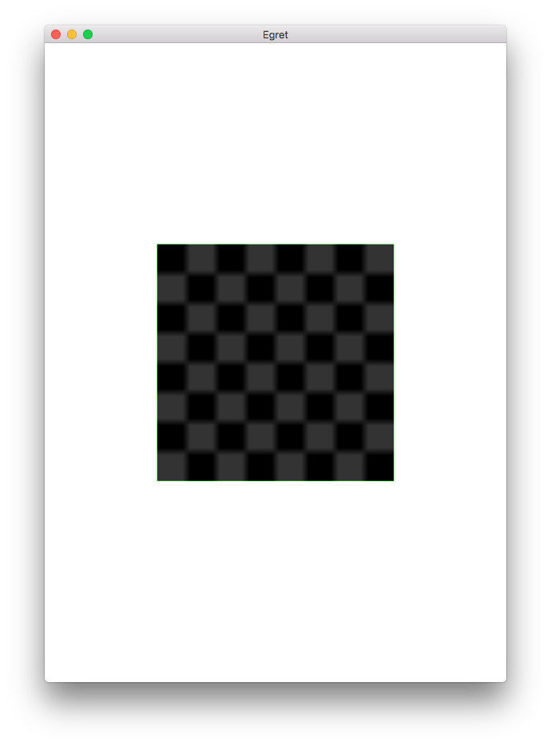
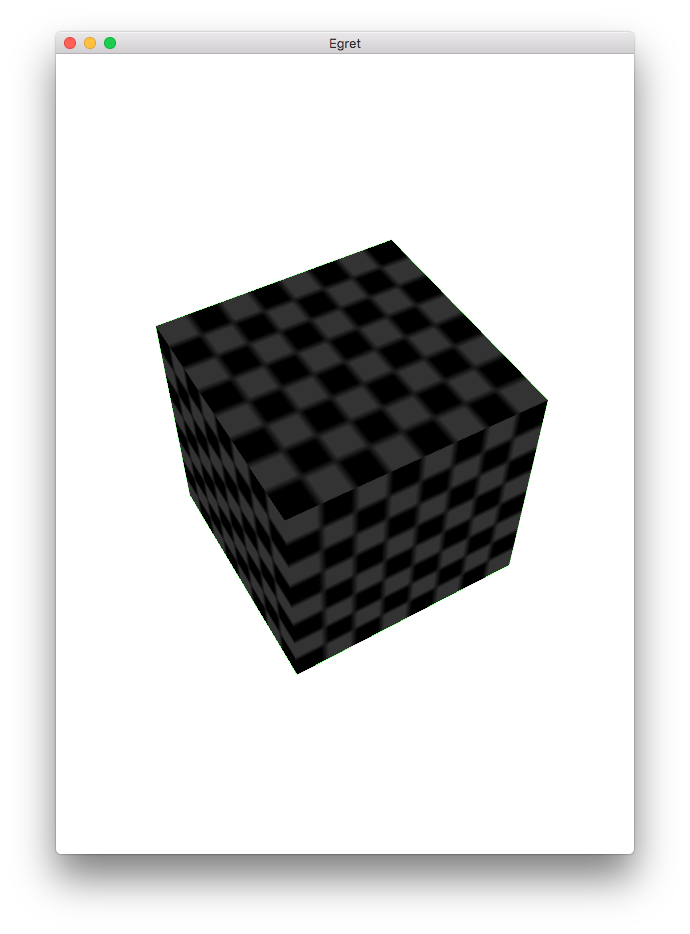

`LookAtController`是Egret3D提供的一个摄像机控制器，这个控制器可以实现摄像机的“绕点旋转”功能。在PC端，按下鼠标左键并移动，可以是摄像机绕目标进行旋转，按下键盘的WSAD键可进行上下左右移动。同时滑动鼠标滚轮可控制摄像机的视距。

`LookAtController`创建时需要四个参数，第一个参数时需要绑定的`Camera3D`对象，第二个参数则是我们需要被观察的物体。前面提及的“绕点旋转”，这个“点”就是第二个参数。后面两个参数，分别表示是否绑定ctrl按键和alt按键。

首先在场景中创建一个立方体，但不设置摄像机属性，代码如下：

```
class LookAtDemo extends LoadingUI
{

    private _view:egret3d.View3D;
    protected canvas:egret3d.Egret3DCanvas;
    public constructor()
    {
        super();
        this.CloseLoadingView();

        this.canvas = new egret3d.Egret3DCanvas();
        this.canvas.x = 0;
        this.canvas.y = 0;
        this.canvas.width = window.innerWidth;
        this.canvas.height = window.innerHeight;
        this.canvas.start();
        
        this._view = new egret3d.View3D(0,0,window.innerWidth,window.innerHeight);
        this.canvas.addView3D(this._view);
        this.createCub();

    }

    private cube:egret3d.Mesh;
    private mat:egret3d.TextureMaterial;
    private createCub()
    {
        var mat:egret3d.TextureMaterial = new egret3d.TextureMaterial();
        var go:egret3d.CubeGeometry = new egret3d.CubeGeometry();
        this.cube = new egret3d.Mesh(go, mat);
        this._view.addChild3D(this.cube);
    }
    
}
```

创建一个名称为`initLookAt`的方法，用来初始化摄像机控制器。代码如下：

```
private initLookAt()
{
    this.ctl = new egret3d.LookAtController(this._view.camera3D, this.cube);
	this.ctl.distance = 300;
}
```

第一行创建`LookAtController`对象，并且绑定当前摄像机，同时被观察物体为场景中的cube。

第二行我们设置摄像机到这个cube物体直接的距离。

需要注意的一点是，控制器需要调用`update`方法手动刷新，所以我们在下面添加`update`方法，并注册成为`ENTER_FRAME`事件的响应函数。

```
this.canvas.addEventListener(egret3d.Event3D.ENTER_FRAME,this.update,this);
private update(evt:egret3d.Event3D)
{
    this.ctl.update();
}
```

编译并运行，效果如图：



从上图中可以看到，默认图像和cube恰巧互相垂直，所以只看到cube中的一个面，按住鼠标拖拽即可旋转摄像机。

为了方便查看效果，我们也可以针对控制设置其旋转角度。注意，此时旋转，无论设置围绕哪一轴旋转，依然是“绕点旋转”。

在`initLookAt`方法中添加代码，设置其X轴和Y轴旋转角度。

```
this.ctl.rotationX = 50;
this.ctl.rotationY = 120;
```

编译并运行，查看效果。




完整示例代码如下：

```
class LookAtDemo extends LoadingUI
{

    private _view:egret3d.View3D;
    protected canvas:egret3d.Egret3DCanvas;
    public constructor()
    {
        super();
        this.CloseLoadingView();

        this.canvas = new egret3d.Egret3DCanvas();
        this.canvas.x = 0;
        this.canvas.y = 0;
        this.canvas.width = window.innerWidth;
        this.canvas.height = window.innerHeight;
        this.canvas.start();
        
        this._view = new egret3d.View3D(0,0,window.innerWidth,window.innerHeight);
        this.canvas.addView3D(this._view);

        this.createCub();

        this.initLookAt();
        this.canvas.addEventListener(egret3d.Event3D.ENTER_FRAME,this.update,this);
    }

    private cube:egret3d.Mesh;
    private mat:egret3d.TextureMaterial;
    private createCub()
    {
        var mat:egret3d.TextureMaterial = new egret3d.TextureMaterial();
        var go:egret3d.CubeGeometry = new egret3d.CubeGeometry();
        this.cube = new egret3d.Mesh(go, mat);
        this._view.addChild3D(this.cube);
    }
    
    private ctl:egret3d.LookAtController
    private initLookAt()
    {
        this.ctl = new egret3d.LookAtController(this._view.camera3D, this.cube);
        this.ctl.distance = 300;
        this.ctl.rotationX = 50;
this.ctl.rotationY = 120;
    }
    
    private update(evt:egret3d.Event3D)
    {
        this.ctl.update();
    }

}
```