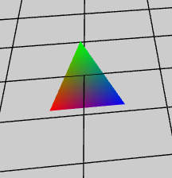
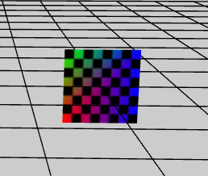

* Mesh 场景中的网格对象 显示模型

----------
    
    // 创建3角形
    protected createTriangle() {
        var geom: egret3d.Geometry = egret3d.GeometryUtil.createGeometry();

        var vb: number[] = [];
        var ib: number[] = [];

        // 0 1 2 坐标 3 4 5 6 颜色 7 8 uv
        vb.push(-50, -50, 0, 1, 0, 0, 1);
        vb.push(0, 50, 0, 0, 1, 0, 1);
        vb.push(50, -50, 0, 0, 0, 1, 1);
        // 加入3个顶点       

        // 设置顶点索引  3个索引  1个3角形面
        ib.push(0, 1, 2);

        // 把数据填充进Geometry
        geom.setVerticesForIndex(0, egret3d.VertexFormat.VF_POSITION | egret3d.VertexFormat.VF_COLOR, vb, 3);
        geom.setVertexIndices(0, ib);

        // 使用Geometry 创建Mesh
        var mesh: egret3d.Mesh = new egret3d.Mesh(geom, new egret3d.ColorMaterial(0xffffff));

        // 设置双面渲染
        mesh.material.bothside = true;

        this.view.addChild3D(mesh);

        mesh.x = -200;
    }

    // 创建四边形
    protected createRcet() {

        //创建一个Geometry 顶点格式为 VertexFormat.VF_POSITION | VertexFormat.VF_NORMAL | VertexFormat.VF_TANGENT | VertexFormat.VF_COLOR | VertexFormat.VF_UV0 | VertexFormat.VF_UV1
        var geom: egret3d.Geometry = egret3d.GeometryUtil.createGeometry();

        var vb: number[] = [];
        var ib: number[] = [];

        // 0 1 2 坐标 3 4 5 6 颜色 7 8 uv
        vb.push(-50, 50, 0, 0, 1, 0, 1, 0, 0);
        vb.push(50, 50, 0, 0, 0, 1, 1, 1, 0);
        vb.push(-50, -50, 0, 1, 0, 0, 1, 0, 1);
        vb.push(50, -50, 0, 0, 0, 1, 1, 1, 1);
        // 加入4个顶点        

        // 设置顶点索引  6个索引  2个3角形面
        ib.push(0, 2, 1, 2, 3, 1);

        // 把数据填充进Geometry
        geom.setVerticesForIndex(0, egret3d.VertexFormat.VF_POSITION | egret3d.VertexFormat.VF_COLOR | egret3d.VertexFormat.VF_UV0, vb, 4);
        geom.setVertexIndices(0, ib);

        var mesh: egret3d.Mesh = new egret3d.Mesh(geom, new egret3d.TextureMaterial());

        // 设置双面渲染
        //mesh.material.bothside = true;

        this.view.addChild3D(mesh);
        mesh.x = 200;
    }

----------