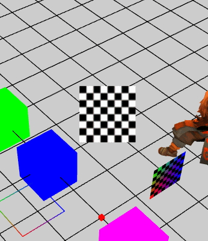

Billboard 
----------

场景中共告板对象 会根据场景中摄像机的旋转进行变化 使自身一直朝向摄像机
 
----------

    // 创建公告板
    protected createBillboard() {
        // Geometry 可以指定 
        var billboard: egret3d.Billboard = new egret3d.Billboard(new egret3d.TextureMaterial());
        this.view.addChild3D(billboard);

        billboard.y = 300;
    }

----------