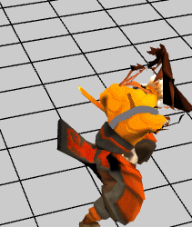

Role
----------

场景中的角色对象 管理角色的avtar 所有avatar共用一个骨骼动画
 
----------

    // 加载一个角色的配置
    protected loaderRole() {
        // 这是个avatar 角色
        var roleLoader: egret3d.QueueLoader = new egret3d.QueueLoader();
        roleLoader.load("resource/doc/Js_20161109/MapConfig.json");
        roleLoader.addEventListener(egret3d.LoaderEvent3D.LOADER_COMPLETE, this.onRoleComplete, this);
    }

    // 角色加载完成
    protected onRoleComplete(e: egret3d.LoaderEvent3D) {
        var roleLoader: egret3d.QueueLoader = e.target;
        var role: egret3d.Role = roleLoader.getAsset("resource/doc/Js_20161109/MapConfig.json");
        this.view.addChild3D(role);
        role.x = 300;

        // avatar 角色 动画播放
        role.skeletonAnimation.play();
    }

----------