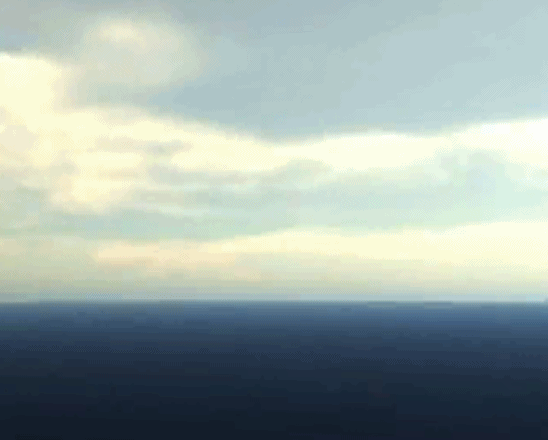
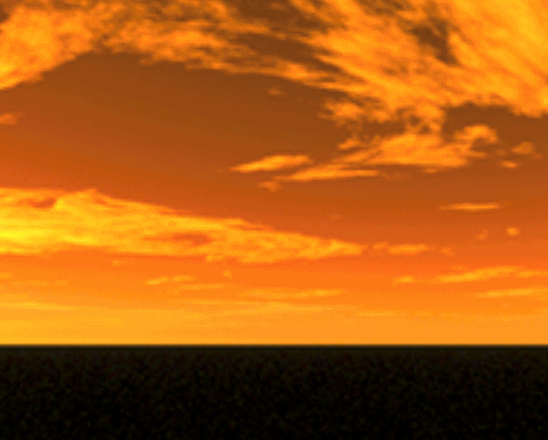

Sky
----------
场景中天空对象 会根据场景摄像机的位置进行跟随

----------
	1.天空盒
    // 加载天空盒资源
    protected loaderSkyBox() {
        var loader: egret3d.QueueLoader = new egret3d.QueueLoader();
        loader.load("resource/doc/sky/cloudy_noon_FR.png");
        loader.load("resource/doc/sky/cloudy_noon_BK.png");
        loader.load("resource/doc/sky/cloudy_noon_LF.png");
        loader.load("resource/doc/sky/cloudy_noon_RT.png");
        loader.load("resource/doc/sky/cloudy_noon_UP.png");
        loader.load("resource/doc/sky/cloudy_noon_DN.png");
        loader.addEventListener(egret3d.LoaderEvent3D.LOADER_COMPLETE, this.onSkyBoxTexture, this);
    }

    // 天空盒资源加载完成 创建天空盒
    protected onSkyBoxTexture(e: egret3d.LoaderEvent3D) {
        var loader: egret3d.QueueLoader = e.target;

        var fr: egret3d.ITexture = loader.getAsset("resource/doc/sky/cloudy_noon_FR.png");
        var bk: egret3d.ITexture = loader.getAsset("resource/doc/sky/cloudy_noon_BK.png");
        var lf: egret3d.ITexture = loader.getAsset("resource/doc/sky/cloudy_noon_LF.png");
        var rt: egret3d.ITexture = loader.getAsset("resource/doc/sky/cloudy_noon_RT.png");
        var up: egret3d.ITexture = loader.getAsset("resource/doc/sky/cloudy_noon_UP.png");
        var dn: egret3d.ITexture = loader.getAsset("resource/doc/sky/cloudy_noon_DN.png");

        // 创建cube贴图
        var cubeTexture: egret3d.CubeTexture = egret3d.CubeTexture.createCubeTextureByImageTexture(fr, bk, lf, rt, up, dn);

        // 创建cube geometry 和 cube 材质
        var sky: egret3d.Sky = new egret3d.Sky(new egret3d.CubeGeometry(10000, 10000, 10000), new egret3d.CubeTextureMaterial(cubeTexture), this.view.camera3D);
        // 设置天空盒 渲染模式为背面渲染
        sky.material.cullMode = egret3d.ContextConfig.FRONT;
        this.view.addChild3D(sky);
    }

	2.天空球
    // 加载天空球资源
    protected loaderSkySphere() {
        var loader: egret3d.QueueLoader = new egret3d.QueueLoader();
        loader.load("resource/doc/sky/sky0026.png");
        loader.addEventListener(egret3d.LoaderEvent3D.LOADER_COMPLETE, this.onSkySphereTexture, this);
    }

    // 天空球资源加载完成 创建天空盒
    protected onSkySphereTexture(e: egret3d.LoaderEvent3D) {
        var loader: egret3d.QueueLoader = e.target;

        var texture: egret3d.ITexture = loader.getAsset("resource/doc/sky/sky0026.png");

        // 创建SphereGeometry 和 材质
        var sky: egret3d.Sky = new egret3d.Sky(new egret3d.SphereGeometry(10000, 100, 100), new egret3d.TextureMaterial(texture), this.view.camera3D);
        // 设置天空盒 渲染模式为背面渲染
        sky.material.cullMode = egret3d.ContextConfig.FRONT;
        this.view.addChild3D(sky);
    }

----------
