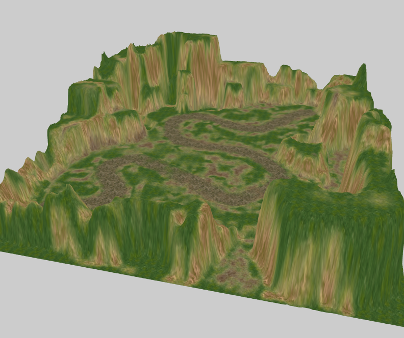

Terrain
----------
根据高度图创建地形网格信息 进行显示 

----------

    // 加载地形的资源
    protected loaderTerrain() {
        var loader = new egret3d.QueueLoader();

        loader.addEventListener(egret3d.LoaderEvent3D.LOADER_COMPLETE, this.onTerrainComplete, this);

        // 高度图
        loader.load("resource/doc/ziyan_xinshou/Heightmap_0.jpg");
        // 地形混合图
        loader.load("resource/doc/ziyan_xinshou/Alphamap_0.jpg");
        // 地表贴图 4张
        loader.load("resource/doc/ziyan_xinshou/SplatPrototype_texture_0.jpg");
        loader.load("resource/doc/ziyan_xinshou/SplatPrototype_texture_1.jpg");
        loader.load("resource/doc/ziyan_xinshou/SplatPrototype_texture_2.jpg");
        loader.load("resource/doc/ziyan_xinshou/SplatPrototype_texture_3.jpg");
    }

    private onTerrainComplete(e: egret3d.LoaderEvent3D) {
        var loader: egret3d.QueueLoader = e.target;

        // 使用高度图创建地形
        var heightImage: egret3d.ImageTexture = <egret3d.ImageTexture>loader.getAsset("resource/doc/ziyan_xinshou/Heightmap_0.jpg");
        var terrain: egret3d.Terrain = new egret3d.Terrain(heightImage, 2000, 500, 2000, 200, 200);
        var mat: egret3d.MaterialBase = terrain.material;
        //mat.gloss = 10.0;
        mat.repeat = true;

        this.view.addChild3D(terrain);

        // 给地形增加地形混合渲染方法
        var terrainMethod: egret3d.TerrainARGBMethod = new egret3d.TerrainARGBMethod(
            egret3d.CheckerboardTexture.texture,
            egret3d.CheckerboardTexture.texture,
            egret3d.CheckerboardTexture.texture,
            egret3d.CheckerboardTexture.texture,
            egret3d.CheckerboardTexture.texture);

        mat.diffusePass.addMethod(terrainMethod);

        terrainMethod.setUVTitling(0, 26.7, 26.7);
        terrainMethod.setUVTitling(1, 16, 16);
        terrainMethod.setUVTitling(2, 26.7, 26.7);
        terrainMethod.setUVTitling(3, 26.7, 26.7);

        // 设置混合贴图和地表贴图
        terrainMethod.controlTexture = loader.getAsset("resource/doc/ziyan_xinshou/Alphamap_0.jpg");
        terrainMethod.splat_0_Texture = loader.getAsset("resource/doc/ziyan_xinshou/SplatPrototype_texture_0.jpg");
        terrainMethod.splat_1_Texture = loader.getAsset("resource/doc/ziyan_xinshou/SplatPrototype_texture_1.jpg");
        terrainMethod.splat_2_Texture = loader.getAsset("resource/doc/ziyan_xinshou/SplatPrototype_texture_2.jpg");
        terrainMethod.splat_3_Texture = loader.getAsset("resource/doc/ziyan_xinshou/SplatPrototype_texture_3.jpg");
    }

----------
