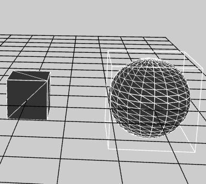
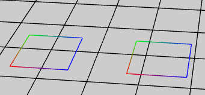
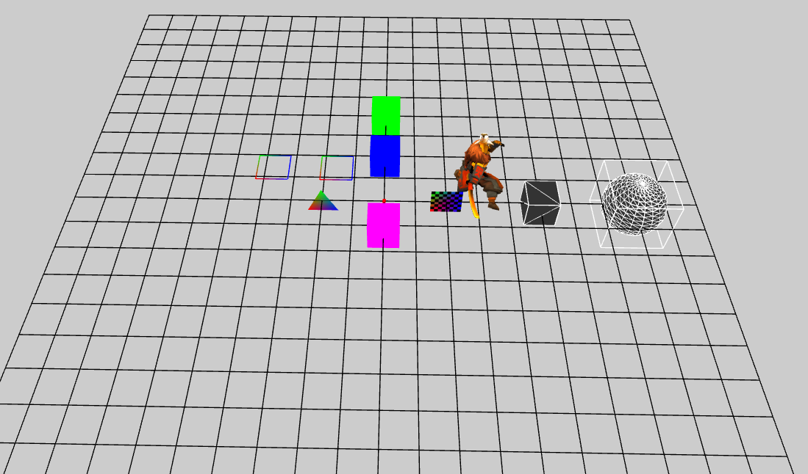

Wirefram
----------
场景中渲染线条的对象
 
----------
	1.
	// 用Geometry 创建线框
    protected createWireframeForGeometry() {
        // 创建一个cube Mesh
        var cube: egret3d.Mesh = new egret3d.Mesh(new egret3d.CubeGeometry(100, 100, 100), new egret3d.ColorMaterial(0x333333));
        this.view.addChild3D(cube);

        cube.x = 500;
        // 用cube 的Geometry 创建线框
        var cubeWireframe: egret3d.Wireframe = new egret3d.Wireframe();
        cubeWireframe.fromGeometry(cube.geometry);
        // 把cube的线框绑定在cube 上
        cube.addChild(cubeWireframe);

        // 创建一个球 Mesh
        var s: egret3d.Mesh = new egret3d.Mesh(new egret3d.SphereGeometry(100, 20, 20), new egret3d.ColorMaterial(0x333333));
        this.view.addChild3D(s);
        // 打开球的包围盒 显示包围盒
        s.bound.visible = true;
        s.x = 800;
        // 用球 的Geometry 创建线框
        var sWireframe: egret3d.Wireframe = new egret3d.Wireframe();
        sWireframe.fromGeometry(s.geometry);
        // 把球的线框绑定在球 上
        s.addChild(sWireframe);
    }

	2.
    // 用顶点 创建线框
    protected createWireframeForVertex() {
      
        var wireframe0: egret3d.Wireframe = new egret3d.Wireframe();
        var vb0: number[] = [];

        // 添加5个顶点 依次连接 连接成一个4边形
        vb0.push(0, 100, 0, 1, 0, 0, 1);
        vb0.push(0, 100, 100, 0, 1, 0, 1);
        vb0.push(100, 100, 100, 0, 0, 1, 1);
        vb0.push(100, 100, 0, 0, 0, 1, 1);
        vb0.push(0, 100, 0, 1, 0, 0, 1);

        // 设置顶点 和 顶点格式为 坐标和颜色
        wireframe0.fromVertexs(vb0, egret3d.VertexFormat.VF_POSITION | egret3d.VertexFormat.VF_COLOR);

        this.view.addChild3D(wireframe0);
        wireframe0.x = -400;

        var wireframe1: egret3d.Wireframe = new egret3d.Wireframe();

        var vb1: number[] = [];

        // 添加8个顶点 两两相边 连接成一个4边形
        vb1.push(0, 100, 0, 1, 0, 0, 1);
        vb1.push(0, 100, 100, 0, 1, 0, 1);

        vb1.push(0, 100, 100, 0, 1, 0, 1);
        vb1.push(100, 100, 100, 0, 0, 1, 1);

        vb1.push(100, 100, 100, 0, 0, 1, 1);
        vb1.push(100, 100, 0, 0, 0, 1, 1);

        vb1.push(100, 100, 0, 0, 0, 1, 1);
        vb1.push(0, 100, 0, 1, 0, 0, 1);

        // 设置顶点 和 顶点格式为 坐标和颜色
        wireframe1.fromVertexsEx(vb1, egret3d.VertexFormat.VF_POSITION | egret3d.VertexFormat.VF_COLOR);

        this.view.addChild3D(wireframe1);

        wireframe1.x = -200;
    }

	3.
    // 用顶点和索引的方式 创建线框
    protected createWireframe() {
        // 创建一个20 * 20 行的 每个格子100 * 100 大小
        var wir: egret3d.Wireframe = new egret3d.Wireframe();
        wir.material.diffuseColor = 0x000000;
        this.view.addChild3D(wir);
        var geom: egret3d.Geometry = wir.geometry;

        var width: number = 100;
        var height: number = 100;

        var row: number = 20;
        var col: number = 20;

        var point_row: number = row + 1;
        var point_col: number = col + 1;

        var vb: Array<number> = new Array<number>();
        var ib: Array<number> = new Array<number>();

        for (var i: number = 0; i < point_row; ++i) {
            vb.push(-width * col / 2, 0, height * i - height * row / 2);
            vb.push(width * col / 2, 0, height * i - height * row / 2);
        }

        for (var i: number = 0; i < point_col; ++i) {
            vb.push(width * i - width * col / 2, 0, height * col / 2);
            vb.push(width * i - width * col / 2, 0, -height * col / 2);
        }

        for (var i: number = 0; i < vb.length / 3; ++i) {
            ib.push(i);
        }
        // 设置顶点数据 
        geom.setVerticesForIndex(0, egret3d.VertexFormat.VF_POSITION, vb, vb.length / 3);

        // 设置索引数据
        geom.setVertexIndices(0, ib);
    }

----------