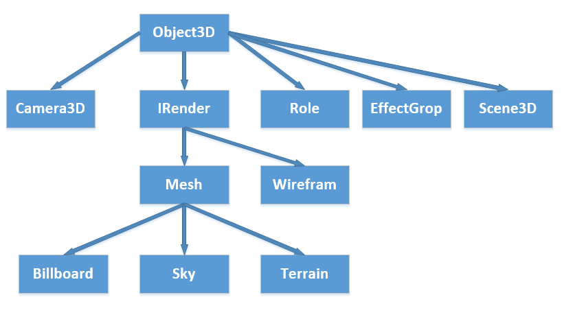
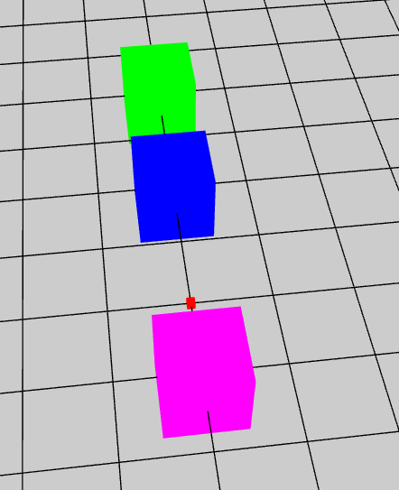

结构图
----------

* Object3D 场景中的基类对象 没有真正的显示实体 带有变换信息

----------

    protected createObject() {

        // 新建一个红色的cube 放在场景的（0，0，0）位置  大小为（10， 10， 10）;
        var cube: egret3d.Mesh = new egret3d.Mesh(new egret3d.CubeGeometry(10, 10, 10), new egret3d.ColorMaterial(0xff0000));
        this.view.addChild3D(cube);

        // 新建一个Object3D对象  
        var object0: egret3d.Object3D = new egret3d.Object3D();
        // 把object0加载场景中
        this.view.addChild3D(object0);

        // 设置object0的本地坐标z = 200
        object0.z = 200;

        // 新建一个Mesh对象  大小为 （100， 100， 100）的盒子
        var mesh0: egret3d.Mesh = new egret3d.Mesh(new egret3d.CubeGeometry(100, 100, 100), new egret3d.ColorMaterial(0x00ff00));
        // 把mesh0添加为object0的子节点
        object0.addChild(mesh0);

        // 设置mesh0的本地坐标z = 200
        mesh0.z = 200;

        // 新建一个Mesh对象  大小为 （100， 100， 100）的盒子
        var mesh1: egret3d.Mesh = new egret3d.Mesh(new egret3d.CubeGeometry(100, 100, 100), new egret3d.ColorMaterial(0x0000ff));
        object0.addChild(mesh1);

        // 新建一个Mesh对象  大小为 （100， 100， 100）的盒子
        var mesh2: egret3d.Mesh = new egret3d.Mesh(new egret3d.CubeGeometry(100, 100, 100), new egret3d.ColorMaterial(0xff00ff));
        object0.addChild(mesh2);
        // 设置mesh2的全局坐标z =  -100
        mesh2.globalZ = -100;
    }

显示结果如图：

* IRender 场景中见的物体
 
----------
	
	IRender 对象里会有 Geometry 还有多材质 还有灯光数据  多个材质共用同一个灯光数据

	IRender 对象中的多材质是和Geomety中的SubGeomtry是相互关联的 

	遍历多材质 和 多个subGeomtry
	
    var mesh: egret3d.Mesh = new egret3d.Mesh(new egret3d.CubeGeometry());
    for (var i: number = 0; i < mesh.materialCount; ++i) {
        var mat: egret3d.MaterialBase = mesh.getMaterial(i);
    }

    for (var i: number = 0; i < mesh.geometry.subGeometrys.length; ++i) {
        var sub: egret3d.SubGeometry = mesh.geometry.subGeometrys[i];
        var mat: egret3d.MaterialBase = mesh.getMaterial(i);
    }

----------