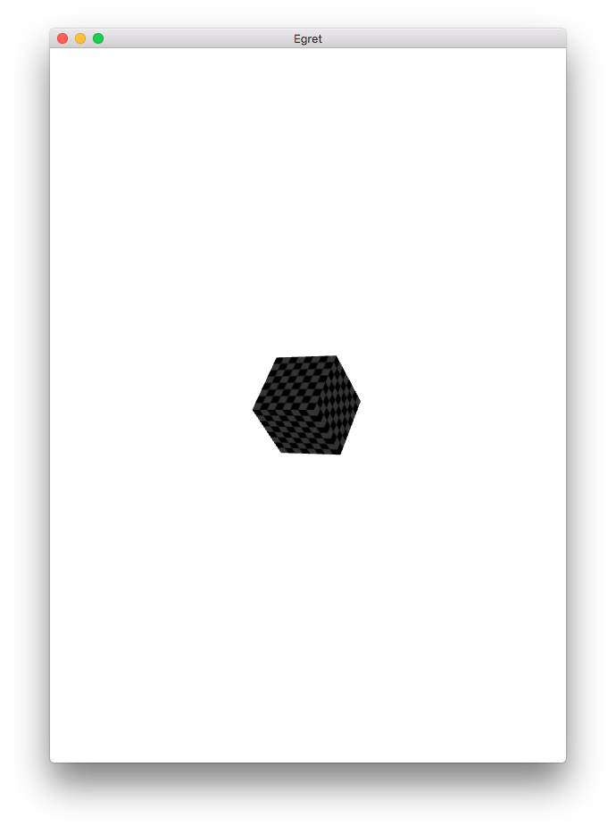

Egret3D内置了多个常用几何体，我们可以使用这些默认提供的几何体快速制作一个三维场景Demo。

要想正确显示一个3D显示对象，你需要准备三个必要元素。

- 几何体模型
- 贴图纹理
- 网格

下面介绍三个元素的创建与使用方法。

## 创建几何体模型

我们使用最为简单的立方体作为演示，代码如下：

```
var geom:egret3d.CubeGeometry = new egret3d.CubeGeometry();
```

## 创建贴图纹理

```
var mater:egret3d.TextureMaterial = new egret3d.TextureMaterial();
```

## 创建网格

```
var cube:egret3d.Mesh = new egret3d.Mesh(geom, mater);
```

## 添加到场景中进行渲染

```
this._view3D.addChild3D( cube );
```

## 改变网格旋转角度

```
cube.rotation = new egret3d.Vector3D(50,30,0);
```

编译并运行，效果如图：




完整代码如下：

```
class ObjectDemo extends LoadingUI {

    protected _egret3DCanvas: egret3d.Egret3DCanvas;
    protected _view3D: egret3d.View3D;
    private cameraCtl: egret3d.LookAtController;
    private lights: egret3d.LightGroup = new egret3d.LightGroup();
    private model: egret3d.Mesh;
    private idle: egret3d.SkeletonAnimationClip;
    private run: egret3d.SkeletonAnimationClip;
    private attack: egret3d.SkeletonAnimationClip;
    public currentAnim: string;


    public constructor() {

        super();

        ///创建Canvas对象。
        this._egret3DCanvas = new egret3d.Egret3DCanvas();
        ///Canvas的起始坐标，页面左上角为起始坐标(0,0)。
        this._egret3DCanvas.x = 0;
        this._egret3DCanvas.y = 0;
        ///设置Canvas页面尺寸。
        this._egret3DCanvas.width = window.innerWidth;
        this._egret3DCanvas.height = window.innerHeight;
        ///创建View3D对象,页面左上角为起始坐标(0,0),其参数依次为:
        ///@param x: number 起始坐标x,
        ///@param y: number 起始坐标y
        ///@param  width: number 显示区域的宽
        ///@param  height: number 显示区域的高
        this._view3D = new egret3d.View3D(0,0,window.innerWidth,window.innerHeight);
        ///当前对象对视位置,其参数依次为:
        ///@param pos 对象的位置
        ///@param target 目标的位置
        this._view3D.camera3D.lookAt(new egret3d.Vector3D(0,0,1000),new egret3d.Vector3D(0,0,0));
        ///View3D的背景色设置
        this._view3D.backColor = 0xffffffff;
        ///将View3D添加进Canvas中
        this._egret3DCanvas.addView3D(this._view3D);

        ///创建平行光
        var dirLight: egret3d.DirectLight = new egret3d.DirectLight(new egret3d.Vector3D(-0.5,0.6,0.2));
        dirLight.diffuse = 0xffffff;
        this.lights.addLight(dirLight);

        ///启动Canvas。
        this._egret3DCanvas.start();

        this.CloseLoadingView()
 
        var geom:egret3d.CubeGeometry = new egret3d.CubeGeometry();
        var mater:egret3d.TextureMaterial = new egret3d.TextureMaterial();
        var cube:egret3d.Mesh = new egret3d.Mesh(geom, mater);
        this._view3D.addChild3D( cube );
        
        cube.rotation = new egret3d.Vector3D(50,30,0);
    }

  
}     
```