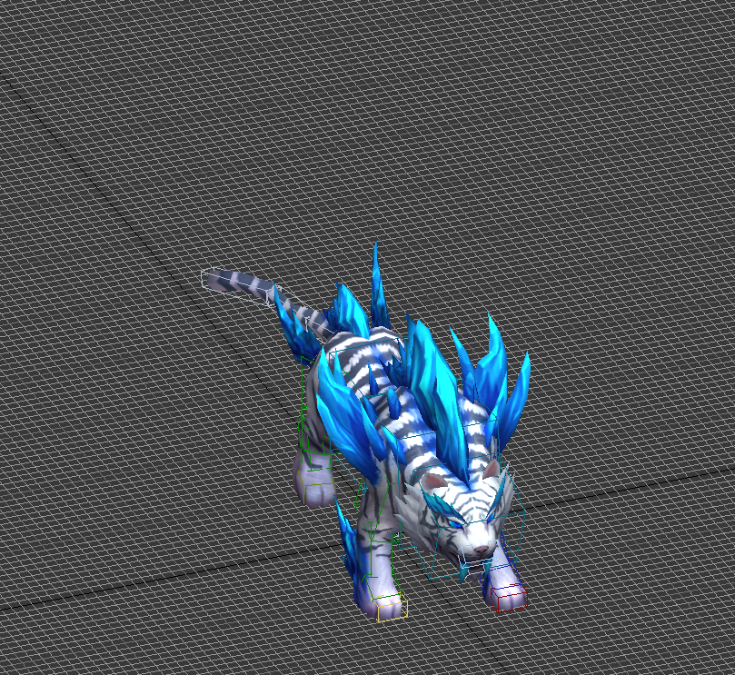
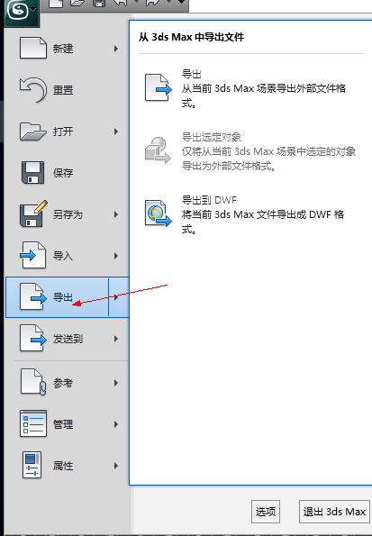
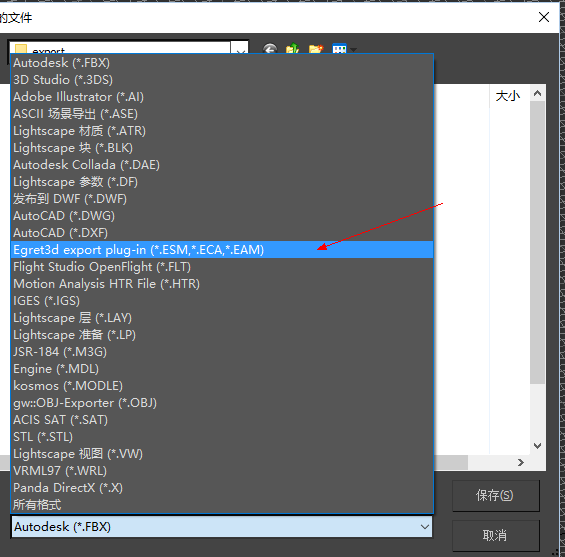
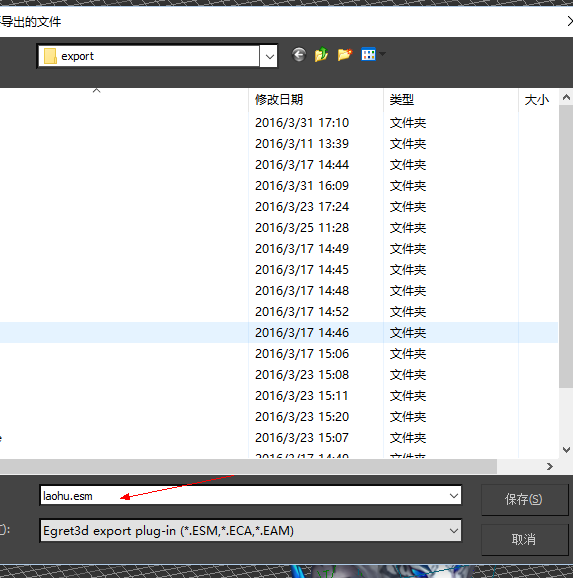

## 需要的环境 ##
1、安装3dmax 2012 64或32 版本  
2、安装vs2013 运行库 http://www.microsoft.com/zh-CN/download/details.aspx?id=40784  
3、安装插件：[3Dmax Export tool](https://github.com/egret-labs/egret-3d/tree/master/ExportTools/3Dmax Export tool/3ds Max 2012 "3Dmax Export tool")

注意：请使用GitHub最新插件使用。

## 导出文件介绍 ##
1、esm 模型数据文件  
2、eam 模型动画文件  
3、eca 相机动画文件  

## 使用说明 ##
1、将Egret 3D Model Plugin 64或32 拷贝到 3ds Max 2012\stdplugs\  目录下（注意拷贝完成后，重新打开3ds max）  
2、打开3ds max后加入模型  
  
3、点击导出  
   
4、选中插件  
   
5、输入文件名，点击保存(文件后缀必须是(.eam, .esm, .eca))(导出后会在当前文件目录下建一个同名文件夹，导出的文件就是这个文件夹内)  
  
6、选择导出方式   
	a.场景导出  场景导出会导出一个config.xml文件这个文件内容是场景中每个模型变换信息
	b.模型和蒙皮动画导出 （包括相机动画）  
	c.静态模型导出   
   

## 注意事项 ##
1、顶点支持的骨骼影响数最多为4
2、不能使用max自定义的shader材质、特殊材质
3、导出模型时,模型位置,置为（0， 0， 0）