## 需要的环境 ##
	1.安装unity3d 4.x版本，推荐4.7.1,暂时不兼容5.x版本。  
	2.运行环境配置：将Setting目录内DLL解压缩，将包中Dll文件置于C:\Windows\System32目录下。
	3.对应Egret3D引擎代码为3.2.0，如果低于此功能会有部分功能无法使用或者出现bug。

## unity示例场景 ##
	1.打开插件内容Egret3D/Example内示例场景Example。

## Mesh导出 ##
	1.将场景中Example_Mesh的active勾选为为可见，如下图所示：
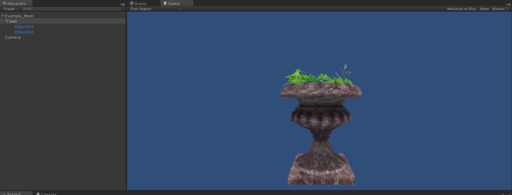

	2.进行导出前需要注意的是，由于unity shader的多样性，很难完全适配，所以推荐使用Egret3D下的shader对相应导出场景进行替换，也在MaterialShader中添加自己
	所需要对应的类型，diffuseTexture支持Tiling和Offset功能(仅支持单张贴图)。
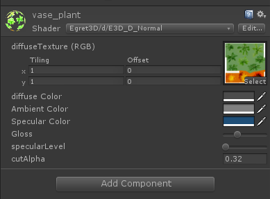
	
	3.点击工具栏，选取场景导出按钮，即可导出。
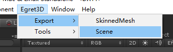

	4.导出内容将自动保存在Egret3D/Egret3DSence目录下，可以点击查看导出内容。
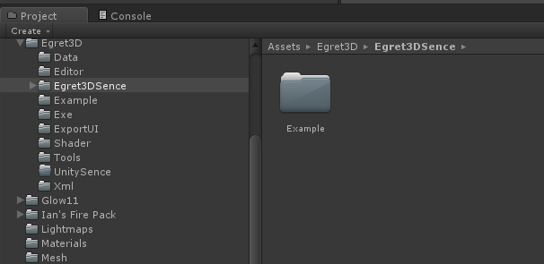

	5.Egret3D引擎使用示例资源展示。
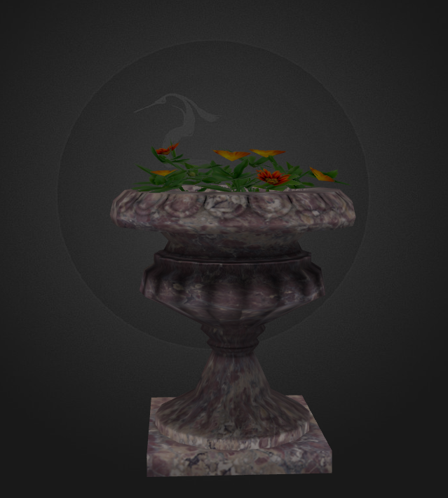

	6.注意事项：
		a.由于引擎的不同，导出mesh对象的scale缩放值不能小于0。
		b.关于尺寸大小的调节，如果为fbx文件导入unity，推荐使用Import Setting中scale factor的大小进行缩放，
		c.由于unity中坐标单位是米，故导入Egret3D相关参数已经已经进行了缩放处理。
		d.支持多Material导出

## SkinnedMesh导出##
	1.将场景中Example_SkinnedMesh勾选为为可见，如下图所示：
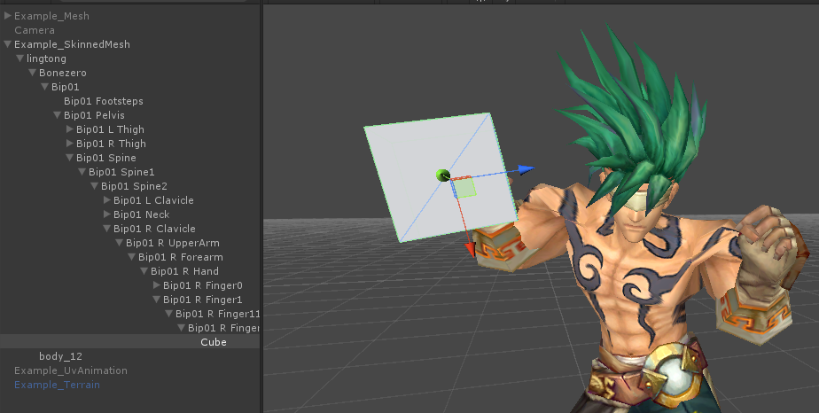

	2.调整模型shader，可以参考mesh的调整方案。调整完毕后，点击SkinnedMeshRendererExport按钮，每个导出的shinnedmesh都包含动画列表，skinned列表，
	根骨骼列表和骨骼binding列表。其中根骨骼必须拖选，少选或者不选会造成错误。骨骼binding是可选，根据需求进行绑定。这里我们演示手指绑定一个cube。
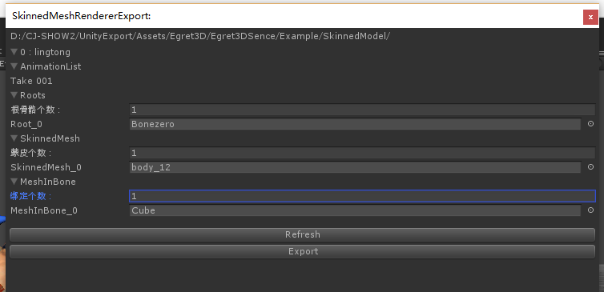
	
	3.确认无误后导出，运行至Egret3D引擎，如下所示
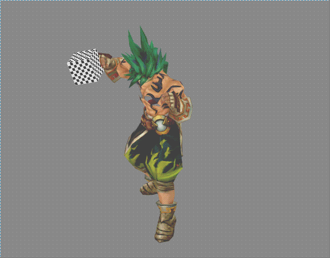

	4.注意事项：
		a.现阶段骨骼动画支持animator组件，暂不支持animation组件，请确认后导出。
		b.可以指定多个根节点。
		c.骨骼的scale缩放暂时还不支持，需要置一后才能导出。
		d.现阶段骨骼binding仅支持绑定mesh资源，其他内容需要拓展。
		e.支持资源换装处理。
		f.导出资源将自动重置坐标至(0,0,0)坐标点。  

	5.代码示例 Class_SkeletonAnimationEx：
	module egret3d {

	    export class Class_SkeletonAnimationEx extends Class_View3D {
	
	        protected role: Role;
	        protected view1: View3D;
	        protected cameraCtl: LookAtController;
	
	        public constructor() {
	            super();
	
	            this.view1 = new View3D(0, 0, window.innerWidth, window.innerHeight);
	            this.view1.camera3D.lookAt(new Vector3D(0, 100, -100), new Vector3D(0, 0, 0));
	            this.view1.backColor = 0xff888888;
	            this._egret3DCanvas.addView3D(this.view1);
	
	            this.cameraCtl = new LookAtController(this.view1.camera3D, new Object3D());
	            this.cameraCtl.distance = 150;
	            this.cameraCtl.rotationX = 60;
	
	            this._egret3DCanvas.start();
	            this._egret3DCanvas.addEventListener(Event3D.ENTER_FRAME, this.update, this);
	
	            var roleLoader: RoleLoader = new RoleLoader();
	            roleLoader.addEventListener(LoaderEvent3D.LOADER_COMPLETE, this.onLoadComplete, this);
	            roleLoader.load("resource/0_0122_huanghunshibing/RoleConfig.json");
	        }
	
	        protected onLoadComplete(e: LoaderEvent3D): void {
	
	            this.role = e.data.role;
	
	            this.view1.addChild3D(this.role);
	
	            this.role.skeletonAnimation.play();
	        }
	
	        public update(e: Event3D) {
	            this.cameraCtl.update();
	        }
	    }
	}

## 地形和光照导出 ##
	1.将场景中Example_Terrain勾选为为可见，如下图所示：
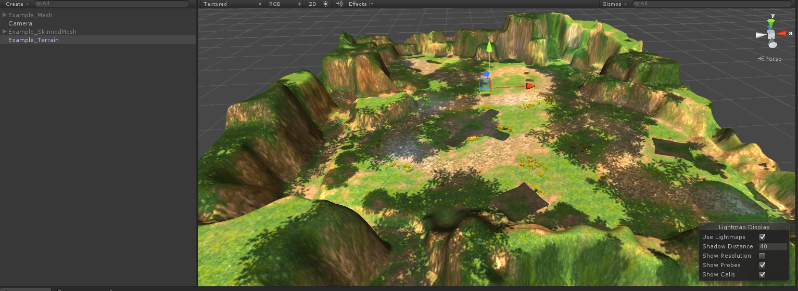

	2.确认无误后导出，运行至Egret3D引擎，如下所示
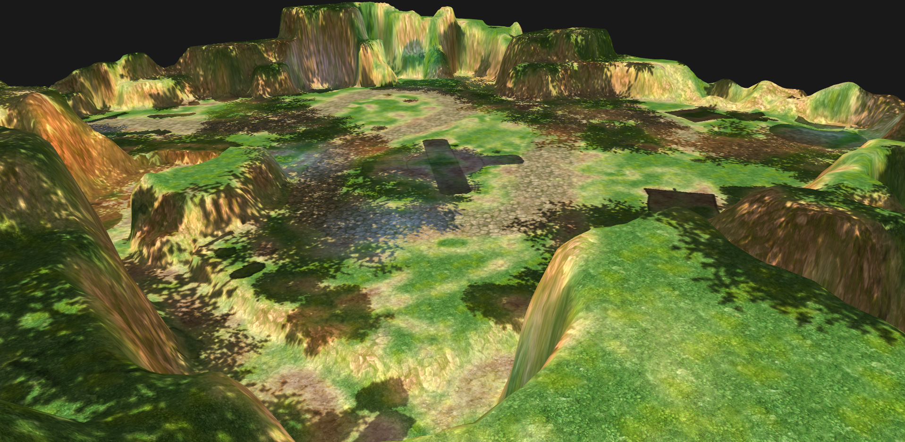

	3.注意事项：
		a.unity地形中绘制的花草是无法被导出的。

## uv动画 ##
	1.选中UV动画对象(可以多选)，点击工具栏，选取MarkUvAnimation按钮，如图所示。

	2.查看修改对应参数：
		a. uv_0,不可为空,单张UV。
		b. uv_1,暂时不可用。
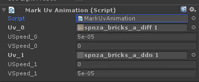

	3.运行效果，可以在场景内运行unity查看效果：
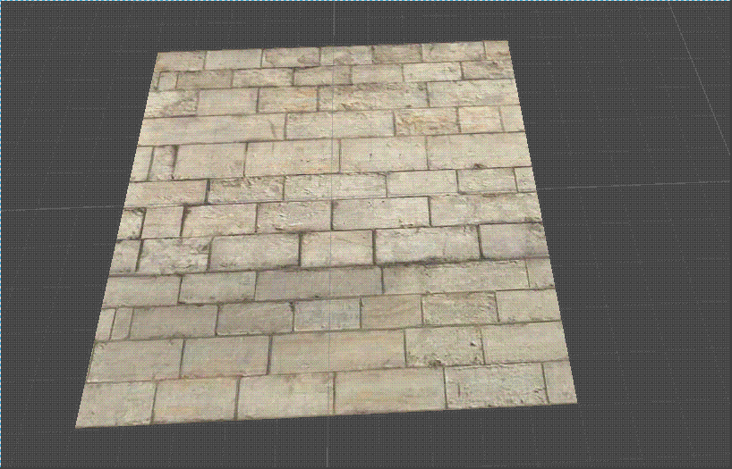

	4.注意事项：
		a.支持unity中预览滚动效果，以实际在Egret3D效果为准。

## shader说明 ##
	1."Egret3D/dns" 其中dns分别指的是
		a. d=>diffuseTexture
		b. n=>normalTexture
		c. s=>specularTexture
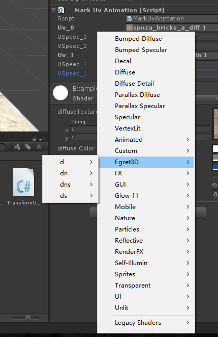

	2. 如果需要使用transparent的透明效果，可以调节Egret3D目录下shader的cutAlpha值进行实现。

## 资源导入 ##
	1.将导出资源文件夹放入如图所示位置：
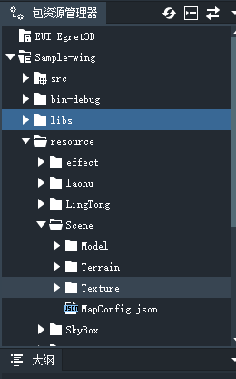

	2.使用maploader进行读取使用：
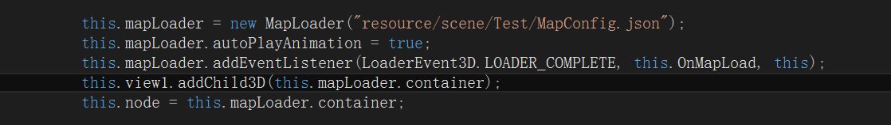

## Alpha错乱问题 ##
	1.点击工具栏，选取InitEgretLayer按钮，如图所示。
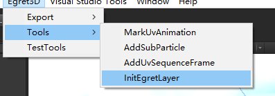  
	
	2.设置存在问题对象的layer层次，如图所示，完毕后导出即可。
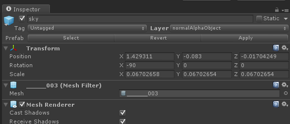  

## Shader调节示例 ##
	1.选中如图所示mesh。
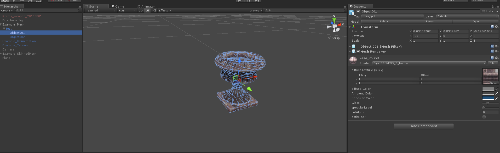

	2.调节颜色值，可以看到显著变化。（当前版本unity显示与Egret3D引擎内，会存在色差问题，建议以Egret3D为准对颜色进行调整）
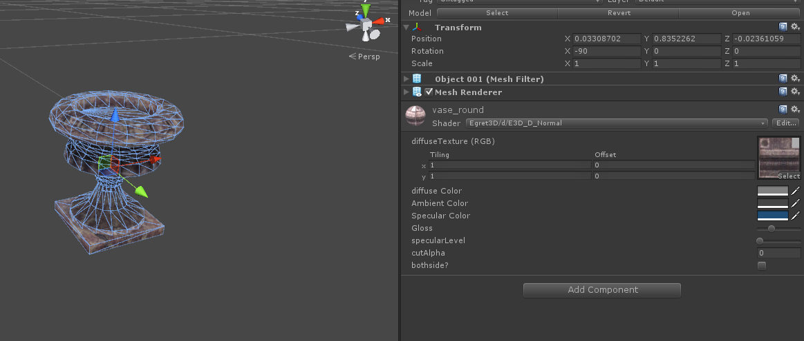

	3.对于如何扣除图片的透明像素的处理方法，我们可以使用cutalpha功能进行实现。	
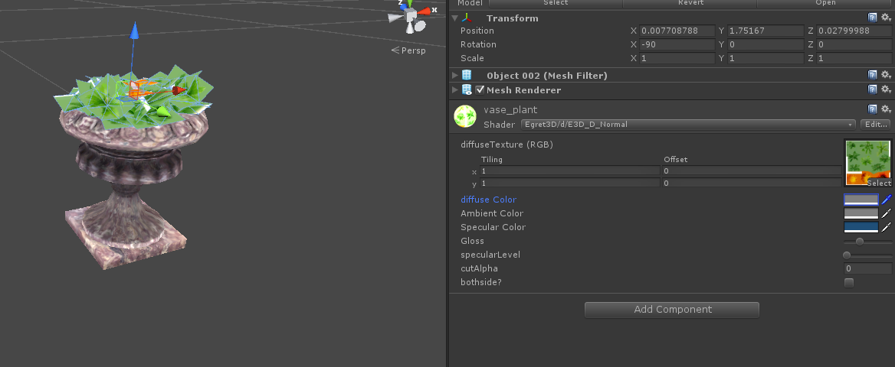
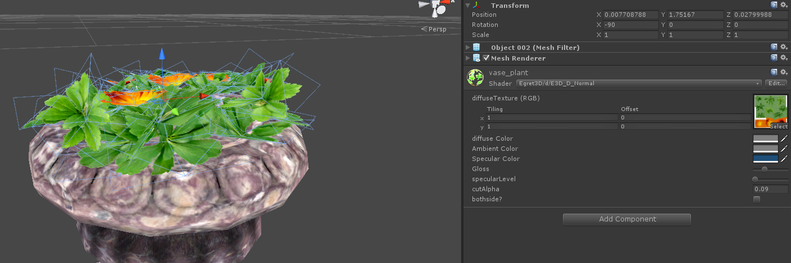
