## 需要的环境 ##
	1.安装unity3d 4.x版本，推荐4.7.1,暂时不兼容5.x版本。  

## 注意事项 ##
	1.当前该导出工具仅支持导出模型与灯光，骨骼动画，其他功能尚不支持，等待添加。  
	2.exr图片格式导出时，会存在损失，如果追求质量，可以使用photoshop单独处理exr格式图片，覆盖导出文件即可。  
	3.当使用在MaterialShader.cs中没有预先定定义过的shader时候，会报错，参考MaterialShader.cs中代码，补全所需即可。   

## 场景导出使用说明 ##
	1.打开unity，导入unity4.7.1_Egret3D.unitypackage
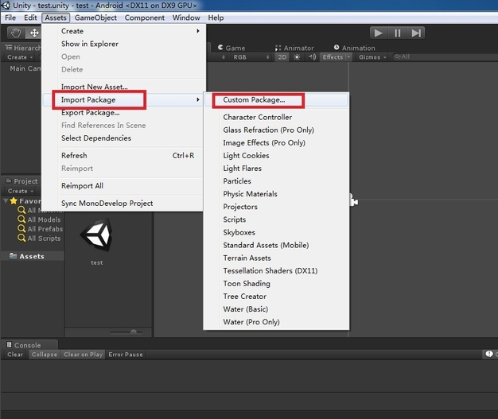

	2.打开场景sence，在编辑器中运行一次。
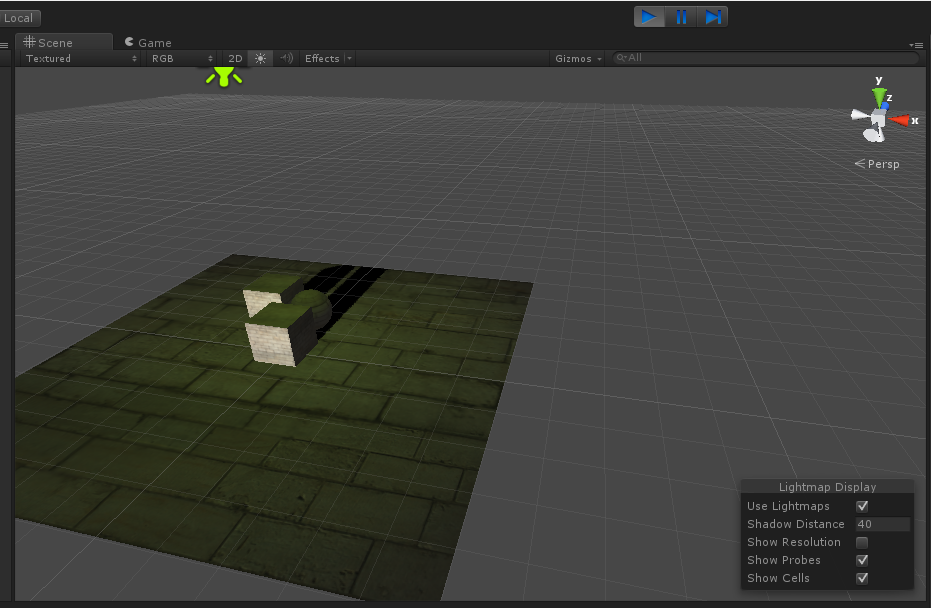

	3.打开工具栏，运行Egret3D/ExportScene。
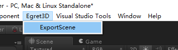

	4.导出资源位于Assets\Egret3D\Egret3DSence文件下。
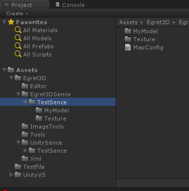

	5.将导出的场景资源文件放入Egret3D引擎内，读取该场景即可。
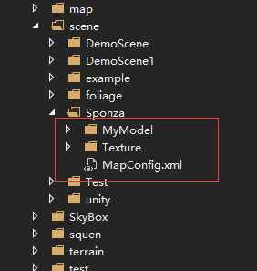

	6.运行查看结果。
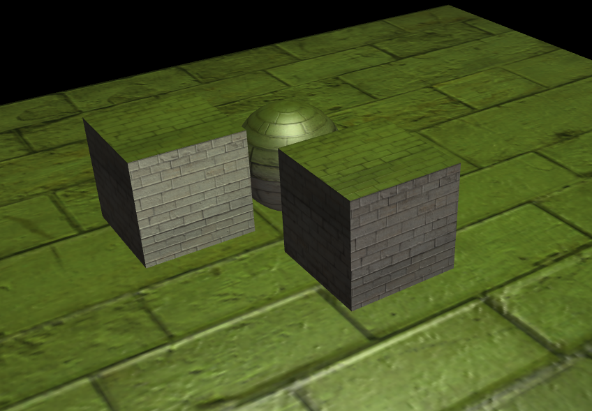

## 场景目录 ##
	1.文件夹MyModel，保存了从unity3d中导出的esm模型信息文件。  
	2.文件夹Texture，保存了从unity3d中导出的图片文件。  
	2.配置表MapConfig.xml，保存了unity3d的场景信息，即Egret3D的场景信息配置表。  
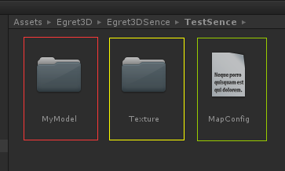

## 骨骼动画导出使用说明 ##
	1.打开场景sence，在编辑器中运行一次。

	2.打开工具栏，运行Egret3D/SkinnedMeshRendererExport。
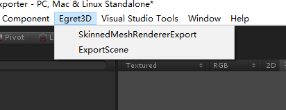

	3.导出界面说明。
		a.第一栏为导出资源路径位置。
		b.工具将罗列出当前所有可见状态下skinnedMesh对象。
		c.检查每个子项中，动画对象，mesh对象以及根骨骼对象是否存在错误。
		b.多个根骨骼需要手动绑定。
		e.确认无误后，使用导出功能。
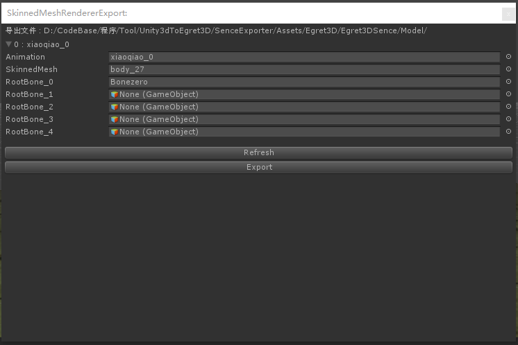

	5.将导出的场景资源文件放入Egret3D引擎内，读取该场景即可。
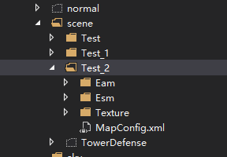

	6.运行查看结果。
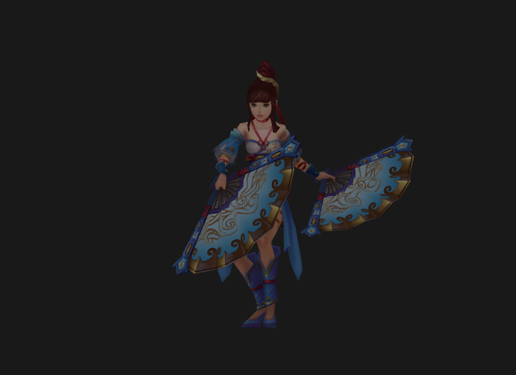
