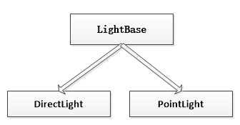

灯光模块
----------
相关代码全部放在源码目录中的`lights`文件夹中。

其中不同类继承关系如下：

所有类型的灯光全部继承自`LightBase`，`LightBase`中封装了与灯光有关的共同属性。

`lightType`：灯光类型，其值来自`LightType`枚举定义。

`intensity`：灯光强度，最小值为0，最大值没有上限。

`halfIntensity`：背光强度。

`ambient`：背光的颜色，背光也是环境光，物体接受一个灯光时，未照射到的部分可使用背光来添加灯光照射效果。这样可以使用背光来代替另外一盏灯光。

`diffuse`：慢反射颜色。

`specular`：灯光在照射到物体时，其镜面高光的反射颜色。

