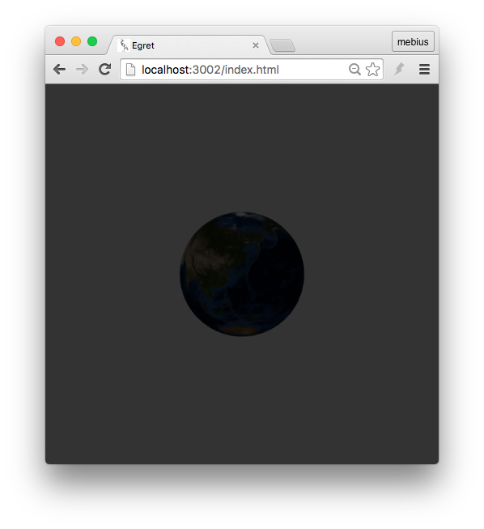
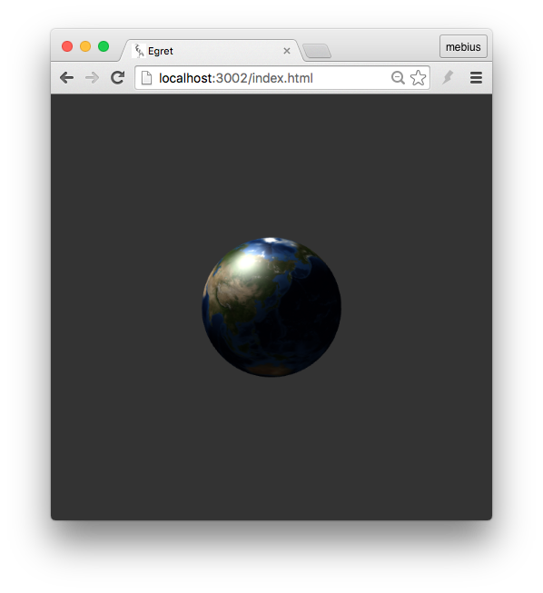
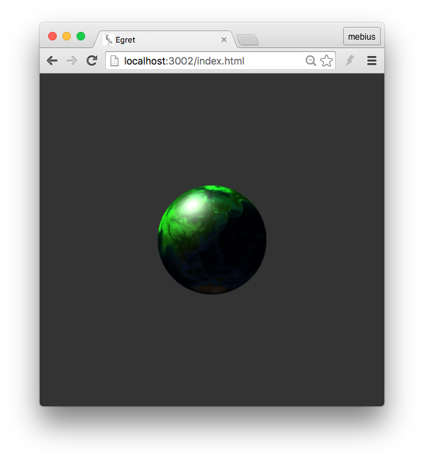
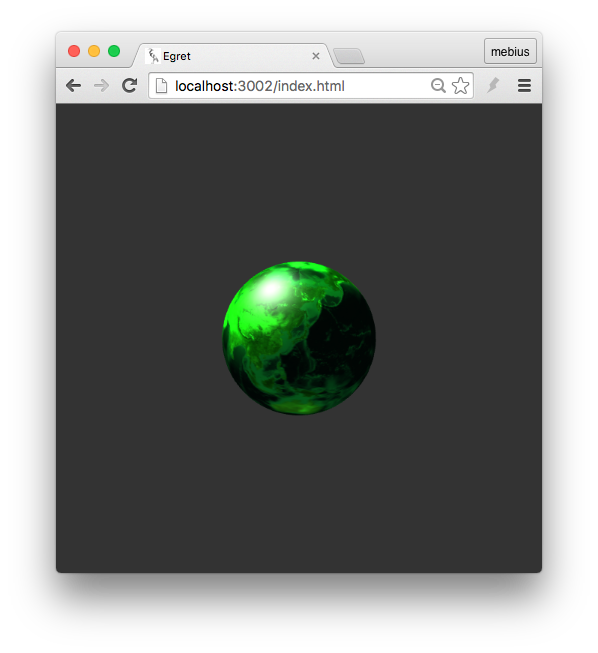

平行光是一种只有方向，强度和颜色的灯光。

Egret3D中，创建平行光可以使用`DirectLight`类。在创建光线过程中，需要指定其方向。

下面代码创建了一个未添加光照的物体。


```
class DirectLightDemo extends LoadingUI
{
    protected _egret3DCanvas: egret3d.Egret3DCanvas;
    protected _view3D: egret3d.View3D;
    protected _sphere: egret3d.Mesh;

    public constructor() {
        super();

        ///创建Canvas对象。
        this._egret3DCanvas = new egret3d.Egret3DCanvas();
        ///Canvas的起始坐标，页面左上角为起始坐标(0,0)。
        this._egret3DCanvas.x = 0;
        this._egret3DCanvas.y = 0;
        ///设置Canvas页面尺寸。
        this._egret3DCanvas.width = window.innerWidth;
        this._egret3DCanvas.height = window.innerHeight;
        ///创建View3D对象,页面左上角为起始坐标(0,0),其参数依次为:
        ///@param x: number 起始坐标x,
        ///@param y: number 起始坐标y
        ///@param  width: number 显示区域的宽
        ///@param  height: number 显示区域的高
        this._view3D = new egret3d.View3D(0,0,window.innerWidth,window.innerHeight);
        ///当前对象对视位置,其参数依次为:
        ///@param pos 对象的位置
        ///@param target 目标的位置
        this._view3D.camera3D.lookAt(new egret3d.Vector3D(300,300,-300),new egret3d.Vector3D(0,0,0));
        ///View3D的背景色设置
        this._view3D.backColor = 0xff333333;
        ///将View3D添加进Canvas中
        this._egret3DCanvas.addView3D(this._view3D);

        ///启动Canvas。
        this._egret3DCanvas.start();
        this.CloseLoadingView();

        this.loadtexture();
    }

    private loadtexture()
    {
        var loader:egret3d.URLLoader = new egret3d.URLLoader();
        loader.addEventListener(egret3d.LoaderEvent3D.LOADER_COMPLETE,this.onload,this);
        loader.load("resource/texture.jpg");
    }

    private onload(evt:egret3d.LoaderEvent3D)
    {
        ///创建颜色材质
        var mat: egret3d.TextureMaterial = new egret3d.TextureMaterial(evt.loader.data);
        ///创建立方体对象
        var geometery: egret3d.SphereGeometry = new egret3d.SphereGeometry(70,50,50);
        ///通过材质和立方体对象生成Mesh
        this._sphere = new egret3d.Mesh(geometery,mat);
        ///将mesh插入view3D
        this._view3D.addChild3D(this._sphere);
    }
}
```

编译，运行效果如下：



接下来，我们添加一个颜色为白色，强度为1，方向为`(1,-1,0)`的平行光。代码如下：

```
private creatLight()
{
    var lightGroup:egret3d.LightGroup = new egret3d.LightGroup();
    var light:egret3d.DirectLight = new egret3d.DirectLight(new egret3d.Vector3D(1, -1, 0));
    lightGroup.addLight(light);
    light.diffuse = 0xffffff;
    light.intensity = 1;  //光线强度
    this._sphere.material.lightGroup = lightGroup;
}
```

在`onload()`函数最后一行调用`createLight()`方法。

编译后运行效果如图：



我们将光线的颜色改为`0x00ff00`纯绿色，同时将强度修改为`2`，来对比光线对物体成像所产生的不同效果。

修改如下代码：

```
light.diffuse = 0x00ff00;
light.intensity = 2;
```

编译并运行，效果如下：



在`DirectLight`类中，提供了一个名称为`ambient`，该属性需要设置一个ARGB颜色值，用来设定你的环境光的颜色。

我们在`createLight()`方法中，添加对于`ambient`属性的设置。

```
light.ambient = 0xffffffff;
```

编译后运行，效果如下：




