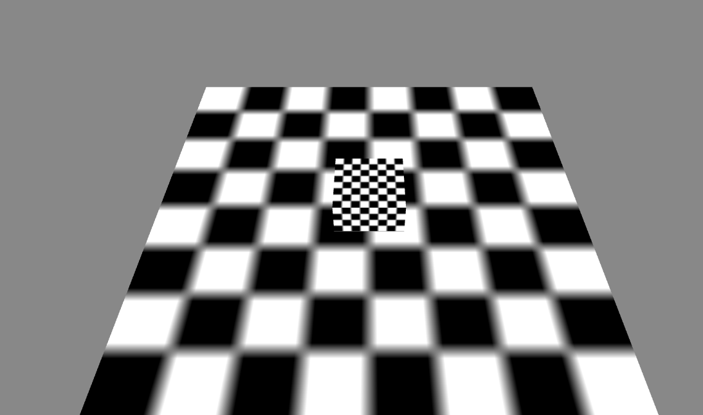
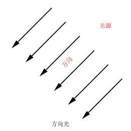
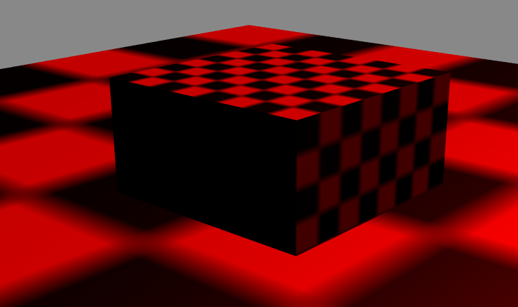
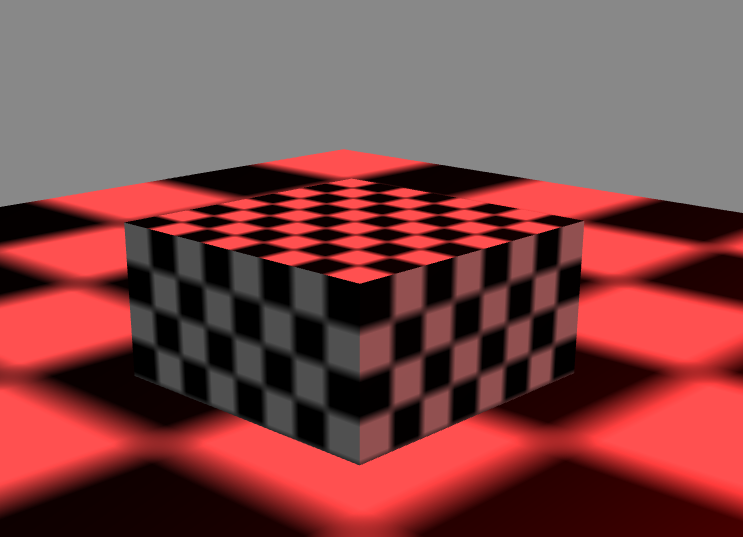

平行光
----------

* 演示准备

----------

	创建一个演示场景：
	class Main {
	
	    protected _egret3DCanvas: egret3d.Egret3DCanvas;
	    protected view1: egret3d.View3D;
	    protected cameraCtl: egret3d.LookAtController;
	
	    public constructor() {
	
	        ///创建3DCanvas
	        this._egret3DCanvas = new egret3d.Egret3DCanvas();
	        this._egret3DCanvas.x = 0;
	        this._egret3DCanvas.y = 0;
	        this._egret3DCanvas.width = window.innerWidth;
	        this._egret3DCanvas.height = window.innerHeight;
	        this._egret3DCanvas.start();
	        ///创建View3D
	        this.view1 = new egret3d.View3D(0, 0, window.innerWidth, window.innerHeight);
	        this.view1.camera3D.lookAt(new egret3d.Vector3D(0, 100, -100), new egret3d.Vector3D(0, 0, 0));
	        this.view1.backColor = 0xff888888;
	        this._egret3DCanvas.addView3D(this.view1);
	        ///创建相机控制器
	        this.cameraCtl = new egret3d.LookAtController(this.view1.camera3D, new egret3d.Object3D());
	        this.cameraCtl.distance = 150;
	        this.cameraCtl.rotationX = 60;
	        ///启动3DCanvas，注册每帧更新事件
	        this._egret3DCanvas.start();
	        this._egret3DCanvas.addEventListener(egret3d.Event3D.ENTER_FRAME, this.update, this);
	        ///创建立方体，放置于场景内(0,0,0)位置
	        var mat_cube: egret3d.TextureMaterial = new egret3d.TextureMaterial();
	        var geometery_Cube: egret3d.CubeGeometry = new egret3d.CubeGeometry();
	        var cube = new egret3d.Mesh(geometery_Cube, mat_cube);
	        this.view1.addChild3D(cube);
	        ///创建面片，放置于场景内(0,0,0)位置
	        var mat_Plane: egret3d.TextureMaterial = new egret3d.TextureMaterial();
	        var geometery_Plane: egret3d.PlaneGeometry = new egret3d.PlaneGeometry();
	        var plane = new egret3d.Mesh(geometery_Plane, mat_Plane);
	        this.view1.addChild3D(plane);
	    }
	
	
	    
	    public update(e: egret3d.Event3D) {
	        ///更新控制器
	        this.cameraCtl.update();
	    }
	}  

----------

* DirectLight 方向光

----------

	1）什么是方向光：
		平行光又称为方向光（Directional Light），是一组没有衰减的平行的光线，类似太阳光的效果。

	2）方向光的模型如图：

	3) 给演示场景添加一个方向光：
		在演示代码的构造函数尾部我们可以添加如下代码：

    	///创建一个灯光组，该灯光组将管理场景内的灯光资源
        var lights: egret3d.LightGroup = new egret3d.LightGroup();
        ///创建一个方向光对象，其中参数(-0.5, -0.6, 0.2)为方向向量，为灯光方向，默认方向为0, 0, 1)。
        var dirLight: egret3d.DirectLight = new egret3d.DirectLight(new egret3d.Vector3D(-0.5, -0.6, 0.2));
        ///灯光漫反射颜色是红色，默认为白色
        dirLight.diffuse = 0xff0000;
        ///写入组
        lights.addLight(dirLight);
        ///设置灯效组。
        cube.material.lightGroup = lights;
        plane.material.lightGroup = lights;
  

		还可以修改灯光的背光颜色，如下所示：  

 		///创建一个灯光组，该灯光组将管理场景内的灯光资源
        var lights: egret3d.LightGroup = new egret3d.LightGroup();
        ///创建一个方向光对象，其中参数(-0.5, -0.6, 0.2)为方向向量，为灯光方向，默认方向为0, 0, 1)。
        var dirLight: egret3d.DirectLight = new egret3d.DirectLight(new egret3d.Vector3D(-0.5, -0.6, 0.2));
        ///灯光漫反射颜色是红色，默认为白色
        dirLight.diffuse = 0xff0000;
        ///灯光背光颜色是灰色，默认为黑色
        dirLight.ambient = 0x505050;
        ///写入组
        lights.addLight(dirLight);

        ///设置灯效组。
        cube.material.lightGroup = lights;
        plane.material.lightGroup = lights;
  

----------