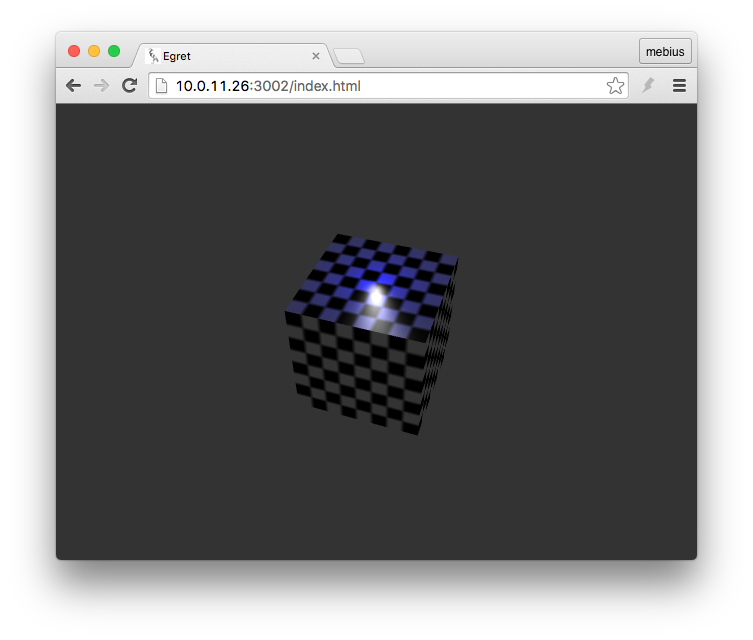

点光源是一种比较常用的灯光类型，你可以将点光源想象为三维场景中的一个灯泡，它将在一定范围内产生光照，这个范围可以归纳为一个可设置半径的球体。

与平行光不同，点光源是一个有位置，有半径和颜色的光源。由于点光源的特性，它并不存在所谓的方向，而是需要一个位置。我们来看一个具体的点光源示例。

```
class PointLigthDemo extends LoadingUI
{
    protected _egret3DCanvas: egret3d.Egret3DCanvas;
    protected _view3D: egret3d.View3D;
    protected _sphere: egret3d.Mesh;

    public constructor() {
        super();

        ///创建Canvas对象。
        this._egret3DCanvas = new egret3d.Egret3DCanvas();
        ///Canvas的起始坐标，页面左上角为起始坐标(0,0)。
        this._egret3DCanvas.x = 0;
        this._egret3DCanvas.y = 0;
        ///设置Canvas页面尺寸。
        this._egret3DCanvas.width = window.innerWidth;
        this._egret3DCanvas.height = window.innerHeight;
        ///创建View3D对象,页面左上角为起始坐标(0,0),其参数依次为:
        ///@param x: number 起始坐标x,
        ///@param y: number 起始坐标y
        ///@param  width: number 显示区域的宽
        ///@param  height: number 显示区域的高
        this._view3D = new egret3d.View3D(0,0,window.innerWidth,window.innerHeight);
        ///当前对象对视位置,其参数依次为:
        ///@param pos 对象的位置
        ///@param target 目标的位置
        this._view3D.camera3D.lookAt(new egret3d.Vector3D(100,300,-300),new egret3d.Vector3D(0,0,0));
        ///View3D的背景色设置
        this._view3D.backColor = 0xff333333;
        ///将View3D添加进Canvas中
        this._egret3DCanvas.addView3D(this._view3D);

        ///启动Canvas。
        this._egret3DCanvas.start();
        this.CloseLoadingView();

        ///创建颜色材质
        var mat: egret3d.TextureMaterial = new egret3d.TextureMaterial();
        ///创建立方体对象
        var geometery: egret3d.CubeGeometry = new egret3d.CubeGeometry(100,100,100);
        ///通过材质和立方体对象生成Mesh
        this._sphere = new egret3d.Mesh(geometery,mat);
        ///将mesh插入view3D
        this._view3D.addChild3D(this._sphere);
        this.creatLight();
    }

    private creatLight()
    {
        var lightGroup:egret3d.LightGroup = new egret3d.LightGroup();
        var light:egret3d.PointLight = new egret3d.PointLight(0x0000ff);
        lightGroup.addLight(light);
        light.radius = 2;
        light.falloff = 0.1;
        light.y = 60;
        this._sphere.material.lightGroup = lightGroup;
    }
}
```

上面的示例中，我们创建了一个宽高深度均为100的立方体。并且在物体上方放置了一盏颜色为蓝色，半径为2的电光源，同时设置其衰减度属性为0.1。最终编译运行效果如图：



### radius 灯光半径

### 	falloff 灯光衰减度