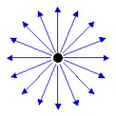
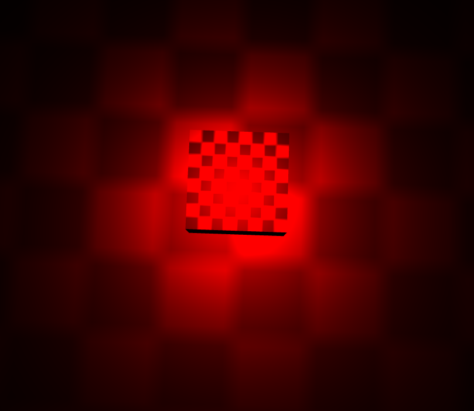
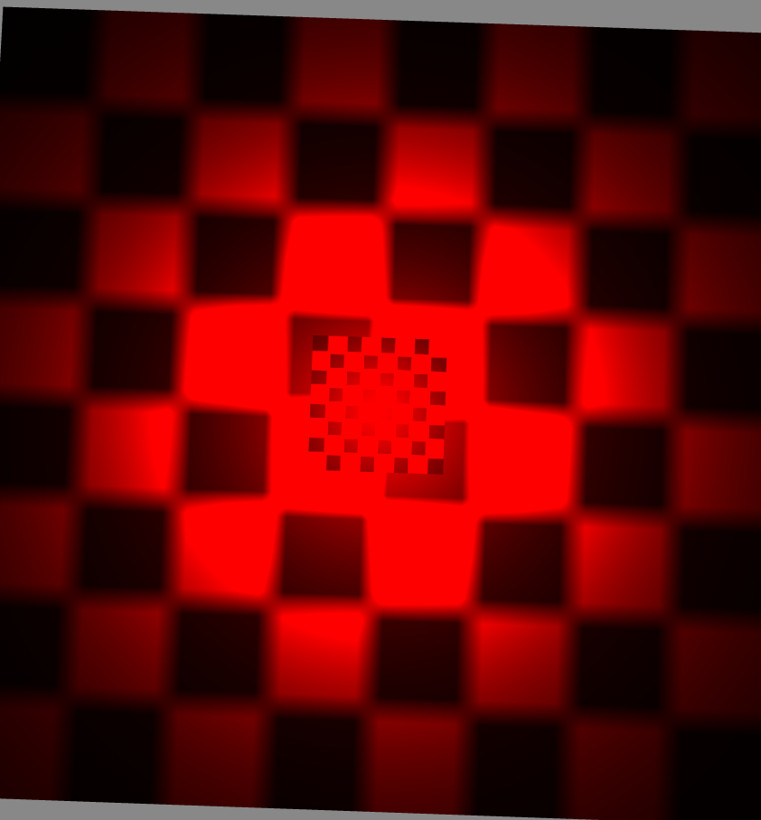
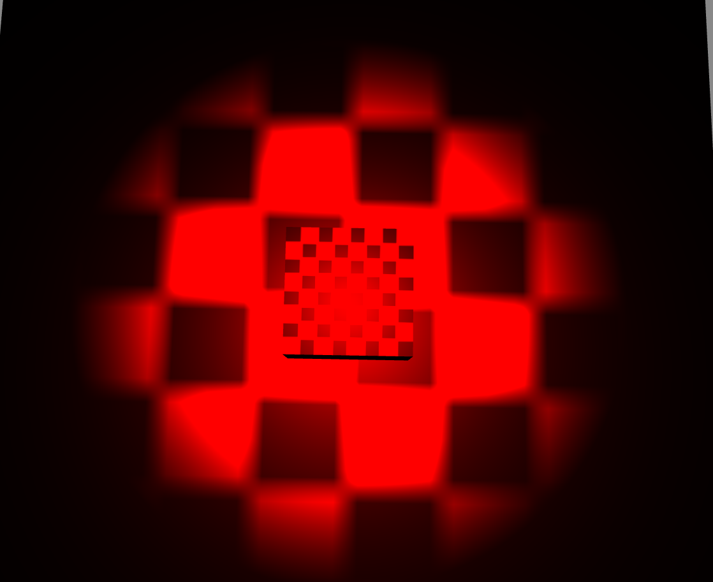
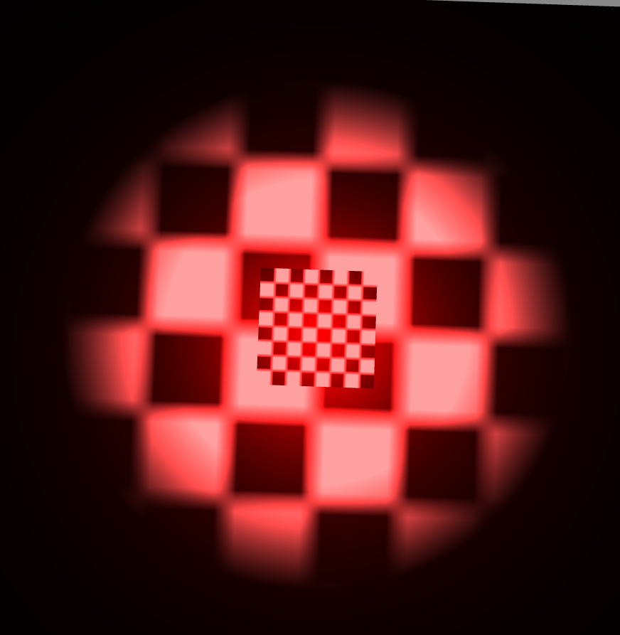

点光源
----------

* 演示准备

----------

	创建一个演示场景：
	class Main {
	
	    protected _egret3DCanvas: egret3d.Egret3DCanvas;
	    protected view1: egret3d.View3D;
	    protected cameraCtl: egret3d.LookAtController;
	
	    public constructor() {
	
	        ///创建3DCanvas
	        this._egret3DCanvas = new egret3d.Egret3DCanvas();
	        this._egret3DCanvas.x = 0;
	        this._egret3DCanvas.y = 0;
	        this._egret3DCanvas.width = window.innerWidth;
	        this._egret3DCanvas.height = window.innerHeight;
	        this._egret3DCanvas.start();
	        ///创建View3D
	        this.view1 = new egret3d.View3D(0, 0, window.innerWidth, window.innerHeight);
	        this.view1.camera3D.lookAt(new egret3d.Vector3D(0, 100, -100), new egret3d.Vector3D(0, 0, 0));
	        this.view1.backColor = 0xff888888;
	        this._egret3DCanvas.addView3D(this.view1);
	        ///创建相机控制器
	        this.cameraCtl = new egret3d.LookAtController(this.view1.camera3D, new egret3d.Object3D());
	        this.cameraCtl.distance = 150;
	        this.cameraCtl.rotationX = 60;
	        ///启动3DCanvas，注册每帧更新事件
	        this._egret3DCanvas.start();
	        this._egret3DCanvas.addEventListener(egret3d.Event3D.ENTER_FRAME, this.update, this);
	        ///创建立方体，放置于场景内(0,0,0)位置
	        var mat_cube: egret3d.TextureMaterial = new egret3d.TextureMaterial();
	        var geometery_Cube: egret3d.CubeGeometry = new egret3d.CubeGeometry();
	        var cube = new egret3d.Mesh(geometery_Cube, mat_cube);
	        this.view1.addChild3D(cube);
	        ///创建面片，放置于场景内(0,0,0)位置
	        var mat_Plane: egret3d.TextureMaterial = new egret3d.TextureMaterial();
	        var geometery_Plane: egret3d.PlaneGeometry = new egret3d.PlaneGeometry();
	        var plane = new egret3d.Mesh(geometery_Plane, mat_Plane);
	        this.view1.addChild3D(plane);
	    }
	
	
	    
	    public update(e: egret3d.Event3D) {
	        ///更新控制器
	        this.cameraCtl.update();
	    }
	}  

----------

	1）什么是点光源：
		点光源是理想化为质点点光源。点光源是抽象化了的物理概念，点光源在现实中也是不存在的，指的是从一个点向周围空间均匀发光的光源，类似蜡烛的光照效果。

	2）点光源的模型如图：
  

	3) 给演示场景添加一个点光源： 

 		///创建一个灯光组，该灯光组将管理场景内的灯光资源
        var lights: egret3d.LightGroup = new egret3d.LightGroup();
        ///创建一个点光源
        var pointLight: egret3d.PointLight = new egret3d.PointLight();
        ///设置点光源高度为100
        pointLight.y = 100;
        ///灯光漫反射颜色是红色，默认为白色
        pointLight.diffuse = 0xff0000;
        ///写入组
        lights.addLight(pointLight);
        ///设置灯效组。
        cube.material.lightGroup = lights;
        plane.material.lightGroup = lights;
  

	还可以修改点光源的半径，如下所示：  

        ///创建一个灯光组，该灯光组将管理场景内的灯光资源
        var lights: egret3d.LightGroup = new egret3d.LightGroup();
        ///创建一个点光源
        var pointLight: egret3d.PointLight = new egret3d.PointLight();
        ///设置点光源高度为100
        pointLight.y = 100;
        ///灯光漫反射颜色是红色,默认为白色
        pointLight.diffuse = 0xff0000;
        ///设置点光源半径，默认点光源半径为100，这里我们扩大一倍。
        pointLight.radius = 200;
        ///写入组
        lights.addLight(pointLight);
        ///设置灯效组。
        cube.material.lightGroup = lights;
        plane.material.lightGroup = lights;
  

	还可以修改点光源的衰减度，如下所示：  

        ///创建一个灯光组，该灯光组将管理场景内的灯光资源
        var lights: egret3d.LightGroup = new egret3d.LightGroup();
        ///创建一个点光源
        var pointLight: egret3d.PointLight = new egret3d.PointLight();
        ///设置点光源高度为100
        pointLight.y = 100;
        ///灯光漫反射颜色是红色,默认为白色
        pointLight.diffuse = 0xff0000;
        ///设置点光源半径，默认点光源半径为100，这里我们扩大2倍。
        pointLight.radius = 300
        ///设置点光源衰减值，默认值0.01，这里设置为0.5。
        pointLight.cutoff = 0.5;
        ///写入组
        lights.addLight(pointLight);
        ///设置灯效组。
        cube.material.lightGroup = lights;
        plane.material.lightGroup = lights;
  

	还可以修改灯光的背光颜色，如下所示： 
        ///创建一个灯光组，该灯光组将管理场景内的灯光资源
        var lights: egret3d.LightGroup = new egret3d.LightGroup();
        ///创建一个点光源
        var pointLight: egret3d.PointLight = new egret3d.PointLight();
        ///设置点光源高度为100
        pointLight.y = 100;
        ///灯光漫反射颜色是红色,默认为白色
        pointLight.diffuse = 0xff0000;
        ///灯光背光颜色是灰色，默认为黑色
        pointLight.ambient = 0x505050;
        ///设置点光源半径，默认点光源半径为100，这里我们扩大2倍。
        pointLight.radius = 300
        ///设置点光源衰减值，默认值0.01，这里设置为0.5。
        pointLight.cutoff = 0.5;
        ///写入组
        lights.addLight(pointLight);
        ///设置灯效组。
        cube.material.lightGroup = lights;
        plane.material.lightGroup = lights;
  