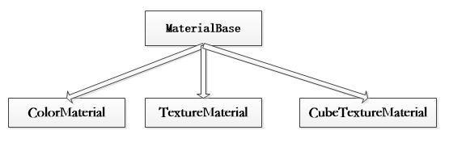

简单的说就是物体看起来是什么质地。材质可以看成是材料和质感的结合。

在渲染程式中，它是表面各可视属性的结合，这些可视属性是指表面的色彩、纹理、光滑度、透明度、发光度等。

正是有了这些属性，才能让我们识别三维中的模型是什么做成的，也正是有了模型材质。

只有IRender对象才会有材质信息，每个IRender对象还有可能会有多材质。

材质对象中的diffusePass可以添加各种特效方法，在特效中会有介绍。

你可以使用的材质类型包含如下三种:

- ColorMaterial 颜色材质
- CubeTextureMaterial 立方体纹理材质
- TextureMaterial 纹理材质

结构图

