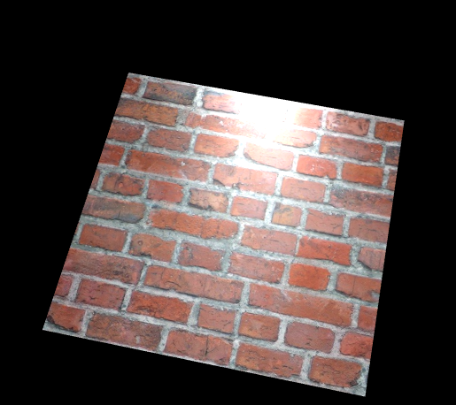
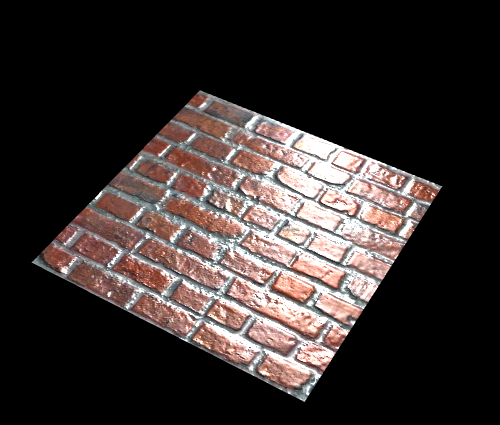
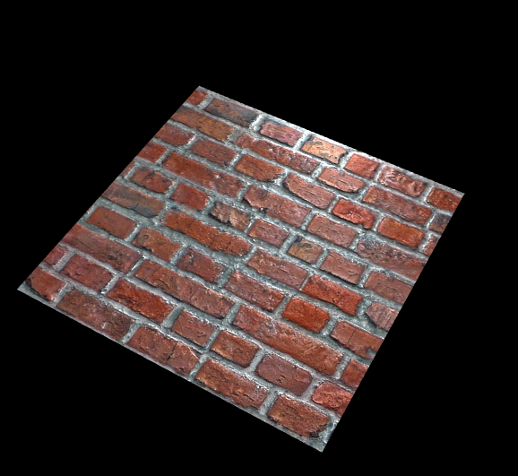
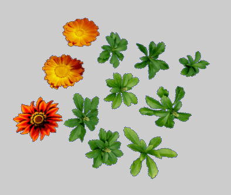
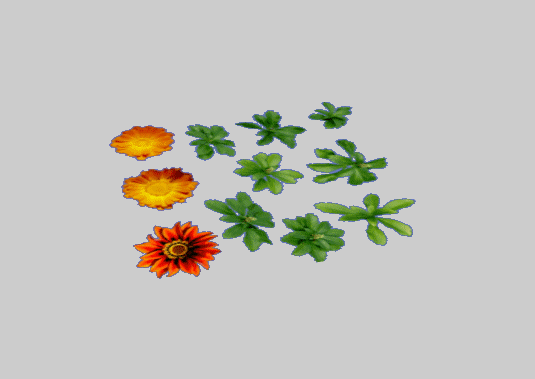

材质
----------
设置普通贴图、法线贴图、高光贴图

    // 加载漫反射贴图 法线贴图 高光贴图
    protected loaderAsset() {
        var loader: egret3d.QueueLoader = new egret3d.QueueLoader();
        loader.addEventListener(egret3d.LoaderEvent3D.LOADER_COMPLETE, this.onAssetComplete, this);

        loader.load("resource/doc/materail/brick-diffuse.jpg");
        loader.load("resource/doc/materail/brick-normal.jpg");
        loader.load("resource/doc/materail/brick-specular.jpg");
    }

    // 
    protected onAssetComplete(e: egret3d.LoaderEvent3D) {
        var loader: egret3d.QueueLoader = e.target; 
        var plane: egret3d.Mesh = new egret3d.Mesh(new egret3d.PlaneGeometry(300, 300));
        this.view.addChild3D(plane);

        plane.material.ambientColor = 0xcccccc;
        var p0: egret3d.PointLight = new egret3d.PointLight(0xffffff);

        // 设置点光源的坐标
        p0.y = 50;
        p0.z = 200;

        this.lights.addLight(p0);

        plane.material.lightGroup = this.lights;

        // 设置漫反射贴图
        plane.material.diffuseTexture = loader.getAsset("resource/doc/materail/brick-diffuse.jpg");

        // 设置法线贴图
        plane.material.normalTexture = loader.getAsset("resource/doc/materail/brick-normal.jpg");

        // 设置高光贴图
        plane.material.specularTexture = loader.getAsset("resource/doc/materail/brick-specular.jpg");
    }

----------

	普通贴图加灯光后的效果：

	加入法线贴图加灯光后的效果：

	加入高光贴图加灯光后的效果：

----------

设置cutAlpha
----------

    // 把一张透明贴图 cut alpha
    protected useCutAlpha() {
        var plane: egret3d.Mesh = new egret3d.Mesh(new egret3d.PlaneGeometry(300, 300));
        this.view.addChild3D(plane);
        plane.material.diffuseTexture = this.queueLoader.getAsset("resource/doc/materail/cut.png");
        plane.material.cutAlpha = 0.5;
    }

----------

设置贴图双面渲染
----------

    // 把一张透明贴图 cut alpha
    protected useCutAlpha() {
        var plane: egret3d.Mesh = new egret3d.Mesh(new egret3d.PlaneGeometry(300, 300));
        this.view.addChild3D(plane);
        plane.material.diffuseTexture = this.queueLoader.getAsset("resource/doc/materail/cut.png");
        plane.material.cutAlpha = 0.5;

        // 设置双面渲染
        plane.material.bothside = true;
    }

----------