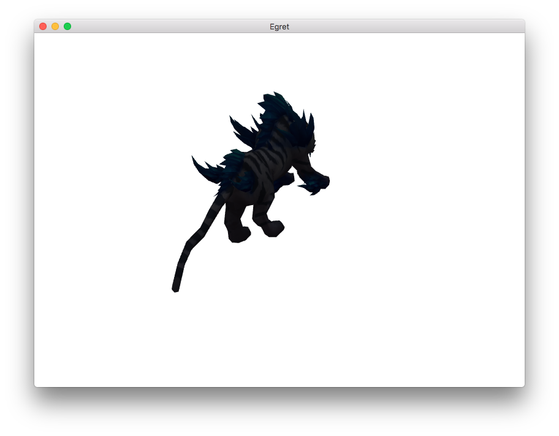

静态模型需要先加载esm文件，然后进行模型创建渲染。导出方法请参考《Egret3D 模型导出》部分。

首先，通过`URLLoader`加载已经制作好的模型文件。

```
var loader:egret3d.URLLoader = new egret3d.URLLoader();
        loader.addEventListener(egret3d.LoaderEvent3D.LOADER_COMPLETE,this.onLoad,this);
loader.load("resource/laohu/Mon_04.esm");

private onLoad(evt: egret3d.LoaderEvent3D)
{
}
```

当文件加载完成后，可以通过`evt.loader.data`访问到被加载的数据。

> 需要注意的是，由于URLLoader内部已包含文件解析功能，此时我们获取到的数据类型为`egret3d.Geometry`。

当获取到`egret3d.Geometry`文件，我们可以借助`Mesh`来创建我们的可视化对象。

接下来，创建一个`TextureMaterial`纹理材质，并通过`URLLoader`加载模型对应的贴图文件。

与此同时，你可以创建`Mesh`对象，并将其添加到view中。代码如下：

```
private _mat:egret3d.TextureMaterial;
private _mesh:egret3d.Mesh;
private _geom:egret3d.Geometry;
private onLoad(evt: egret3d.LoaderEvent3D)
{
        this._geom = evt.loader.data;
        this._mat = new egret3d.TextureMaterial();
        this._mesh = new egret3d.Mesh(this._geom, this._mat);
        this._mesh.rotation = new egret3d.Vector3D(30,30,0);
        this._view.addChild3D( this._mesh );


        var loader:egret3d.URLLoader = new egret3d.URLLoader();
        loader.addEventListener(egret3d.LoaderEvent3D.LOADER_COMPLETE,this.onTextureLoad,this);
        loader.load("resource/laohu/Mon_04.png");
}
```

当我们的贴图纹理加载完成后，可以将其设置给`TextureMaterial`的`diffuseTexture`漫反射属性。代码如下：

```
private onTextureLoad(evt: egret3d.LoaderEvent3D)
{
        var texture:egret3d.ImageTexture = evt.loader.data;
        this._mat.diffuseTexture = texture;
}
```

至此，我们的静态模型使用的代码就已经全部完成，编译并运行，效果如图：



完整代码如下：

```
class Main extends egret.DisplayObject{
    // Canvas操作对象
    protected _egret3DCanvas: egret3d.Egret3DCanvas;
    
    // View3D操作对象
    protected _view: egret3d.View3D;
    /**
    * look at 摄像机控制器 。</p>
    * 指定摄像机看向的目标对象。</p>
    * 1.按下鼠标左键并移动鼠标可以使摄像机绕着目标进行旋转。</p>
    * 2.按下键盘的(w s a d) 可以摄像机(上 下 左 右)移动。</p>
    * 3.滑动鼠标滚轮可以控制摄像机的视距。</p>
    */
    private cameraCtl: egret3d.LookAtController;

    // 灯光组
    private lights: egret3d.LightGroup = new egret3d.LightGroup();

    // 模型对象
    private model: egret3d.Mesh;
    
    // 待机动画
    private idle: egret3d.SkeletonAnimationClip;
    
    // 加载界面
    private loadingUI = new LoadingUI();
    public constructor() {
        super();
        
        //创建Canvas对象。
        this._egret3DCanvas = new egret3d.Egret3DCanvas();
        //Canvas的起始坐标，页面左上角为起始坐标(0,0)。
        this._egret3DCanvas.x = 0;
        this._egret3DCanvas.y = 0;
        //设置Canvas页面尺寸。
        this._egret3DCanvas.width = window.innerWidth;
        this._egret3DCanvas.height = window.innerHeight;
        
        //创建View3D对象,页面左上角为起始坐标(0,0)
        this._view = new egret3d.View3D(0,0,window.innerWidth,window.innerHeight);
        //当前对象对视位置,其参数依次为:
        //@param pos 对象的位置
        //@param target 目标的位置
        this._view.camera3D.lookAt(new egret3d.Vector3D(0,0,1000),new egret3d.Vector3D(0,0,0));
        //View3D的背景色设置
        this._view.backColor = 0xffffffff;
        //将View3D添加进Canvas中
        this._egret3DCanvas.addView3D(this._view);
        
        //启动Canvas。
        this._egret3DCanvas.start();
        
        this.loadingUI.CloseLoadingView();

        var loader:egret3d.URLLoader = new egret3d.URLLoader();
        loader.addEventListener(egret3d.LoaderEvent3D.LOADER_COMPLETE,this.onLoad,this);
        loader.load("resource/laohu/Mon_04.esm");

    }
    
    private _mat:egret3d.TextureMaterial;
    private _mesh:egret3d.Mesh;
    private _geom:egret3d.Geometry;
    private onLoad(evt: egret3d.LoaderEvent3D)
    {
        this._geom = evt.loader.data;
        this._mat = new egret3d.TextureMaterial();
        this._mesh = new egret3d.Mesh(this._geom, this._mat);
        this._mesh.rotation = new egret3d.Vector3D(30,30,0);
        this._view.addChild3D( this._mesh );


        var loader:egret3d.URLLoader = new egret3d.URLLoader();
        loader.addEventListener(egret3d.LoaderEvent3D.LOADER_COMPLETE,this.onTextureLoad,this);
        loader.load("resource/laohu/Mon_04.png");
    }

    private onTextureLoad(evt: egret3d.LoaderEvent3D)
    {
        var texture:egret3d.ImageTexture = evt.loader.data;
        this._mat.diffuseTexture = texture;
    }
    
}     
```