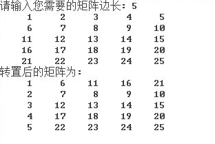

3D基本变换
===============

## 3D矩阵（Matrix4_4） ##

    * Matrix4_4 类表示一个转换矩阵，该矩阵描述了三维 (3D) 显示对象的缩放/旋转/位移
    * 该矩阵可以追加转换功能，包括缩放/旋转/位移
    * Matrix4_4 类可用于视锥投影，这会将 3D 坐标空间中的点映射到二维 (2D) 视图，常用有透视投影和正交投影
    * 单一矩阵可以将多个转换组合在一起，并一次性对 3D 显示对象应用这些转换
    * 例如，可以将一个矩阵应用于 3D 坐标，以便依次执行旋转和平移
    
---------

* lookAt:从3D坐标点A观察坐标点B，设定观察视角的正上方，获得满足这个条件的矩阵
 	* 可以用于控制相机或者显示对象的方向，使面向目标
 	* egret3d.Camera3D和egret3d.Object3D已经封装过该函数，你只需要调用camera3D.lookAt()或者object3D.lookAt()
 	
----------

	var matrix: egret3d.Matrix4_4 = new egret3d.Matrix4_4();
    var eyePosition: egret3d.Vector3D = new egret3d.Vector3D(0, 0, 0);
    var atPosition: egret3d.Vector3D = new egret3d.Vector3D(100, 20, 40);
    matrix.lookAt(eyePosition, atPosition, egret3d.Vector3D.Y_AXIS);

	//matrix
	//[0]	0.3713906705379486	Number
	//[1]	-0.16951587796211243	Number
	//[2]	0.9128709435462952	Number
	//[3]	0	Number
	//[4]	0	Number
	//[5]	0.9831920862197876	Number
	//[6]	0.18257418274879455	Number
	//[7]	0	Number
	//[8]	-0.9284766912460327	Number
	//[9]	-0.06780634820461273	Number
	//[10]	0.3651483654975891	Number
	//[11]	0	Number
	//[12]	0	Number
	//[13]	0	Number
	//[14]	0	Number
	//[15]	1	Number

----------

* multiply:矩阵相乘
 	* 矩阵A和矩阵B相乘的得到矩阵C
 	* 一个3D对象，先使用矩阵A进行转换，然后用矩阵B进行转换，其结果与直接用C矩阵转换是等价的操作
 	* 注意前乘和后乘的区别，矩阵相乘不满足交换律
 	
----------

	var matrix1: egret3d.Matrix4_4 = new egret3d.Matrix4_4();
	var matrix2: egret3d.Matrix4_4 = new egret3d.Matrix4_4();
    matrix1.multiply(matrix2);

----------

* perspective:生成一个透视投影矩阵
 	* 通过设定视锥体的空间数据，包括远近裁剪面距离/观察范围夹角/屏幕横纵比，获得矩阵
 	* egret3d.Camera3D封装有该矩阵的方法调用，通过设定CameraType即可自动构造透视投影矩阵
 	* 3D场景渲染中会使用到该功能
 	
----------

	var projectMatrix: egret3d.Matrix4_4 = new egret3d.Matrix4_4();
	var fovY:number = 60;
	var aspectRatio:number = 3/4;
	var near:number = 1;
	var far:number = 10000;
	//构造透视投影矩阵
    projectMatrix.perspective(fovY, aspectRatio, near, far);

----------

* ortho:生成一个正交投影矩阵
 	* 通过设定视锥体的空间数据，包括远近裁剪面距离/屏幕宽度和高度
 	* egret3d.Camera3D封装有该矩阵的方法调用，通过设定CameraType即可自动构造正交投影矩阵
 	* GUI和HUD的渲染会使用到该功能
 	
----------

	var projectMatrix: egret3d.Matrix4_4 = new egret3d.Matrix4_4();
	var width:number = 1024;
	var height:number = 768;
	var near:number = 1;
	var far:number = 10000;
	//构造正交投影矩阵
    projectMatrix.ortho(fovY, aspectRatio, near, far);

----------

* fromToRotation:获得一个矩阵，使他能够将A向量变换成B向量
	 
----------

	var matrix:egret3d.Matrix4_4 = new egret3d.Matrix4_4();
	var direction1:egret3d.Vector3D = new egret3d.Vector3D(-1,0,2,1);
	var direction2:egret3d.Vector3D = new egret3d.Vector3D(10,5,1,1);
	direction1.normalize();
	direction2.normalize();
	//求出模型矩阵
	matrix.fromToRotation(direction1, direction2);
	
---------

* append:矩阵前乘
 	* 与multiply相同
 	
----------

	var matrix1: egret3d.Matrix4_4 = new egret3d.Matrix4_4();
	var matrix2: egret3d.Matrix4_4 = new egret3d.Matrix4_4();
    matrix1.append(matrix2);

----------

* appendRotation:获得一个矩阵，该矩阵描述着绕设定的旋转轴旋转一定的角度
 
----------

	var matrix: egret3d.Matrix4_4 = new egret3d.Matrix4_4();
	var axis: egret3d.Vector3D = new egret3d.Vector3D(1, -1, 10, 1);
	axis.normalize();
	//围绕axis指定的方向，旋转45度角
    matrix.appendRotation(45, axis);

----------

* appendScale:追加三轴缩放值
	* 将当前的矩阵追加xyz三个方向缩放值
 
----------

	var matrix: egret3d.Matrix4_4 = new egret3d.Matrix4_4();
	var scaleX:number = 0.5;
	var scaleY:number = 1.5;
	var scaleZ:number = 2.5;
	//X Y Z 方向分别缩放 0.5 1.5 2.5
	matrix.appendScale(scaleX, scaleY, scaleZ);
	
	//matrix
	//[0]	0.5	Number
	//[1]	0	Number
	//[2]	0	Number
	//[3]	0	Number
	//[4]	0	Number
	//[5]	1.5	Number
	//[6]	0	Number
	//[7]	0	Number
	//[8]	0	Number
	//[9]	0	Number
	//[10]	2.5	Number
	//[11]	0	Number
	//[12]	0	Number
	//[13]	0	Number
	//[14]	0	Number
	//[15]	1	Number

----------

* appendTranslation:追加平移数据
	* 将当前的矩阵追加xyz三个方向平移数据
 
----------

	var matrix: egret3d.Matrix4_4 = new egret3d.Matrix4_4();
	var offsetX:number = 0.5;
	var offsetY:number = 1.5;
	var offsetZ:number = 2.5;
	//X Y Z 方向分别平移 0.5 1.5 2.5
	matrix.appendTranslation(offsetX, offsetY, offsetZ);
	
	//matrix
	//[0]	1	Number
	//[1]	0	Number
	//[2]	0	Number
	//[3]	0	Number
	//[4]	0	Number
	//[5]	1	Number
	//[6]	0	Number
	//[7]	0	Number
	//[8]	0	Number
	//[9]	0	Number
	//[10]	1	Number
	//[11]	0	Number
	//[12]	0.5	Number
	//[13]	1.5	Number
	//[14]	2.5	Number
	//[15]	1	Number

----------

* decompose:分解一个矩阵，获得缩放/平移/旋转数据
	* 分解得出的结果为egret3D.Vector3D的数组中，长度为3.其中第一个记录平移数据，第二个记录旋转数据，第三个记录缩放数据
	* 需要指定旋转数据格式，请参照egret3d.Orientation3D中枚举出的3个值
 
----------

	var matrix: egret3d.Matrix4_4 = new egret3d.Matrix4_4();

	var offsetX:number = 0.2;
	var offsetY:number = 0.4;
	var offsetZ:number = 0.6;
	//X Y Z 方向分别平移 0.2 0.4 0.6
	matrix.appendTranslation(offsetX, offsetY, offsetZ);

	var scaleX:number = 0.5;
	var scaleY:number = 1.5;
	var scaleZ:number = 2.5;
	//X Y Z 方向分别缩放 0.5 1.5 2.5
	matrix.appendScale(scaleX, scaleY, scaleZ);

	var axis: egret3d.Vector3D = new egret3d.Vector3D(1, -1, 10, 1);
	axis.normalize();
	//围绕axis指定的方向，旋转45度角
    matrix.appendRotation(45, axis);

	//拆分矩阵
	var result:egret3d.Vector3D[] = matrix.decompose(egret3d.Orientation3D.QUATERNION);
	var pos:egret3d.Vector3D = result[0];
    var rot:egret3d.Vector3D = result[1];
    var scale:egret3d.Vector3D = result[2];
	
	//<-0.41275760531425476, 0.34762030839920044, 1.5260378122329712>
	//<0.03789130620377082, -0.037891307211827124, 0.37891307413438385, 0.9238795211721623>
	//<0.5000000018751693, 1.5000000284558414, 2.49999994435313>

----------

* deltaTransformVector:按照该矩阵所包含的旋转信息，变换另外一个向量
	* 向量没有平移信息
 
----------

	var matrix: egret3d.Matrix4_4 = new egret3d.Matrix4_4();

	var offsetX:number = 0.2;
	var offsetY:number = 0.4;
	var offsetZ:number = 0.6;
	//X Y Z 方向分别平移 0.2 0.4 0.6
	matrix.appendTranslation(offsetX, offsetY, offsetZ);

	var scaleX:number = 0.5;
	var scaleY:number = 1.5;
	var scaleZ:number = 2.5;
	//X Y Z 方向分别缩放 0.5 1.5 2.5
	matrix.appendScale(scaleX, scaleY, scaleZ);

	var axis: egret3d.Vector3D = new egret3d.Vector3D(1, -1, 10, 1);
	axis.normalize();
	//围绕axis指定的方向，旋转45度角
    matrix.appendRotation(45, axis);

	//给定原向量
	var direction:egret3d.Vector3D = new egret3d.Vector3D(10, 10, -5, 1);
	direction.normalize();

	matrix.deltaTransformVector(direction, direction);
	
	//w	0	Number
	//x	-0.43193634599447245	Number
	//y	1.024675299723943	Number
	//z	-0.75433882077535	Number

----------

* transformVector:使用当前矩阵变换另外一个位置点
	* 初始位置被变换之后，得到的结果为按照当前矩阵所给定的数据获得的新位置
	* 坐标数据不包含缩放/旋转信息
 
----------

	var matrix: egret3d.Matrix4_4 = new egret3d.Matrix4_4();

	var offsetX:number = 0.2;
	var offsetY:number = 0.4;
	var offsetZ:number = 0.6;
	//X Y Z 方向分别平移 0.2 0.4 0.6
	matrix.appendTranslation(offsetX, offsetY, offsetZ);

	var scaleX:number = 0.5;
	var scaleY:number = 1.5;
	var scaleZ:number = 2.5;
	//X Y Z 方向分别缩放 0.5 1.5 2.5
	matrix.appendScale(scaleX, scaleY, scaleZ);

	var axis: egret3d.Vector3D = new egret3d.Vector3D(1, -1, 10, 1);
	axis.normalize();
	//围绕axis指定的方向，旋转45度角
    matrix.appendRotation(45, axis);

	//给定原向量
	var direction:egret3d.Vector3D = new egret3d.Vector3D(10, 10, -5, 1);
	direction.normalize();

	matrix.transformVector(direction, direction);
	
	//w	1	Number
	//x	-0.8446939513087273	Number
	//y	1.3722956081231434	Number
	//z	0.7716989914576212	Number

----------

* invert:获取当前矩阵的逆矩阵
	* 理想状态下，矩阵和逆矩阵的乘积为单位矩阵
	* 不是所有的矩阵都有逆矩阵
 
----------

	var matrix: egret3d.Matrix4_4 = new egret3d.Matrix4_4();

	var offsetX:number = 0.2;
	var offsetY:number = 0.4;
	var offsetZ:number = 0.6;
	//X Y Z 方向分别平移 0.2 0.4 0.6
	matrix.appendTranslation(offsetX, offsetY, offsetZ);

	var scaleX:number = 0.5;
	var scaleY:number = 1.5;
	var scaleZ:number = 2.5;
	//X Y Z 方向分别缩放 0.5 1.5 2.5
	matrix.appendScale(scaleX, scaleY, scaleZ);

	var axis: egret3d.Vector3D = new egret3d.Vector3D(1, -1, 10, 1);
	axis.normalize();
	//围绕axis指定的方向，旋转45度角
    matrix.appendRotation(45, axis);

	//给定原向量
	var direction:egret3d.Vector3D = new egret3d.Vector3D(10, 10, -5, 1);
	direction.normalize();

	var enable:boolean = matrix.invert();

	//enable : true

	//[0]	1.4199564456939697	Number
	//[1]	-0.46867436170578003	Number
	//[2]	-0.016519593074917793	Number
	//[3]	0	Number
	//[4]	1.394537091255188	Number
	//[5]	0.47331884503364563	Number
	//[6]	-0.03949161246418953	Number
	//[7]	0	Number
	//[8]	0.19745805859565735	Number
	//[9]	0.027532655745744705	Number
	//[10]	0.39770281314849853	Number
	//[11]	0	Number
	//[12]	-0.20000006258487701	Number
	//[13]	-0.4000000059604645	Number
	//[14]	-0.6000000238418579	Number
	//[15]	1	Number

----------

* makeTransform:输入缩放/旋转/位移信息，生成一个矩阵
	* 旋转数据为四元数格式
 
----------

	var matrix: egret3d.Matrix4_4 = new egret3d.Matrix4_4();

	var pos:egret3d.Vector3D = new egret3d.Vector3D(0.2, 0.4, 0.6, 1);
	var scale:egret3d.Vector3D = new egret3d.Vector3D(0.5, 1.5, 2.5, 1);
	var rot:egret3d.Quaternion = new egret3d.Quaternion(-1, 2, 10, 1);
	rot.normalize();
	//组装
    matrix.makeTransform(pos, scale, rot);

	//[0]	-0.4811320900917053	Number56939697	Number
	//[1]	0.07547169923782348	Number6170578003	Number
	//[2]	-0.11320754885673523	Number93074917793	Number
	//[3]	0	Number
	//[4]	-0.3396226465702057	Number1255188	Number
	//[5]	-1.3584905862808227	Number503364563	Number
	//[6]	0.5377358198165893	Number1246418953	Number
	//[7]	0	Number
	//[8]	-0.37735849618911743	Number859565735	Number
	//[9]	0.9905660152435303	Number5745744705	Number
	//[10]	2.264151096343994	Number314849853	Number
	//[11]	0	Number
	//[12]	0.20000000298023224	Number6258487701	Number
	//[13]	0.4000000059604645	Number059604645	Number
	//[14]	0.6000000238418579	Number238418579	Number
	//[15]	1	Number

----------

* recompose:输入缩放/旋转/位移信息，重组矩阵
	* 旋转数据为欧拉角格式
	* 该函数先将欧拉角转化成四元数，然后调用makeTransform方法实现
 
----------

	var matrix: egret3d.Matrix4_4 = new egret3d.Matrix4_4();

	var pos:egret3d.Vector3D = new egret3d.Vector3D(0.2, 0.4, 0.6, 1);
	var scale:egret3d.Vector3D = new egret3d.Vector3D(0.5, 1.5, 2.5, 1);
	var rot:egret3d.Vector3D = new egret3d.Vector3D(-1, 2, 10, 1);
	rot.normalize();
	//组装
    matrix.recompose([pos, rot, scale]);

----------

* transpose:转置一个矩阵，使矩阵按照右上和左下角互换规则交换所有数据
 
----------

----------

* lerp:矩阵插值操作
	* 从矩阵A到矩阵B通过输入0-1之间的一个时间作为插值系数，进行平滑插值
 
----------

	var matrixA: egret3d.Matrix4_4 = new egret3d.Matrix4_4();
	var matrixB: egret3d.Matrix4_4 = new egret3d.Matrix4_4();
	
	var result: egret3d.Matrix4_4 = new egret3d.Matrix4_4();
	var t:number = 0.2;
	result.lerp(matrixA, matrixB, t);

----------
       