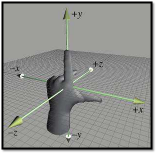
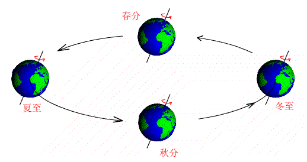
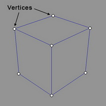
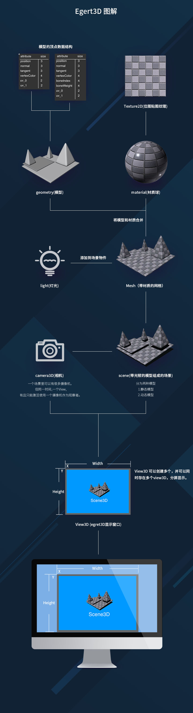

<!--
讨论：

文档的深度，是否需要推荐读者自行准备相关知识,推荐阅读书籍.

1. 3D 坐标系:Egret3D 中的左手坐标系， 多坐标系（世界坐标系，物体本地坐标系，摄像机坐标系）
2. 3D 中的方向与变换:向量，Egret3D中向量的表示形式(egret3d.Vector3D),射线(egret3d.Ray),Egret3D中四元数的表示形式(egret3d.Quaternion),矩阵变换(Matrix4_4)
3. 3D 中的三角网络:定点，法线向量
4. 3D 引擎渲染机制:简单介绍 3D 引擎渲染机制
-->
## 概述    
Egret3D 引擎的运行环境为在 HTML5 中的模式为 WebGL 的 Canvas，可以理解为  WebGL 的封装。    
由于3D引擎使用涉及比较专业的图形学知识，本教程对每一方面的知识只进行比较精要的说明，主要结合引擎本身的用法来说明。3D的基本知识可以通过市面上比较经典的书籍来学习。    
推荐：电子工业出版社的《WebGL编程指南》。

## 3D 坐标系

### 左手坐标系     
在3D空间，有三个互为垂直的方向，分别用X轴、Y轴和Z轴来表示。       
2D空间的坐标系通常只有两种，一种是X轴向右，Y轴向上；另一种是X轴向左，Y轴向上。Egret2D引擎即使用第一种坐标系。    
3D空间的坐标系也分为两种。但这两种坐标系中，X轴和Y轴均为X轴向右，Y轴向上。   
不同的是Z轴，为了便于快速确定方向，通常用左手和右手来进行记忆。Egret3D 引擎使用的是左手坐标系。   
伸出左手掌垂直向上，与屏幕平行，其中拇指与其他手指垂直指向右方。弯曲中指向前垂直指向屏幕，食指保持原位置。则拇指、食指和中指分别指向X轴、Y轴和Z轴的正向。如图所示：    
    

### 世界坐标系    
一个完整的3D场景，有大量的3D物体。要对所有这些3D物体进行定位，就需要一个统一的坐标系，这就是世界坐标系。   

### 物体本地坐标系
如前所述，所有3D场景中的物体对于都3D场景有一个坐标，这是世界坐标系。
而在具体的定位时对物体提供一个3D坐标，需要确定这个物体本身如何与这个坐标对应。这类似于2D引擎中的锚点信息。即3D物体本身有一个坐标原点，该物体在3D场景的坐标是以这个原点来对应设置的。这就是本地坐标系的原点。     
本地坐标系又称局部坐标系，这个坐标系也是有三个互相垂直的方向轴。   
物体的中心以及X、Y、Z轴的方向都是在建模时设置好的，这个坐标通常位于规则3D物体的中心，当然可以在创建3D模型时随意调整。
 当3D物体进行自身旋转是围绕本地坐标系的某个方向轴进行的，缩放或平移是以本地坐标系原点来设置的。    
     
一个大家熟知的世界坐标系和本地坐标系的对比例子是地球的公转和自转。地球的自转是相对于地球的本地坐标系，地球的公转是相对于以太阳的球心为原点的世界坐标系。         

### 摄像机坐标系
3D场景中世界坐标系和所有其中的3D物体所具有的本地坐标系可以精确定位一个完整的场景。然而，最终在用户屏幕上如何显示还需要一个坐标系，那就是视觉坐标系，或者称之为摄像机坐标系。就是从哪里观察这个3D场景，以及以什么角度观察。   
摄像机坐标系可以理解为一个特殊的物体本地坐标系，只不过这个物体不会有任何显示。而只是一个3D场景观察者。所以摄像机坐标系的坐标是相对于世界坐标系的。     

## 3D 中的基本几何概念
### 顶点    
无论是2D还是3D图形，顶点都是最基本的几何元素。   

### 三角形          
构成三维模型的基本单位是三角形。不管三维模型的形状有多么复杂，其基本组成都是三角形。只不过复杂的模型由更多的三角形构成而已。    

### 矢量   
矢量也称为向量，通常用来表示三维空间中的一个坐标点。
Egret3D 中使用 Vector3D  来表示矢量。这个类的构造函数原型为：   
`Vector3D ( x:number, y:number, z:number, w:number );`    
前三个容易理解，就是X轴、Y轴和Z轴的坐标值。第四个值w默认值为 1.0，当给其以不同的值则可作为一种透视投影的三维位置或投影，也可以做四元数中的第四个值w。

### 射线    
射线即为初中几何中所涉及的射线概念。当然，这里的射线是三维空间的。   
定义射线很简单，有一个给定的原点，以及任何一个射线上的其他点。这两个点可以明确表示射线的方向。   
射线在 Egret3D 中用 Ray 表示。如上文所述，构造函数只需要提供两个点：     
`Ray( origin:egret3d.Vector3D,direction:egret3d.Vector3D );`     

## 3D 中的方向与变换

### 法线     
三维平面的法线是垂直于该平面的三维向量。曲面在某点P处的法线为垂直于该点切平面的向量。    
![220px-SurfaceNormalDrawing][]     
曲面法线的法向不具有唯一性；在相反方向的法线也是曲面法线。定向曲面的法线通常按照右手定则来确定。    
在三维计算机图形学中通常使用曲面法线进行光照计算。   

### 矩阵变换    
在3D空间的对象都需要最基本的三种变换：位置、旋转和缩放。如果对每个顶点进行复杂多种形式的变换，多次运算的计算量将会相当大。就需要有一种更高效的方式。     
3D图形学广泛采用的方法是用矩阵实现变换。矩阵可以将若干不同的变换复合成一个矩阵。每个顶点只需要进行一次矩阵变换就可以得到相应的结果值。    
Egret3D中的4乘4矩阵用类 Matrix4_4 来表示。这个类的构造函数原型为：    
`Matrix4_4( datas:Float32Array )`

### 四元数   
在3D空间，相对于位置的变化或比例缩放，旋转更为复杂。按照我们的习惯，我们更加熟悉的是另外两种旋转的表示方法——矩阵旋转和欧拉旋转。矩阵旋转使用了一个4*4大小的矩阵来表示绕任意轴旋转的变换矩阵，而欧拉选择则是按照一定的坐标轴顺序（例如先x、再y、最后z）、每个轴旋转一定角度来变换坐标或向量，它实际上是一系列坐标轴旋转的组合。    
然而，在实际的3D开发中，还有一种比较抽象的旋转表示方法，叫四元数。其相对于上述两种旋转表示有以下优点：    
* 可以避免万向节锁现象；   
* 只需要一个4维的四元数就可以执行绕任意过原点的向量的旋转，方便快捷，在某些实现下比旋转矩阵效率更高；   
* 可以提供平滑插值；    
在 Egret3D 中，Quaternion类定义了一个四元数表示物体在空间的旋转。     
四元数包含一个标量和一个三维向量分量，四元数Q可以记为：
`Q=[w,(x,y,z)]`    
在3D数学中使用单位四元数来表示旋转，对于三维空间中旋转轴为n，旋转角度为α的旋转，如果用四元数表示，这几个分量分别为：    
`w=cos(α/2)
x=sin(α/2) * cos(βx)
y=sin(α/2) * cos(βy)
z=sin(α/2) * cos(βz)
`     
其中 `cos(βx)`、`cos(βy)`、`cos(βz)`分别为旋转轴的x,y,z分量。这个类的构造函数原型为：    
`Quaternion ( x :number, y :number, z :number, w :number )`

## 3D 引擎渲染机制

### 图形渲染管线(Pipeline)     
在 Egret3D 中任何事物都在3D空间中，但是屏幕和窗口是一个2D像素阵列，所以 Egret3D 的大部分工作都是关于如何把3D坐标转变为适应你屏幕的2D像素。3D坐标转为2D坐标的处理过程是由 Egret3D 的图形渲染管线管理的。图形渲染管线可以被划分为两个主要部分：第一个部分把你的3D坐标转换为2D坐标，第二部分是把2D坐标转变为实际的有颜色的像素。       
Pipeline，大多译为管线，实际上指的是一堆原始图形数据途经一个输送管道，期间经过各种变化处理最终出现在屏幕的过程。      

### 着色器    
图形渲染管线接收一组3D坐标，然后把它们转变为你屏幕上的有色2D像素。图形渲染管线可以被划分为几个阶段，每个阶段需要把前一个阶段的输出作为输入。所有这些阶段都是高度专门化的(它们有一个特定的函数)，它们能简单地并行执行。由于它们的并行执行特性，当今大多数显卡都有成千上万的小处理核心，在GPU上为每一个(渲染管线)阶段运行各自的小程序，从而在图形渲染管线中快速处理你的数据。这些小程序叫做 着色器(Shader)。

### OpenGL着色器语言    
有些着色器允许开发者自己配置，我们可以用自己写的着色器替换默认的。这样我们就可以更细致地控制图形渲染管线中的特定部分了，因为它们运行在GPU上，所以它们会节约宝贵的CPU时间。OpenGL着色器是用OpenGL着色器语言(OpenGL Shading Language, GLSL)写成。   
在下面，你会看到一个图形渲染管线的每个阶段的抽象表达。要注意蓝色部分代表的是我们可以自定义的着色器。   
       

###  流程图

