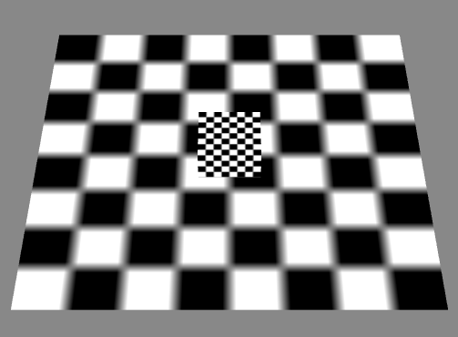
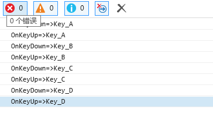

KeyEvent3D

----------

* 演示准备

----------

	创建一个演示场景：
	class Main {
	
	    protected _egret3DCanvas: egret3d.Egret3DCanvas;
	    protected view1: egret3d.View3D;
	    protected cube: egret3d.Mesh;
	
	    public constructor() {
	
	        ///创建3DCanvas
	        this._egret3DCanvas = new egret3d.Egret3DCanvas();
	        this._egret3DCanvas.x = 0;
	        this._egret3DCanvas.y = 0;
	        this._egret3DCanvas.width = window.innerWidth;
	        this._egret3DCanvas.height = window.innerHeight;
	        this._egret3DCanvas.start();
	        ///创建View3D
	        this.view1 = new egret3d.View3D(0, 0, window.innerWidth, window.innerHeight);
	        this.view1.camera3D.lookAt(new egret3d.Vector3D(0, 1000, -1000), new egret3d.Vector3D(0, 0, 0));
	        this.view1.backColor = 0xff888888;
	        this._egret3DCanvas.addView3D(this.view1);
	        ///启动3DCanvas
	        this._egret3DCanvas.start();
	        ///创建立方体，放置于场景内(0,0,0)位置
	        var mat_cube: egret3d.TextureMaterial = new egret3d.TextureMaterial();
	        var geometery_Cube: egret3d.CubeGeometry = new egret3d.CubeGeometry();
	        this.cube = new egret3d.Mesh(geometery_Cube, mat_cube);
	        this.view1.addChild3D(this.cube);
	        ///创建面片，放置于场景内(0,0,0)位置
	        var mat_Plane: egret3d.TextureMaterial = new egret3d.TextureMaterial();
	        var geometery_Plane: egret3d.PlaneGeometry = new egret3d.PlaneGeometry();
	        var plane = new egret3d.Mesh(geometery_Plane, mat_Plane);
	        this.view1.addChild3D(plane);
	
	    }
	
	}  

	1) 在egret3d.KeyCode内引擎定义了所有Key的枚举类型，详细可以参考引擎内的枚举值。
	2) 按键事件分别为：KEY_DOWN 按键每次按下时响应和KEY_UP 按键每次回弹时响应。
	3) 示例代码：
			
			class Main {
			
			    protected _egret3DCanvas: egret3d.Egret3DCanvas;
			    protected view1: egret3d.View3D;
			    protected cube: egret3d.Mesh;
			
			    public constructor() {
			
			        ///创建3DCanvas
			        this._egret3DCanvas = new egret3d.Egret3DCanvas();
			        this._egret3DCanvas.x = 0;
			        this._egret3DCanvas.y = 0;
			        this._egret3DCanvas.width = window.innerWidth;
			        this._egret3DCanvas.height = window.innerHeight;
			        this._egret3DCanvas.start();
			        ///创建View3D
			        this.view1 = new egret3d.View3D(0, 0, window.innerWidth, window.innerHeight);
			        this.view1.camera3D.lookAt(new egret3d.Vector3D(0, 1000, -1000), new egret3d.Vector3D(0, 0, 0));
			        this.view1.backColor = 0xff888888;
			        this._egret3DCanvas.addView3D(this.view1);
			        ///启动3DCanvas，注册每帧更新事件
			        this._egret3DCanvas.start();
			        ///创建立方体，放置于场景内(0,0,0)位置
			        var mat_cube: egret3d.TextureMaterial = new egret3d.TextureMaterial();
			        var geometery_Cube: egret3d.CubeGeometry = new egret3d.CubeGeometry();
			        this.cube = new egret3d.Mesh(geometery_Cube, mat_cube);
			        this.view1.addChild3D(this.cube);
			        ///创建面片，放置于场景内(0,0,0)位置
			        var mat_Plane: egret3d.TextureMaterial = new egret3d.TextureMaterial();
			        var geometery_Plane: egret3d.PlaneGeometry = new egret3d.PlaneGeometry();
			        var plane = new egret3d.Mesh(geometery_Plane, mat_Plane);
			        this.view1.addChild3D(plane);
			        ///注册事件，需要依次写入事件标识符，注册方法和注册对象。
			        egret3d.Input.addEventListener(egret3d.KeyEvent3D.KEY_DOWN, this.OnKeyDown, this);
			        egret3d.Input.addEventListener(egret3d.KeyEvent3D.KEY_UP, this.OnKeyUp, this);
			    }
			
			    ///按键按下事件响应,其中e: egret3d.KeyEvent3D会作为参数传递给响应事件。
			    public OnKeyDown(e: egret3d.KeyEvent3D) {
			        ///e.keyCode保存了触发该次事件的按键枚举值，通过转换成字符串可以输出。
			        var code = egret3d.KeyCode[e.keyCode];
			        console.log("OnKeyDown=>" + code);
			    }
			    ///按键弹回事件响应,其中e: egret3d.KeyEvent3D会作为参数传递给响应事件。
			    public OnKeyUp(e: egret3d.KeyEvent3D) {
			         ///e.keyCode保存了触发该次事件的按键枚举值，通过转换成字符串可以输出。
			        var code = egret3d.KeyCode[e.keyCode];
			        console.log("OnKeyUp=>" + code);
			    }
			}      

