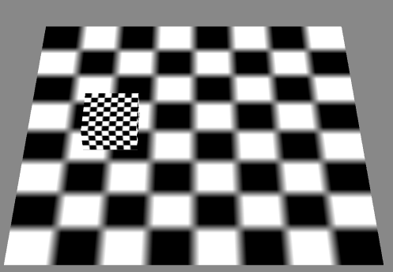

帧事件

----------

* 演示准备

----------

	创建一个演示场景：
	class Main {
	
	    protected _egret3DCanvas: egret3d.Egret3DCanvas;
	    protected view1: egret3d.View3D;
	    protected cube: egret3d.Mesh;
	
	    public constructor() {
	
	        ///创建3DCanvas
	        this._egret3DCanvas = new egret3d.Egret3DCanvas();
	        this._egret3DCanvas.x = 0;
	        this._egret3DCanvas.y = 0;
	        this._egret3DCanvas.width = window.innerWidth;
	        this._egret3DCanvas.height = window.innerHeight;
	        this._egret3DCanvas.start();
	        ///创建View3D
	        this.view1 = new egret3d.View3D(0, 0, window.innerWidth, window.innerHeight);
	        this.view1.camera3D.lookAt(new egret3d.Vector3D(0, 1000, -1000), new egret3d.Vector3D(0, 0, 0));
	        this.view1.backColor = 0xff888888;
	        this._egret3DCanvas.addView3D(this.view1);
	        ///启动3DCanvas
	        this._egret3DCanvas.start();
	        ///创建立方体，放置于场景内(0,0,0)位置
	        var mat_cube: egret3d.TextureMaterial = new egret3d.TextureMaterial();
	        var geometery_Cube: egret3d.CubeGeometry = new egret3d.CubeGeometry();
	        this.cube = new egret3d.Mesh(geometery_Cube, mat_cube);
	        this.view1.addChild3D(this.cube);
	        ///创建面片，放置于场景内(0,0,0)位置
	        var mat_Plane: egret3d.TextureMaterial = new egret3d.TextureMaterial();
	        var geometery_Plane: egret3d.PlaneGeometry = new egret3d.PlaneGeometry();
	        var plane = new egret3d.Mesh(geometery_Plane, mat_Plane);
	        this.view1.addChild3D(plane);
	
	    }
	
	}      

	1) 该事件的持有对象为egret3d.Egret3DCanvas对象，所以注册该事件应该如示例代码所示：
		this._egret3DCanvas.addEventListener(egret3d.Event3D.ENTER_FRAME, this.OnUpdate, this);
	2）事件触发时，注册函数会传递一个类型为egret3d.Event3D的参数，其中egret3d.Event3D.delay为每帧间隔延时，egret3d.Event3D.time为当前时间戳；
	3) 示例代码：
		通过每帧更新控制cube进行x轴水平运动。

				class Main {
				
				    protected _egret3DCanvas: egret3d.Egret3DCanvas;
				    protected view1: egret3d.View3D;
				    protected cube: egret3d.Mesh;
				
				    private cur_x: number;
				    private radio: number = 1;;
				
				    public constructor() {
				        ///创建3DCanvas
				        this._egret3DCanvas = new egret3d.Egret3DCanvas();
				        this._egret3DCanvas.x = 0;
				        this._egret3DCanvas.y = 0;
				        this._egret3DCanvas.width = window.innerWidth;
				        this._egret3DCanvas.height = window.innerHeight;
				        this._egret3DCanvas.start();
				        ///创建View3D
				        this.view1 = new egret3d.View3D(0, 0, window.innerWidth, window.innerHeight);
				        this.view1.camera3D.lookAt(new egret3d.Vector3D(0, 1000, -1000), new egret3d.Vector3D(0, 0, 0));
				        this.view1.backColor = 0xff888888;
				        this._egret3DCanvas.addView3D(this.view1);
				        ///启动3DCanvas，注册每帧更新事件
				        this._egret3DCanvas.start();
				        ///创建立方体，放置于场景内(0,0,0)位置
				        var mat_cube: egret3d.TextureMaterial = new egret3d.TextureMaterial();
				        var geometery_Cube: egret3d.CubeGeometry = new egret3d.CubeGeometry();
				        this.cube = new egret3d.Mesh(geometery_Cube, mat_cube);
				        this.view1.addChild3D(this.cube);
				        ///创建面片，放置于场景内(0,0,0)位置
				        var mat_Plane: egret3d.TextureMaterial = new egret3d.TextureMaterial();
				        var geometery_Plane: egret3d.PlaneGeometry = new egret3d.PlaneGeometry();
				        var plane = new egret3d.Mesh(geometery_Plane, mat_Plane);
				        this.view1.addChild3D(plane);
				        ///注册事件，持有对象为_egret3DCanvas，每帧触发该注册方法，需要依次写入事件标识符，注册方法和注册对象。
				        this._egret3DCanvas.addEventListener(egret3d.Event3D.ENTER_FRAME, this.OnUpdate, this);
				    }
				
				
				    ///注册后，该事件将每帧响应
				    public OnUpdate(e: egret3d.Event3D) {
				        var speed = 0.04;
				        ///我们这里简单的控制cube的x值来进行水平位移动画
				        ///限制x的运动范围为-200至200之间。
				        if (this.cube.x > 200) {
				            this.radio = -1;
				        } else if (this.cube.x < -200) {
				            this.radio = 1;
				        }
				        ///通过速度和每帧间隔时长计算位移，radio是位移方向系数。
				        this.cube.x += speed * e.delay * this.radio;
				    }
				}      

