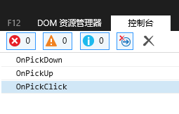
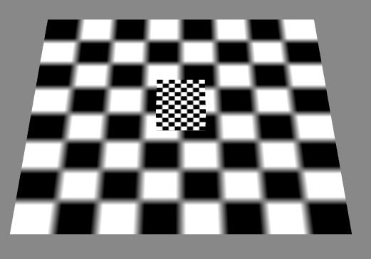

PickEvent3D拣选事件

----------

* 演示准备

----------

	创建一个演示场景：
	class Main {
	
	    protected _egret3DCanvas: egret3d.Egret3DCanvas;
	    protected view1: egret3d.View3D;
	    protected cube: egret3d.Mesh;
	
	    public constructor() {
	
	        ///创建3DCanvas
	        this._egret3DCanvas = new egret3d.Egret3DCanvas();
	        this._egret3DCanvas.x = 0;
	        this._egret3DCanvas.y = 0;
	        this._egret3DCanvas.width = window.innerWidth;
	        this._egret3DCanvas.height = window.innerHeight;
	        this._egret3DCanvas.start();
	        ///创建View3D
	        this.view1 = new egret3d.View3D(0, 0, window.innerWidth, window.innerHeight);
	        this.view1.camera3D.lookAt(new egret3d.Vector3D(0, 1000, -1000), new egret3d.Vector3D(0, 0, 0));
	        this.view1.backColor = 0xff888888;
	        this._egret3DCanvas.addView3D(this.view1);
	        ///启动3DCanvas
	        this._egret3DCanvas.start();
	        ///创建立方体，放置于场景内(0,0,0)位置
	        var mat_cube: egret3d.TextureMaterial = new egret3d.TextureMaterial();
	        var geometery_Cube: egret3d.CubeGeometry = new egret3d.CubeGeometry();
	        this.cube = new egret3d.Mesh(geometery_Cube, mat_cube);
	        this.view1.addChild3D(this.cube);
	        ///创建面片，放置于场景内(0,0,0)位置
	        var mat_Plane: egret3d.TextureMaterial = new egret3d.TextureMaterial();
	        var geometery_Plane: egret3d.PlaneGeometry = new egret3d.PlaneGeometry();
	        var plane = new egret3d.Mesh(geometery_Plane, mat_Plane);
	        this.view1.addChild3D(plane);
	
	    }
	
	}      

	1) Pick事件是引擎中可操作物体拣选事件。
	2）需要注册对象IRender，开启enablePick后才能监听了PickEvent3D事件，触摸和鼠标点选都是可以触发该事件的。
	3) Pick事件可以分为PICK_CLICK（点击拣选事件），PICK_DOWN（按下拣选事件），PICK_UP（弹起拣选事件），PICK_MOVE（光标移动拣选事件）和
		PICK_WHEEL（滚轮滚动拣选事件）。其中PICK_CLICK，PICK_DOWN和PICK_UP响应顺序为：

  
		
	4) 示例代码：我们这里书写一个控制cube的代码，PICK_DOWN时选中cube，PICK_UP取消选中cube，PICK_MOVE可以拖动cube，PICK_WHEEL控制旋转。

				class Main {
				
				    protected _egret3DCanvas: egret3d.Egret3DCanvas;
				    protected view1: egret3d.View3D;
				
				    private pickMesh: egret3d.Mesh;
				
				    public constructor() {
				        ///创建3DCanvas
				        this._egret3DCanvas = new egret3d.Egret3DCanvas();
				        this._egret3DCanvas.x = 0;
				        this._egret3DCanvas.y = 0;
				        this._egret3DCanvas.width = window.innerWidth;
				        this._egret3DCanvas.height = window.innerHeight;
				        this._egret3DCanvas.start();
				        ///创建View3D
				        this.view1 = new egret3d.View3D(0, 0, window.innerWidth, window.innerHeight);
				        this.view1.camera3D.lookAt(new egret3d.Vector3D(0, 1000, -1000), new egret3d.Vector3D(0, 0, 0));
				        this.view1.backColor = 0xff888888;
				        this._egret3DCanvas.addView3D(this.view1);
				        ///启动3DCanvas，注册每帧更新事件
				        this._egret3DCanvas.start();
				        ///创建立方体，放置于场景内(0,0,0)位置
				        var mat_cube: egret3d.TextureMaterial = new egret3d.TextureMaterial();
				        var geometery_Cube: egret3d.CubeGeometry = new egret3d.CubeGeometry();
				        var cube = new egret3d.Mesh(geometery_Cube, mat_cube);
				        this.view1.addChild3D(cube);
				        ///创建面片，放置于场景内(0,0,0)位置
				        var mat_Plane: egret3d.TextureMaterial = new egret3d.TextureMaterial();
				        var geometery_Plane: egret3d.PlaneGeometry = new egret3d.PlaneGeometry();
				        var plane = new egret3d.Mesh(geometery_Plane, mat_Plane);
				        this.view1.addChild3D(plane);
				        ///开启拣选功能
				        cube.enablePick = true;
				        plane.enablePick = true;
				        ///注册事件，持有对象为IRender，需要依次写入事件标识符，注册方法和注册对象。
				        cube.addEventListener(egret3d.PickEvent3D.PICK_CLICK, this.OnPickClick, this);
				        cube.addEventListener(egret3d.PickEvent3D.PICK_DOWN, this.OnPickDown, this);
				        cube.addEventListener(egret3d.PickEvent3D.PICK_UP, this.OnPickUp, this);
				        plane.addEventListener(egret3d.PickEvent3D.PICK_MOVE, this.OnPickMove, this);
				        cube.addEventListener(egret3d.PickEvent3D.PICK_WHEEL, this.OnPickWheel, this);
				
				    }
				
				    ///pick点击事件，这里我们只输出点选日志信息。
				    public OnPickClick(e: egret3d.PickEvent3D) {
				        console.log("OnPickClick");
				    }
				    ///pick按下事件，这里我们选中移动操作目标，并缩放1.5倍
				    public OnPickDown(e: egret3d.PickEvent3D) {
				        this.pickMesh = e.target;
				    }
				    ///pick回弹事件，这里我们取消移动操作目标，并还原缩放
				    public OnPickUp(e: egret3d.PickEvent3D) {
				        this.pickMesh = null;
				    }
				    ///pick光标移动事件，当选中对象不为空的事件，进行拖动操作。
				    public OnPickMove(e: egret3d.PickEvent3D) {
				        if (this.pickMesh != null) {
				            this.pickMesh.x = e.pickResult.localPosition.x;
				            this.pickMesh.z = e.pickResult.localPosition.z;
				        }
				    }
				    ///pick滚轮事件，通过滚轮事件控制cube的旋转
				    public OnPickWheel(e: egret3d.PickEvent3D) {
				        var mesh: egret3d.Mesh = e.target;
				        mesh.rotationX += 10;
				    }
				
				}      

  

