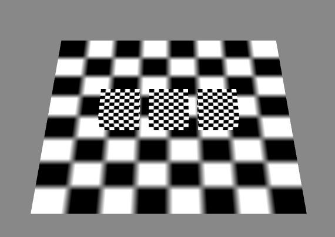
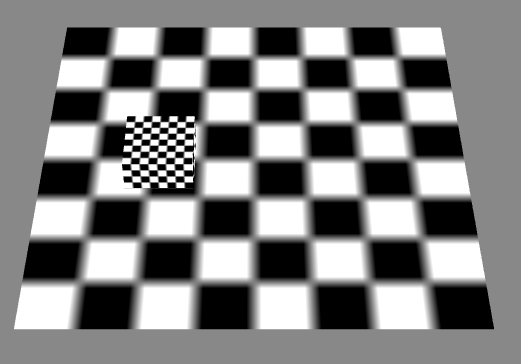
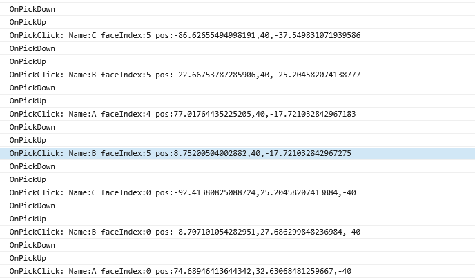

PickEvent3D拣选事件

----------

* 演示准备

----------

	创建一个演示场景，其中我们定义了abc三个不通的cube：
	class Main {
	
	    protected _egret3DCanvas: egret3d.Egret3DCanvas;
	    protected view1: egret3d.View3D;
	    protected cube_A: egret3d.Mesh;
	    protected cube_B: egret3d.Mesh;
	    protected cube_C: egret3d.Mesh;
	
	
	    public constructor() {
	
	        ///创建3DCanvas
	        this._egret3DCanvas = new egret3d.Egret3DCanvas();
	        this._egret3DCanvas.x = 0;
	        this._egret3DCanvas.y = 0;
	        this._egret3DCanvas.width = window.innerWidth;
	        this._egret3DCanvas.height = window.innerHeight;
	        this._egret3DCanvas.start();
	        ///创建View3D
	        this.view1 = new egret3d.View3D(0, 0, window.innerWidth, window.innerHeight);
	        this.view1.camera3D.lookAt(new egret3d.Vector3D(0, 1000, -1000), new egret3d.Vector3D(0, 0, 0));
	        this.view1.backColor = 0xff888888;
	        this._egret3DCanvas.addView3D(this.view1);
	        ///启动3DCanvas
	        this._egret3DCanvas.start();
	        ///创建立方体A，放置于场景内(100,0,0)位置
	        var mat_cube_A: egret3d.TextureMaterial = new egret3d.TextureMaterial();
	        var geometery_Cube_A: egret3d.CubeGeometry = new egret3d.CubeGeometry();
	        this.cube_A = new egret3d.Mesh(geometery_Cube_A, mat_cube_A);
	        this.cube_A.x = 100;
	        this.cube_A.name = "A";
	        this.view1.addChild3D(this.cube_A);
	        ///创建立方体B，放置于场景内(0,0,0)位置
	        var mat_cube_B: egret3d.TextureMaterial = new egret3d.TextureMaterial();
	        var geometery_Cube_B: egret3d.CubeGeometry = new egret3d.CubeGeometry();
	        this.cube_B = new egret3d.Mesh(geometery_Cube_B, mat_cube_B);
	        this.cube_B.x = 0;
	        this.cube_B.name = "B";
	        this.view1.addChild3D(this.cube_B);
	        ///创建立方体B，放置于场景内(-100,0,0)位置
	        var mat_cube_C: egret3d.TextureMaterial = new egret3d.TextureMaterial();
	        var geometery_Cube_C: egret3d.CubeGeometry = new egret3d.CubeGeometry();
	        this.cube_C = new egret3d.Mesh(geometery_Cube_C, mat_cube_C);
	        this.cube_C.x = -100;
	        this.cube_C.name = "C";
	        this.view1.addChild3D(this.cube_C);
	        ///创建面片，放置于场景内(0,0,0)位置
	        var mat_Plane: egret3d.TextureMaterial = new egret3d.TextureMaterial();
	        var geometery_Plane: egret3d.PlaneGeometry = new egret3d.PlaneGeometry();
	        var plane = new egret3d.Mesh(geometery_Plane, mat_Plane);
	        this.view1.addChild3D(plane);
	
	    }
	
	}      

	1) Pick事件是引擎中可操作物体拣选事件。
	2）需要注册对象IRender，开启enablePick后才能监听了PickEvent3D事件，触摸和鼠标点选都是可以触发该事件的。
	3) Pick事件可以分为PICK_CLICK（点击拣选事件），PICK_DOWN（按下拣选事件），PICK_UP（弹起拣选事件），PICK_MOVE（光标移动拣选事件）和
		PICK_WHEEL（滚轮滚动拣选事件）。
	4) 示例代码：我们这里书写一个测试Pick事件的代码，选中的cube将变为红色。

	class Main {
	
	    protected _egret3DCanvas: egret3d.Egret3DCanvas;
	    protected view1: egret3d.View3D;
	    protected cube_A: egret3d.Mesh;
	    protected cube_B: egret3d.Mesh;
	    protected cube_C: egret3d.Mesh;
	    protected cube_Pick: egret3d.Mesh;
	
	    public constructor() {
	
	        ///创建3DCanvas
	        this._egret3DCanvas = new egret3d.Egret3DCanvas();
	        this._egret3DCanvas.x = 0;
	        this._egret3DCanvas.y = 0;
	        this._egret3DCanvas.width = window.innerWidth;
	        this._egret3DCanvas.height = window.innerHeight;
	        this._egret3DCanvas.start();
	        ///创建View3D
	        this.view1 = new egret3d.View3D(0, 0, window.innerWidth, window.innerHeight);
	        this.view1.camera3D.lookAt(new egret3d.Vector3D(0, 1000, -1000), new egret3d.Vector3D(0, 0, 0));
	        this.view1.backColor = 0xff888888;
	        this._egret3DCanvas.addView3D(this.view1);
	        ///启动3DCanvas
	        this._egret3DCanvas.start();
	        ///创建立方体A，放置于场景内(100,0,0)位置
	        var mat_cube_A: egret3d.TextureMaterial = new egret3d.TextureMaterial();
	        var geometery_Cube_A: egret3d.CubeGeometry = new egret3d.CubeGeometry();
	        this.cube_A = new egret3d.Mesh(geometery_Cube_A, mat_cube_A);
	        this.cube_A.x = 100;
	        this.cube_A.name = "A";
	        this.view1.addChild3D(this.cube_A);
	        ///创建立方体B，放置于场景内(0,0,0)位置
	        var mat_cube_B: egret3d.TextureMaterial = new egret3d.TextureMaterial();
	        var geometery_Cube_B: egret3d.CubeGeometry = new egret3d.CubeGeometry();
	        this.cube_B = new egret3d.Mesh(geometery_Cube_B, mat_cube_B);
	        this.cube_B.x = 0;
	        this.cube_B.name = "B";
	        this.view1.addChild3D(this.cube_B);
	        ///创建立方体B，放置于场景内(-100,0,0)位置
	        var mat_cube_C: egret3d.TextureMaterial = new egret3d.TextureMaterial();
	        var geometery_Cube_C: egret3d.CubeGeometry = new egret3d.CubeGeometry();
	        this.cube_C = new egret3d.Mesh(geometery_Cube_C, mat_cube_C);
	        this.cube_C.x = -100;
	        this.cube_C.name = "C";
	        this.view1.addChild3D(this.cube_C);
	        ///创建面片，放置于场景内(0,0,0)位置
	        var mat_Plane: egret3d.TextureMaterial = new egret3d.TextureMaterial();
	        var geometery_Plane: egret3d.PlaneGeometry = new egret3d.PlaneGeometry();
	        var plane = new egret3d.Mesh(geometery_Plane, mat_Plane);
	        this.view1.addChild3D(plane);
	
	        ///开启拣选功能
	        this.cube_A.enablePick = true;
	        this.cube_B.enablePick = true;
	        this.cube_C.enablePick = true;
	
	        ///给Cube注册事件。
	        this.cube_A.addEventListener(egret3d.PickEvent3D.PICK_CLICK, this.OnPickClick, this);
	        this.cube_A.addEventListener(egret3d.PickEvent3D.PICK_DOWN, this.OnPickDown, this);
	        this.cube_A.addEventListener(egret3d.PickEvent3D.PICK_UP, this.OnPickUp, this);
	        this.cube_B.addEventListener(egret3d.PickEvent3D.PICK_CLICK, this.OnPickClick, this);
	        this.cube_B.addEventListener(egret3d.PickEvent3D.PICK_DOWN, this.OnPickDown, this);
	        this.cube_B.addEventListener(egret3d.PickEvent3D.PICK_UP, this.OnPickUp, this);
	        this.cube_C.addEventListener(egret3d.PickEvent3D.PICK_CLICK, this.OnPickClick, this);
	        this.cube_C.addEventListener(egret3d.PickEvent3D.PICK_DOWN, this.OnPickDown, this);
	        this.cube_C.addEventListener(egret3d.PickEvent3D.PICK_UP, this.OnPickUp, this);
	    }
	    ///pick点击事件，这里我们只输出点选日志信息。
	    public OnPickClick(e: egret3d.PickEvent3D) {
	        var mesh: egret3d.Mesh = e.target;
	        ///相交面索引
	        var faceIndex = e.pickResult.faceIndex;
	        ///pick的世界坐标
	        var pos = e.pickResult.globalPosition;
	        ///这里我们将信息输出
	        console.log("OnPickClick:" + " Name:" + mesh.name + " faceIndex:" + faceIndex + " pos:" + pos.x + "," + pos.y + "," + pos.z);
	    }
	    ///pick按下事件，这里我们只输出点选日志信息
	    public OnPickDown(e: egret3d.PickEvent3D) {
	        console.log("OnPickDown");
	        if (this.cube_Pick != null) {
	            ///将上次pick对象设置为白色
	            this.cube_Pick.material.diffuseColor = 0xffffff;
	        }
	        ///设置选中对象为红色
	        this.cube_Pick = e.target;
	        this.cube_Pick.material.diffuseColor = 0xff0000;
	    }
	    ///pick回弹事件，这里我们只输出点选日志信息
	    public OnPickUp(e: egret3d.PickEvent3D) {
	        console.log("OnPickUp");
	    }
	
	}            

  

