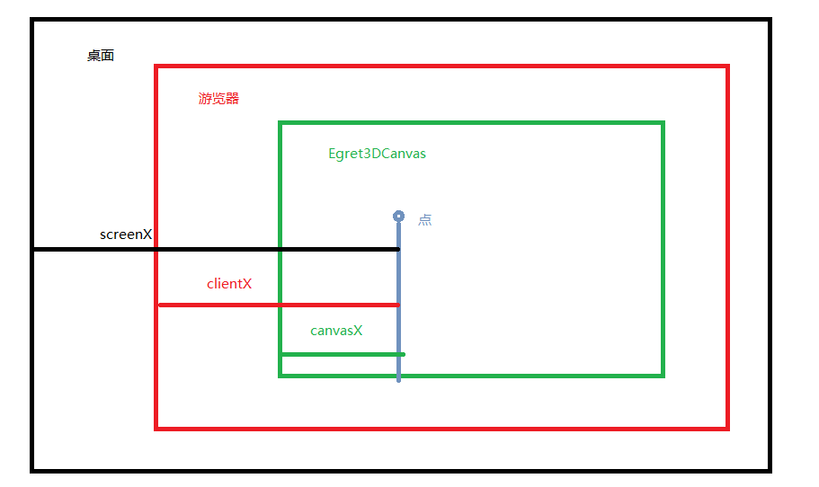
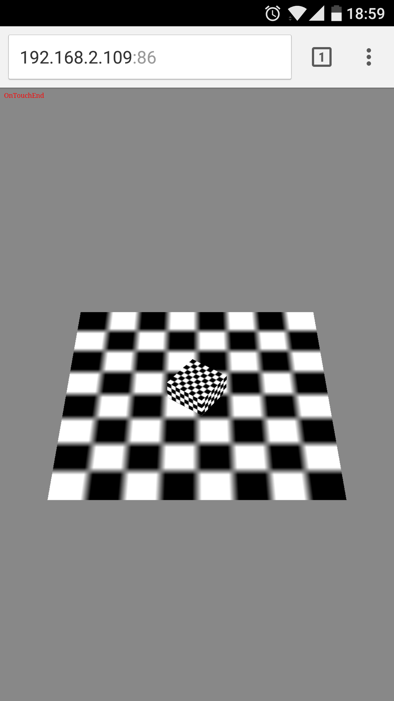

TouchEvent3D 触摸事件

----------

* 演示准备

----------

	创建一个演示场景：
	class Main {
	
	    protected _egret3DCanvas: egret3d.Egret3DCanvas;
	    protected view1: egret3d.View3D;
	    protected cube: egret3d.Mesh;
	
	    public constructor() {
	
	        ///创建3DCanvas
	        this._egret3DCanvas = new egret3d.Egret3DCanvas();
	        this._egret3DCanvas.x = 0;
	        this._egret3DCanvas.y = 0;
	        this._egret3DCanvas.width = window.innerWidth;
	        this._egret3DCanvas.height = window.innerHeight;
	        this._egret3DCanvas.start();
	        ///创建View3D
	        this.view1 = new egret3d.View3D(0, 0, window.innerWidth, window.innerHeight);
	        this.view1.camera3D.lookAt(new egret3d.Vector3D(0, 1000, -1000), new egret3d.Vector3D(0, 0, 0));
	        this.view1.backColor = 0xff888888;
	        this._egret3DCanvas.addView3D(this.view1);
	        ///启动3DCanvas
	        this._egret3DCanvas.start();
	        ///创建立方体，放置于场景内(0,0,0)位置
	        var mat_cube: egret3d.TextureMaterial = new egret3d.TextureMaterial();
	        var geometery_Cube: egret3d.CubeGeometry = new egret3d.CubeGeometry();
	        this.cube = new egret3d.Mesh(geometery_Cube, mat_cube);
	        this.view1.addChild3D(this.cube);
	        ///创建面片，放置于场景内(0,0,0)位置
	        var mat_Plane: egret3d.TextureMaterial = new egret3d.TextureMaterial();
	        var geometery_Plane: egret3d.PlaneGeometry = new egret3d.PlaneGeometry();
	        var plane = new egret3d.Mesh(geometery_Plane, mat_Plane);
	        this.view1.addChild3D(plane);
	
	    }
	
	}      

	1) 触摸事件只能在手机上进行测试演示。
	2）响应事件时的参数e: egret3d.TouchEvent3D，参数内数据说明：
		a) screenX:相对于用户屏幕水平偏移量，而screenY也就是垂直方向的，此时的参照点也就是原点是屏幕的左上角。
		b）clientX:跟screenX相比就是将参照点改成了浏览器内容区域的左上角，该参照点会随之滚动条的移动而移动。
		c) pageX：参照点也是浏览器内容区域的左上角，但它不会随着滚动条而变动
		b）canvasX:相对于Egret3DCanvas水平偏移量，而canvasY也就是垂直方向的，此时的参照点也就是原点是Egret3DCanvas的左上角。

	3)示例代码：这是我们制作一个控制cube旋转的代码。
	
	class Main {
	
	    protected _egret3DCanvas: egret3d.Egret3DCanvas;
	    protected view1: egret3d.View3D;
	
	    private x_Cur: number = 0;
	    private cube: egret3d.Mesh;
	
	    public constructor() {
	        ///创建3DCanvas
	        this._egret3DCanvas = new egret3d.Egret3DCanvas();
	        this._egret3DCanvas.x = 0;
	        this._egret3DCanvas.y = 0;
	        this._egret3DCanvas.width = window.innerWidth;
	        this._egret3DCanvas.height = window.innerHeight;
	        this._egret3DCanvas.start();
	        ///创建View3D
	        this.view1 = new egret3d.View3D(0, 0, window.innerWidth, window.innerHeight);
	        this.view1.camera3D.lookAt(new egret3d.Vector3D(0, 1000, -1000), new egret3d.Vector3D(0, 0, 0));
	        this.view1.backColor = 0xff888888;
	        this._egret3DCanvas.addView3D(this.view1);
	        ///启动3DCanvas，注册每帧更新事件
	        this._egret3DCanvas.start();
	        ///创建立方体，放置于场景内(0,0,0)位置
	        var mat_cube: egret3d.TextureMaterial = new egret3d.TextureMaterial();
	        var geometery_Cube: egret3d.CubeGeometry = new egret3d.CubeGeometry();
	        this.cube = new egret3d.Mesh(geometery_Cube, mat_cube);
	        this.view1.addChild3D(this.cube);
	        ///创建面片，放置于场景内(0,0,0)位置
	        var mat_Plane: egret3d.TextureMaterial = new egret3d.TextureMaterial();
	        var geometery_Plane: egret3d.PlaneGeometry = new egret3d.PlaneGeometry();
	        var plane = new egret3d.Mesh(geometery_Plane, mat_Plane);
	        this.view1.addChild3D(plane);
	
	        ///注册事件，持有对象为IRender，需要依次写入事件标识符，注册方法和注册对象。
	        egret3d.Input.addEventListener(egret3d.TouchEvent3D.TOUCH_START, this.OnTouchStart, this);
	        egret3d.Input.addEventListener(egret3d.TouchEvent3D.TOUCH_END, this.OnTouchEnd, this);
	        egret3d.Input.addEventListener(egret3d.TouchEvent3D.TOUCH_MOVE, this.OnTouchMove, this);
	        ///开启手机屏幕日志信息显示
	        egret3d.Debug.instance.isDebug = true;
	    }
	
	    ///触摸开始事件。
	    public OnTouchStart(e: egret3d.TouchEvent3D) {
	        egret3d.Debug.instance.trace("OnTouchStart");
	    }
	    ///触摸结束事件
	    public OnTouchEnd(e: egret3d.TouchEvent3D) {
	        egret3d.Debug.instance.trace("OnTouchEnd");
	    }
	    ///触摸移动事件
	    public OnTouchMove(e: egret3d.TouchEvent3D) {
	        if (this.x_Cur - e.targetTouches[0].clientX > 0) {
	            this.cube.rotationY += 4;
	        } else {
	            this.cube.rotationY -= 4;
	        }
	        this.x_Cur = e.targetTouches[0].clientX;
	    }
	}      
		

