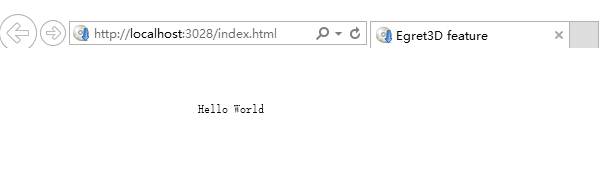
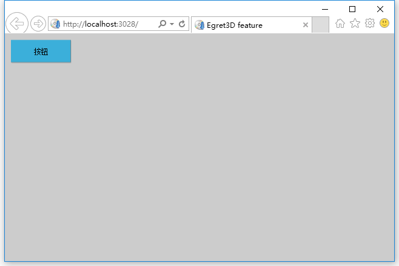
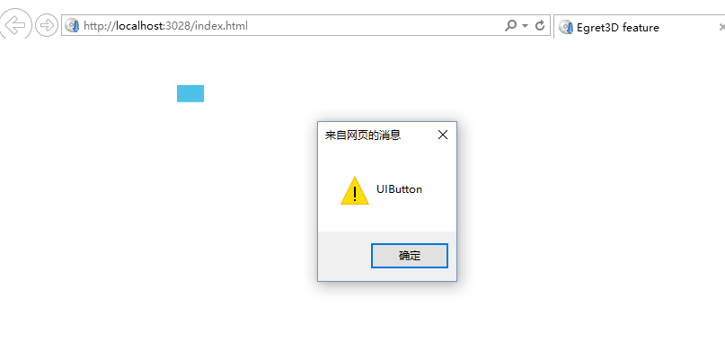
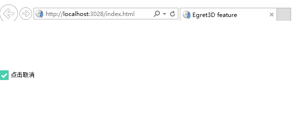
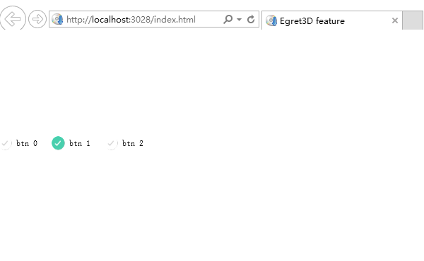
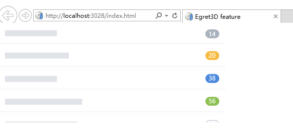
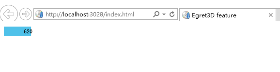
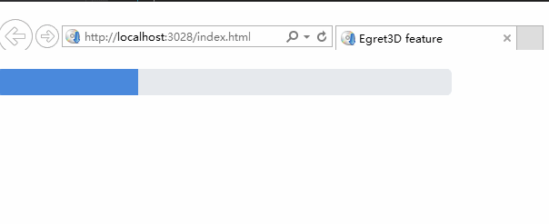
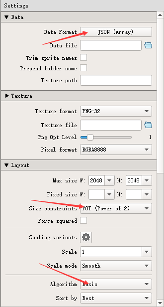
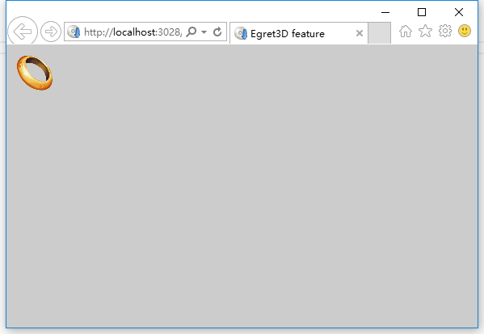

# Egret3d Gui 教程 #

本教程主要介绍了如何在egret3d引擎中开始并使用gui功能, 以及gui组件的基本用法.

首先进行3d引擎的初始化

> this.initEngine();


    export class GuiTest{
            private _canvas: Egret3DCanvas;
        	private _view:View3D;
	        private _ctl:HoverController;
	    
	        constructor() {
				//引擎初始化
	            this.initEngine();

	            let queueLoad: QueueLoader = new QueueLoader();
	            //加载默认皮肤
	            queueLoad.loadDefaultGUISkin();
	
	            queueLoad.addEventListener(LoaderEvent3D.LOADER_COMPLETE,
	                this.initedGui,
	                this);
	        }
	
	        private initEngine() {
	            this._canvas = new Egret3DCanvas();
	            this._canvas.x = 0;
	            this._canvas.y = 0;
	            this._canvas.width = window.innerWidth;
	            this._canvas.height = window.innerHeight;
	            this._canvas.start();
	
	            this._view = new View3D(0, 0, window.innerWidth * window.devicePixelRatio, window.innerHeight * window.devicePixelRatio);
	            this._view.camera3D.lookAt(new Vector3D(0, 100, -100), new Vector3D(0, 0, 0));
	            this._view.backColor = 0xffcccccc;
	            this._canvas.addView3D(this._view);
	
	            this._ctl = new HoverController(this._view.camera3D);
	            this._ctl.tiltAngle = 60;
	            this._ctl.distance = 1000;
	
	            Egret3DEngine.instance.debug = false;
	            this._canvas.start();
	            this._canvas.addEventListener(Event3D.ENTER_FRAME, this.update, this);
	        }
	
	        private update(e: Event3D) {
	            this._ctl.update();
	        }	

			private initedGui(){
				var textField: gui.UITextField = new gui.UITextField();
		        textField.textColor = 0x000000;
		        textField.text = "Hello World";
		
		        this._view.addGUI(textField);
			}
    
    	   
    }


引擎初始化完成后.通过 *QueueLoader类* 创建一个加载队列，调用 loadDefaultGUISkin() 方法加载默认皮肤，来开启gui功能。


	            let queueLoad: QueueLoader = new QueueLoader();
	            //加载默认皮肤
	            queueLoad.loadDefaultGUISkin();
	
	            queueLoad.addEventListener(LoaderEvent3D.LOADER_COMPLETE,
	                this.initedGui,
	                this);

----------

# UITextField 控件 #
UITextField 控件用来显示文本信息
> public UITextField(textFieldType: UITextFieldType = UITextFieldType.DYNAMIC)

- textFieldType	文本类型
	- 	UITextFieldType.DYNAMIC	用户无法编辑的动态文本字段
	- 	UITextFieldType.INPUT 用户可以编辑的输入文本字段
# 示例 #

在屏幕上显示"Hello World" 文字

    
    private initedGui() {
		var textField: gui.UITextField = new gui.UITextField();
        textField.textColor = 0x000000;
        textField.text = "Hello World";

        this._view.addGUI(textField);
    
    }

运行结果如图所示


----------

# LabelButton 控件 #
> public UILabelButton()

# 示例 #
绘制一个LabelButton按钮


    private initedGui() {
	    let labelBtn: gui.UILabelButton = new gui.UILabelButton();
	    labelBtn.label = "按钮";
	    labelBtn.x = 10;
	    labelBtn.y = 10;
	    labelBtn.width = 100;
	    labelBtn.height = 40;
	    this._view.addGUI(labelBtn);
    
    }

运行结果如图所示:




----------

# UIButton 控件 #
> public UIButton()

# 示例 #

绘制一个按钮并响应单击事件


            private initedGui() {

                var btn: gui.UIButton = new gui.UIButton();
                btn.name = "UIButton";
                btn.width = 30;
                btn.height = 20
                btn.x = 200;
                btn.y = 50;
                
              
                btn.addEventListener(MouseEvent3D.MOUSE_UP , (e) =>  {
                    alert(btn.name);
                }, this);

                this._view.addGUI(btn);

            }

运行结果如图所示




----------
# UICheckBox 控件 #
> public UICheckBox()


TextureResourceManager类 是gui贴图资源 管理器

> export class TextureResourceManager extends egret3d.EventDispatcher

可以通过 getTexture()方法 来获取贴图资源

> public getTexture(name: string): Texture


# 示例 #

绘制一个CheckBox 控件 点击 选中/取消

        public initedGui() {
			//获取 checkBox 控件 checkUpState 的 贴图
            var checkUpState: Texture = textureResMgr.getTexture("default.png");
			//获取 checkBox 控件 checkDownState 的 贴图
            var checkDownState: Texture = textureResMgr.getTexture("checked.png");

            var checkBox: gui.UICheckBox = new gui.UICheckBox();
            checkBox.width = checkUpState.width;
            checkBox.height = checkUpState.height;
            checkBox.label = "点击选中";
            checkBox.y = 100;
            this._view.addGUI(checkBox);


            checkBox.addEventListener(MouseEvent3D.MOUSE_CLICK,
                (e) => {
                    checkBox.label = checkBox.selected ? "点击取消" : "点击选中";
                },
                this);


        }


运行结果如图所示



----------
# UIRadioButton 控件 #
> public UIRadioButton()

# 示例 #

    public initedGui(){
			//获取 UIRadioButton 控件 radioUpState 的 贴图
            var radioUpState: Texture = textureResMgr.getTexture("unselected.png");
			//获取 UIRadioButton 控件 radioDownState 的 贴图
            var radioDownState: Texture = textureResMgr.getTexture("selected.png");

			//创建一个 UIRadioButtonGroup 组 把 UIRadioButton 添加到组中
            var radioButtonGroup: gui.UIRadioButtonGroup = new gui.UIRadioButtonGroup();

            radioButtonGroup.addEventListener(Event3D.CHANGE, (e)=>this.onchange(e), this);
            for (var i: number = 0; i < 3; i++) {
                var radioBtn: gui.UIRadioButton = new gui.UIRadioButton();
                radioBtn.width = radioUpState.width;
                radioBtn.height = radioUpState.height;

                radioBtn.label = "btn " + i;
                radioBtn.y = 150;
                radioBtn.x = i * (radioBtn.buttonAndLabelWidth + 5);
                this._view.addGUI(radioBtn);

                radioButtonGroup.addItem(radioBtn);
            }   

            //设置默认选中项
            radioButtonGroup.selectedIndex = 1;  
  
			//当 UIRadioButtonGroup 索引改变时
        	private onchange(e: Event3D) {
            	var radioButtonGroupe: gui.UIRadioButtonGroup = e.target;
            	//当前选中项的索引
            	console.log(radioButtonGroupe.selectedIndex);
        	}
    }


运行结果如图所示



----------


# UIList 控件 #
> public UIList()


# 示例 #

    public initedGui(){
            var list: gui.UIList = new gui.UIList();
            list.width = 460;
            list.height = 200;
            list.y = 0;
            var texAry = ["14.png", "20.png", "38.png", "56.png", "91.png", "99+.png"];
            for (var i: number = 0; i < texAry.length; i++) {
                var tempQuad: Quad = new Quad();
                tempQuad.width = 460;
                tempQuad.height = 41;
                tempQuad.texture = textureResMgr.getTexture(texAry[i]);
                list.addItem(tempQuad);
            }
            this._view.addGUI(list);    
    }

运行结果如图所示



----------
# UISlider 控件 #
> public UISlider()
 
移动滑块时值增加或减小的量
> slider.snapInterval = 1

UISlider 组件允许的最大值
> slider.maximum = 1000

UISlider 组件允许的最小值
> slider.minimum = 100

UISlider 组件显示的当前值
> slider.value = 500

# 示例 #
    public initedGui(){
            var slider: gui.UISlider = new gui.UISlider();
            slider.width = 100;
            slider.height = 20;
            slider.x = 10;
            slider.y = 10;

            slider.snapInterval = 10;
            slider.maximum = 1000;
            slider.minimum = 100;
			slider.value = 500;

            slider.addEventListener(Event3D.CHANGE,
                (e) => {
                    console.log(slider.value);
                },
                this);
            this._view.addGUI(slider);
    }
    


运行结果如图所示




----------

# UIProgressBar 控件 #
> public UIProgressBar()

设置进度条比例 取值范围为0-1,即进度条由空到填满
> progressBar.ratio += 0.001;


设置进度条样式
> public setStyle(style: string, value: any) 


    progressBar.setStyle("bar",value);
    progressBar.setStyle("background",value);

 

 # 示例 #

    public initedGui(){
            var progressBar: gui.UIProgressBar = new gui.UIProgressBar();
            progressBar.height = 29;
            progressBar.width = 500;
            this._view.addGUI(progressBar);
            setInterval(() => {
                if (progressBar.ratio === 1) {
                    progressBar.ratio = 0;
                }
                progressBar.ratio += 0.001;
            },
                16);
            progressBar.y = 20;

			this._view.addGUI(progressBar);
    }


运行结果如图所示



----------


# UIPanel 控件 #
> public UIPanel()
一个可以设置背景的容器组件


修改背景颜色
> uiPanel.background.color = 0x000000;

替换背景贴图
> uiPanel.setStyle("background", textureResMgr.getTexture(name);


    public initedGui(){
            var uiPanel: gui.UIPanel = new gui.UIPanel();

            var txt: gui.UITextField = new gui.UITextField();
            txt.text = "This is a Panel";

            uiPanel.addChild(txt);

            this._view.addGUI(uiPanel);    
    }


----------

# 自定义 Gui控件的样式 #

可以通过加载由TexturePacker生成的资源, 来显示贴图,其中TexturePacker导出设置如下:




通过*UnitLoader*或者*QueueLoader*( 当你需要加载多个资源的时候, 单个资源也可以使用 )来加载TexturePacker导出的资源.   
加载完成后贴图将可以通过 *textureResMgr.getTexture()* 来获取, 其中的参数便是TexturePacker导出的json里的图片名.

下面的代码片段演示了如何加载TexturePacker生成的贴图资源. 并在加载完成后显示一张加载资源里的gui图片:

```
        constructor() {
            this.initEngine();
            //开启gui功能
            this._view.openGui(this.initedGui, this);
         
        }

        private initedGui() {
            let queueLoader: QueueLoader = new QueueLoader("resource/ui/gameAsset.json");
            queueLoader.addEventListener(LoaderEvent3D.LOADER_COMPLETE,
                (e) => {
                    let quad: Quad = new Quad();
                    quad.texture = textureResMgr.getTexture("50t.png");
                    quad.width = 50;
                    quad.height = 50;
                    quad.x = 10;
                    quad.y = 10;
                    this._view.addGUI(quad);
                },
                this);
        }
```


成功运行后, 结果如下:




设置默认皮肤对应的贴图
> public setDefaultSkin(skinName: string, texture: any)
> *skinName* 皮肤名称
> *texture* 贴图资源


# 示例 #

通过 *gui.SkinManager* 皮肤管理类 设置 组件的默认皮肤  


	//设置Button按钮 的弹起状态
    gui.SkinManager.instance.setDefaultSkin(gui.DefaultSkinName.DEFAULT_BUTTON_UP, upState);
	//设置Button按钮 的按下状态
    gui.SkinManager.instance.setDefaultSkin(gui.DefaultSkinName.DEFAULT_BUTTON_DOWN, downState);
	//设置Button按钮 的不可点击状态
    gui.SkinManager.instance.setDefaultSkin(gui.DefaultSkinName.DEFAULT_BUTTON_DISABLE, disabletate);
