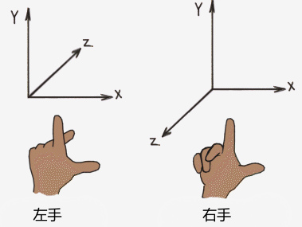

> 以下教程部分摘自 learnopengl

中英文词汇对照

- Aliasing 锯齿 
- Alpha 透明度 
- Ambient Light 环境光 
- Antialiasing 抗锯齿 
- Aspect Ratio 纵横比 
- Bezier curve 贝塞尔曲线 
- Bitplane 位平面 
- Buffer 缓冲区 
- Cartesian 笛卡尔 
- Clip coordinates 裁剪坐标 
- Clipping 裁剪 
- Convex 凸 
- Culling 剔除 
- Destination color 目标颜色 
- Dithering 抖动 
- Double buffered 双缓冲 
- Extruded 拉伸 
- Eye coordinates 视觉坐标 
- Frustum 平头截体 
- Immediate mode 立即模式 
- Implementation 实现 
- Khronos OpenGL维护小组 
- Literal 字面值 
- Matrix 矩阵 
- Mipmapping Mip贴图 
- Modelview Matrix 模型视图矩阵 
- Normal 法线 
- Normalize 规范化 
- Orthographic 正交 
- Prespective 透视 
- Piexl 像素 
- Pixmap 像素图 
- Polygon 多边形 
- Primitive 图元 
- Projection 投影 
- Quadrilateral 四边形 
- Resterize 光栅化 
- Retained mode 保留模式 
- Render 渲染 
- Scintillation 闪烁 
- Shader 着色器 
- Source Color 源颜色 
- Specification 说明 
- Spline 样条 
- Stipple 点画 
- Tessellation 镶嵌 
- Texel 纹理像素 
- Texture 纹理 
- Transformation 变换 
- Translucence 半透明 
- Vector 向量 
- Vertex 顶点 
- Viewing Volume 可视区域 
- Viewport 视口 
- Wireframe 线框 
- pipeline 渲染管线 

## 3D数学知识

在学习任何一个3D引擎之前，先保证自己有最基本的3D知识，不然真会处处碰壁。

首先需要理解3D的概念，如何从3维数据转变成模型。

### 3D坐标系

egret3D使用左手坐标系定义，Y轴向上

实际上一个3维物体也会存在相对坐标系问题

- 局部空间(Local Space，或者称为物体空间(Object Space))
- 世界空间(World Space)
- 观察空间(View Space，或者称为视觉空间(Eye Space))
- 裁剪空间(Clip Space)
- 屏幕空间(Screen Space)

为了将坐标从一个坐标系转换到另一个坐标系，我们需要用到几个转换矩阵，最重要的几个分别是模型(Model)、视图(View)、投影(Projection)三个矩阵。首先，顶点坐标开始于局部空间(Local Space)，称为局部坐标(Local Coordinate)，然后经过世界坐标(World Coordinate)，观察坐标(View Coordinate)，裁剪坐标(Clip Coordinate)，并最后以屏幕坐标(Screen Coordinate)结束。

局部坐标是对象相对于局部原点的坐标
也是对象开始的坐标。

将局部坐标转换为世界坐标，世界坐标是作为一个更大空间范围的坐标系统。这些坐标是相对于世界的原点的。

接下来我们将世界坐标转换为观察坐标，观察坐标是指以摄像机或观察者的角度观察的坐标。

在将坐标处理到观察空间之后，我们需要将其投影到裁剪坐标。裁剪坐标是处理-1.0到1.0范围内并判断哪些顶点将会出现在屏幕上。

最后，我们需要将裁剪坐标转换为屏幕坐标，我们将这一过程成为视口变换(Viewport Transform)。视口变换将位于-1.0到1.0范围的坐标转换到由glViewport函数所定义的坐标范围内。最后转换的坐标将会送到光栅器，由光栅器将其转化为片段。

你可能了解了每个单独的坐标空间的作用。我们之所以将顶点转换到各个不同的空间的原因是有些操作在特定的坐标系统中才有意义且更方便。例如，当修改对象时，如果在局部空间中则是有意义的；当对对象做相对于其它对象的位置的操作时，在世界坐标系中则是有意义的；等等这些。如果我们愿意，本可以定义一个直接从局部空间到裁剪空间的转换矩阵，但那样会失去灵活性。接下来我们将要更仔细地讨论各个坐标系。

#### 局部空间(Local Space)

局部空间是指对象所在的坐标空间，例如，对象最开始所在的地方。想象你在一个模型建造软件(比如说Blender)中创建了一个立方体。你创建的立方体的原点有可能位于(0，0，0)，即使有可能在最后的应用中位于完全不同的另外一个位置。甚至有可能你创建的所有模型都以(0，0，0)为初始位置，然而他们会在世界的不同位置。则你的模型的所有顶点都是在局部空间：他们相对于你的对象来说都是局部的。

我们一直使用的那个箱子的坐标范围为-0.5到0.5，设定(0, 0)为它的原点。这些都是局部坐标。

#### 世界空间(World Space)

如果我们想将我们所有的对象导入到程序当中，它们有可能会全挤在世界的原点上(0，0，0)，然而这并不是我们想要的结果。我们想为每一个对象定义一个位置，从而使对象位于更大的世界当中。世界空间中的坐标就如它们听起来那样：是指顶点相对于(游戏)世界的坐标。物体变换到的最终空间就是世界坐标系，并且你会想让这些物体分散开来摆放(从而显得更真实)。对象的坐标将会从局部坐标转换到世界坐标；该转换是由模型矩阵(Model Matrix)实现的。

模型矩阵是一种转换矩阵，它能通过对对象进行平移、缩放、旋转来将它置于它本应该在的位置或方向。你可以想象一下，我们需要转换一栋房子，通过将它缩小(因为它在局部坐标系中显得太大了)，将它往郊区的方向平移，然后沿着y轴往坐标旋转。经过这样的变换之后，它将恰好能够与邻居的房子重合。你能够想到上一节讲到的利用模型矩阵将各个箱子放置到这个屏幕上；我们能够将箱子中的局部坐标转换为观察坐标或世界坐标。

#### 观察空间(View Space)

观察空间经常被人们称之OpenGL的摄像机(Camera)(所以有时也称为摄像机空间(Camera Space)或视觉空间(Eye Space))。观察空间就是将对象的世界空间的坐标转换为观察者视野前面的坐标。因此观察空间就是从摄像机的角度观察到的空间。而这通常是由一系列的平移和旋转的组合来平移和旋转场景从而使得特定的对象被转换到摄像机前面。这些组合在一起的转换通常存储在一个观察矩阵(View Matrix)里，用来将世界坐标转换到观察空间。在下一个教程我们将广泛讨论如何创建一个这样的观察矩阵来模拟一个摄像机。

#### 裁剪空间(Clip Space)

在一个顶点着色器运行的最后，OpenGL期望所有的坐标都能落在一个给定的范围内，且任何在这个范围之外的点都应该被裁剪掉(Clipped)。被裁剪掉的坐标就被忽略了，所以剩下的坐标就将变为屏幕上可见的片段。这也就是裁剪空间名字的由来。

因为将所有可见的坐标都放置在-1.0到1.0的范围内不是很直观，所以我们会指定自己的坐标集(Coordinate Set)并将它转换回标准化设备坐标系，就像OpenGL期望它做的那样。

为了将顶点坐标从观察空间转换到裁剪空间，我们需要定义一个投影矩阵(Projection Matrix)，它指定了坐标的范围，例如，每个维度都是从-1000到1000。投影矩阵接着会将在它指定的范围内的坐标转换到标准化设备坐标系中(-1.0，1.0)。所有在范围外的坐标在-1.0到1.0之间都不会被绘制出来并且会被裁剪。在投影矩阵所指定的范围内，坐标(1250，500，750)将是不可见的，这是由于它的x坐标超出了范围，随后被转化为在标准化设备坐标中坐标值大于1.0的值并且被裁剪掉。

### Vector3D

vector3D 为一个3D数据，里面可以存储四个值 x，y，z，w 。

### uv

u,v两个定义的值，作为map映射

## 什么是模型

### 模型结构

3D模型是由无数个三角面组成，而构成三角面又由3个三维顶点按照顺序索引组合。
每个顶点都会有相对应的UV值来映射纹理坐标。每个顶点也可以配对想应的顶点色rgba，提供模型顶点显色问题 。

#### 顶点坐标
由 x,y,z 三个值确定一个顶点坐标

#### uv坐标
由 u,v 两个 0.0~1.0 的值确定一个uv坐标，如果超过这个范围，需要在贴图采样设置能越界采样，在egret3D 的材质中需要设置 material.repeat = true 来开启越界采样，就是美术口中的四方连续图，多用于地表花纹重复纹理中使用

#### 法线
由x,y,z组成的向量，既有方向，又有大小，在模型计算光照时，必须用于计算。

#### 切线
当模型旋转时，就会需要切线来保存动态的法线空间坐标，让模型如何旋转，透视度变化，依然能让模型法线在正确的空间坐标，一般叫做TBN计算

#### 顶点色
rgba四个unit类型的值，每个值都在0.0~255.0之间，顶点色都用于美术增强显示效果，性能使用。

#### 第二uv
第二UV中的UV坐标和第一UV坐标一样，一般当第一UV映射不满足后期需求的时候，就会需要第二UV的数据补足第一UV.
第二UV需要3D美术按需求去制作，也有可能是编辑器自动生成。
