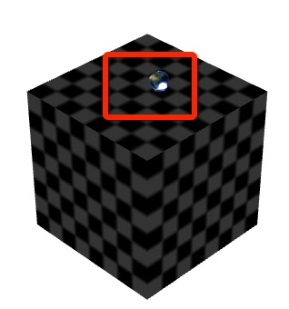
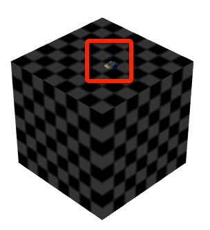

## 模型与点碰撞


### 原理：

* 检测模型与点碰撞其实就是检测一个点是否在模型内。在 egret3d 中，模型与点碰撞，是通过模型的 bound 来检测是否包含这个点（egret3d.Vector3D）来实现。

 这里为了更好的理解，我们将“点“想象成一个稍微大些的球。

* 未碰撞：

	

* 碰撞：

	


### api（egret3d.Bound）:

~~~
pointIntersect ( pos :egret3d.Vector3D ):boolean
~~~

~~~
pos:egret3d.Vector3D — 检测的点
~~~

### 示例：

```
var vector3d:egret3d.Vector3D = new egret3d.Vector3D(ball.x, ball.y, ball.z);
var result:boolean = cube.bound.pointIntersect(vector3d);

```

```
* cube：一个模型
* bound：模型的数据
* pointIntersect：检测方法
* vector3d： 点的数据
* result： 是否碰撞，true 碰撞，false 未碰撞

```

