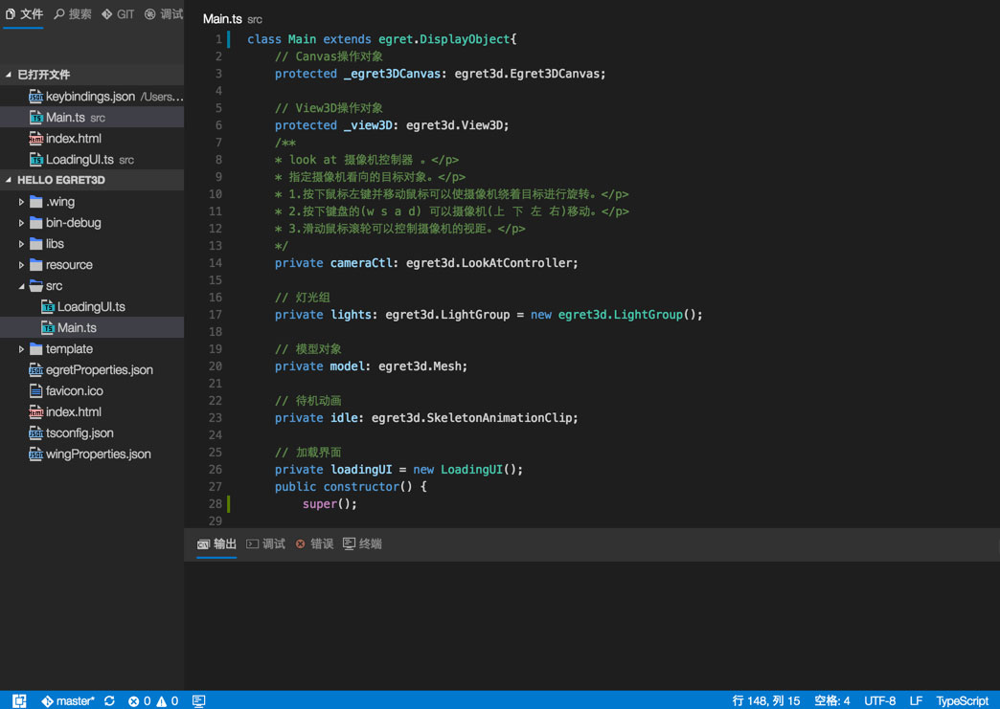
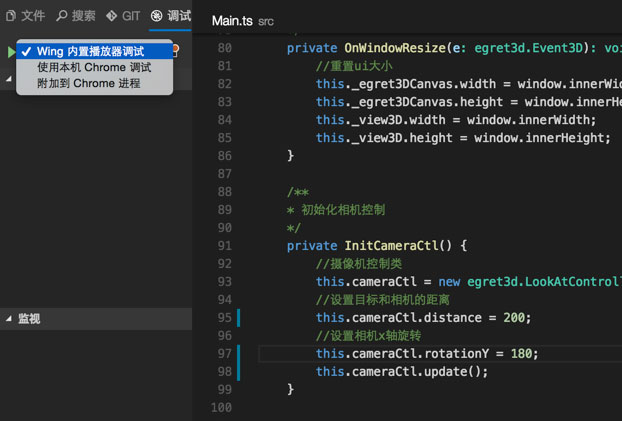
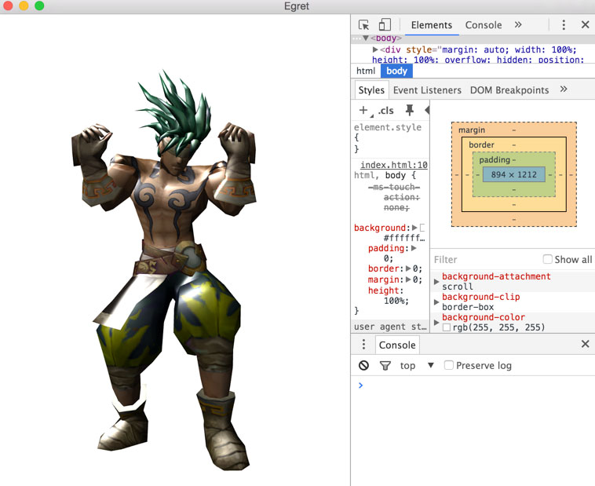
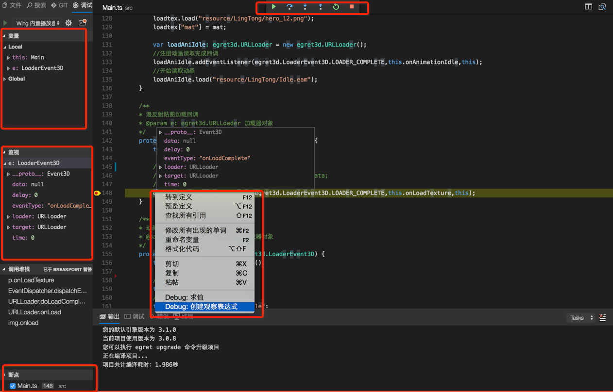
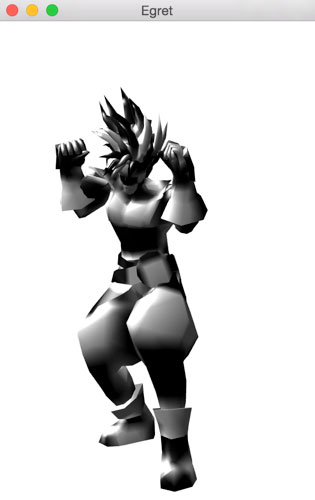

## 1、查看项目结构



查看项目源码我们可以看到，有两个文件`Main.ts`、`LoadingUI.ts`。
1. `Main.ts`是入口文件，在`Main.ts`中加载3D素材和核心逻辑代码。
2. `LoadingUI`显示加载进度条，在资源加载完毕后需要移除加载素材。

接下来咱们详细分析一下默认项目代码。

## 2、查看Main.ts文件
### 2.1 基本概念
```
    // Canvas操作对象
    protected _egret3DCanvas: egret3d.Egret3DCanvas;

    // View3D操作对象
    protected _view3D: egret3d.View3D;
    /**
    * look at 摄像机控制器 。</p>    * 指定摄像机看向的目标对象。</p>    * 1.按下鼠标左键并移动鼠标可以使摄像机绕着目标进行旋转。</p>    * 2.按下键盘的(w s a d) 可以摄像机(上 下 左 右)移动。</p>    * 3.滑动鼠标滚轮可以控制摄像机的视距。</p>    */
    private cameraCtl: egret3d.LookAtController;

    // 灯光组
    private lights: egret3d.LightGroup = new egret3d.LightGroup();

    // 模型对象
    private model: egret3d.Mesh;

    // 待机动画
    private idle: egret3d.SkeletonAnimationClip;

    // 加载界面
    private loadingUI = new LoadingUI();
```
* `_egret3DCanvas`存放view3D对象
* `_view3D`存放3D模型对象
* `cameraCtl`摄像机控制器，可以设置查看3D对象的距离、角度等参数
* `lights`存放灯光数据，没有灯光3D模型就会是黑色，就像黑夜看不见东西一样
* `model`3D模型对象，放到_view3D中
* `idle`存放3D骨骼动画
* `loadingUI`加载界面，控制加载图片文本的显示隐藏

我们目前先不做详细解释，先知道怎么用，在后续文档中会详细介绍各个概念的用法。

### 2.2 查看构造方法

```
	super();
	
    //创建Canvas对象。
    this._egret3DCanvas = new egret3d.Egret3DCanvas();
    //Canvas的起始坐标，页面左上角为起始坐标(0,0)。
    this._egret3DCanvas.x = 0;
    this._egret3DCanvas.y = 0;
    //设置Canvas页面尺寸。
    this._egret3DCanvas.width = window.innerWidth;
    this._egret3DCanvas.height = window.innerHeight;

    //创建View3D对象,页面左上角为起始坐标(0,0)
    this._view3D = new egret3d.View3D(0,0,window.innerWidth,window.innerHeight);
    //当前对象对视位置,其参数依次为:
    //@param pos 对象的位置
    //@param target 目标的位置
    this._view3D.camera3D.lookAt(new egret3d.Vector3D(0,0,1000),new egret3d.Vector3D(0,0,0));
    //View3D的背景色设置
    this._view3D.backColor = 0xffffffff;
    //将View3D添加进Canvas中
    this._egret3DCanvas.addView3D(this._view3D);

    //创建平行光
    var dirLight: egret3d.DirectLight = new egret3d.DirectLight(new egret3d.Vector3D(0.3,-0.3,0.1));
    dirLight.diffuse = 0xffffff;
    this.lights.addLight(dirLight);

    ///创建加载类
    var load: egret3d.URLLoader = new egret3d.URLLoader();
    //设置加载完成回调
    load.addEventListener(egret3d.LoaderEvent3D.LOADER_COMPLETE,this.onLoad,this);
    //开始加载
    load.load("resource/LingTong/Bonezero.esm");

    this.InitCameraCtl();

    //启动Canvas。
    this._egret3DCanvas.start();
    this._egret3DCanvas.addEventListener(egret3d.Event3D.ENTER_FRAME,this.update,this);

    this.loadingUI.OnInitLoadingView(3);

    //设置window resize事件
    egret3d.Input.addEventListener(egret3d.Event3D.RESIZE,this.OnWindowResize,this);
```
构造方法中主要进行对象的实例化，我们一个个解释一下。
* 实例化Canvas对象和View3D对象，然后把View3D对象放到Canvas对象中，舞台就可以显示View3D中的内容。
* 实例化平行光对象，稍后可以添加到3D模型上
>`this.model.material.lightGroup = this.lights;`
* load是加载类用来加载`.esm``.eam``.png`等素材文件
* 所有准备好就可以启动Canvas了
>`this._egret3DCanvas.start();`
* 而`this.update`方法则用来持续渲染摄像机控制器，它集成了很多功能。
只需要在帧循环事件中调用`this.cameraCtl.update();`即可实现如下功能。
    * 1.按下鼠标左键并移动鼠标可以使摄像机绕着目标进行旋转。</p>    * 2.按下键盘的(w s a d) 可以摄像机(上 下 左 右)移动。</p>    * 3.滑动鼠标滚轮可以控制摄像机的视距。</p>* 最后就是LoadingUI实例化，开始初始化，后续会调用加载进度，最后素材加载完毕后移除LoadingUI，下一个小节我们专门解释一下LoadingUI

### 2.3 相机方法相关
接下来我们单独解释一下各个方法功能以及用法。
```
    public update(e: egret3d.Event3D) {
        this.cameraCtl.update();
    }
```
这个其实是用来持续渲染摄像机控制器，上边已经解释过。
```
    /**
    * 初始化相机控制
    */
    private InitCameraCtl() {
        //摄像机控制类
        this.cameraCtl = new egret3d.LookAtController(this._view3D.camera3D,new egret3d.Object3D());
        //设置目标和相机的距离
        this.cameraCtl.distance = 300;
        //设置相机x轴旋转
        this.cameraCtl.rotationX = 0;
    }
```
这个方法是设置一些摄像机初始数值，比如

> `this.cameraCtl.distance = 300`

是设置摄像机距离观察对象为300，稍后我们在第三节`调试Egret3D项目`中修改测试。

> `this.cameraCtl.rotationX = 0`

这句话则是调整摄像机的x轴角度为0.

### 2.4 窗口尺寸变化监听
```
    /**
    * 窗口尺寸变化事件
    */
    private OnWindowResize(e: egret3d.Event3D): void {
        //重置ui大小
        this._egret3DCanvas.width = window.innerWidth;
        this._egret3DCanvas.height = window.innerHeight;
        this._view3D.width = window.innerWidth;
        this._view3D.height = window.innerHeight;
    }
```
这个方法是当浏览器窗口变化时，保证3D场景能够及时更新。

### 2.5 模型加载数据处理
```
    //创建加载类
    var load: egret3d.URLLoader = new egret3d.URLLoader();
    //设置加载完成回调
    load.addEventListener(egret3d.LoaderEvent3D.LOADER_COMPLETE,this.onLoad,this);
    //开始加载
    load.load("resource/LingTong/Bonezero.esm");
```
以上处理加载Egret模型数据，通过上述代码实现。
```
    /**
    * 模型加载回调
    * @param e: egret3d.URLLoader 加载器对象
    */
    protected onLoad(e: egret3d.LoaderEvent3D) {
        this.loadingUI.OnLoadFinished();

        //创建纹理材质
        var mat = new egret3d.TextureMaterial();
        //创建模型基类
        var ge: egret3d.Geometry = e.loader.data;
        //生成mesh
        this.model = new egret3d.Mesh(ge,mat);

        if(ge.vertexFormat & egret3d.VertexFormat.VF_SKIN) {
            ///设置骨骼动画
            this.model.animation = new egret3d.SkeletonAnimation(ge.skeleton);
        }
        this.model.material.lightGroup = this.lights;
        this.model.y = -100;

        //插入model
        this._view3D.addChild3D(this.model);

        var loadtex: egret3d.URLLoader = new egret3d.URLLoader();
        //注册贴图读取完成回调
        loadtex.addEventListener(egret3d.LoaderEvent3D.LOADER_COMPLETE,this.onLoadTexture,this);
        //开始读取贴图 
        loadtex.load("resource/LingTong/hero_12.png");
        loadtex["mat"] = mat;

        var loadAniIdle: egret3d.URLLoader = new egret3d.URLLoader();
        //注册动画读取完成回调
        loadAniIdle.addEventListener(egret3d.LoaderEvent3D.LOADER_COMPLETE,this.onAnimationIdle,this);
        //开始读取动画
        loadAniIdle.load("resource/LingTong/Idle.eam");
    }
```
首先检查数据是否加载完成
> `this.loadingUI.OnLoadFinished();`

这个稍后再下个小节再说

```
    //创建纹理材质
    var mat = new egret3d.TextureMaterial();
    //创建模型基类
    var ge: egret3d.Geometry = e.loader.data;
    //生成mesh
    this.model = new egret3d.Mesh(ge,mat);
```
然后创建纹理材质保留后用，创建模型数据对象，生成mesh对象。

```
    if(ge.vertexFormat & egret3d.VertexFormat.VF_SKIN) {
        ///设置骨骼动画
        this.model.animation = new egret3d.SkeletonAnimation(ge.skeleton);
    }
    this.model.material.lightGroup = this.lights;
    this.model.y = -100;

    //插入model
    this._view3D.addChild3D(this.model);
```
* 然后绑定骨骼动画到`mesh`上。
* 注意这里在材质上边绑定了平行光`this.lights`，这样可以保证模型有亮度，而不是黑乎乎的一片。
* 最后将模型添加到`view3D`上。

```
    var loadtex: egret3d.URLLoader = new egret3d.URLLoader();
    //注册贴图读取完成回调
    loadtex.addEventListener(egret3d.LoaderEvent3D.LOADER_COMPLETE,this.onLoadTexture,this);
    //开始读取贴图 
    loadtex.load("resource/LingTong/hero_12.png");
    loadtex["mat"] = mat;

    var loadAniIdle: egret3d.URLLoader = new egret3d.URLLoader();
    //注册动画读取完成回调
    loadAniIdle.addEventListener(egret3d.LoaderEvent3D.LOADER_COMPLETE,this.onAnimationIdle,this);
    //开始读取动画
    loadAniIdle.load("resource/LingTong/Idle.eam");
```
接下来加载贴图素材，加载动画素材。

### 2.6 模型加载贴图

```
    /**
    * 漫反射贴图加载回调
    * @param e: egret3d.URLLoader 加载器对象
    */
    protected onLoadTexture(e: egret3d.LoaderEvent3D) {
        this.loadingUI.OnLoadFinished();

        //设置材质的漫反射贴图。
        e.loader["mat"].diffuseTexture = e.loader.data;
        //注销回调
        e.loader.removeEventListener(egret3d.LoaderEvent3D.LOADER_COMPLETE,this.onLoadTexture,this);
    }
```
贴图加载完毕后，设置材质的漫反射贴图。如果没有设置的话，就会变成如下效果。


### 2.7 模型加载动画文件
```
    /**
    * 动画加载回调
    * @param e: egret3d.URLLoader 加载器对象
    */
    protected onAnimationIdle(e: egret3d.LoaderEvent3D) {
        this.loadingUI.OnLoadFinished();

        //骨骼动画
        this.idle = e.loader.data;
        //动画名称
        this.idle.animationName = "idle";
        //添加clip
        this.model.animation.skeletonAnimationController.addSkeletonAnimationClip(this.idle);
        //播放动画
        this.model.animation.skeletonAnimationController.play(this.idle.animationName);
        //注销回调
        this.model.removeEventListener(egret3d.LoaderEvent3D.LOADER_COMPLETE,this.onAnimationIdle,this);
    }
```
将骨骼动画添加到模型上，3D模型就可以包含动作了。如果没有骨骼动画，3D模型就没有动作，像一个雕塑你养。
### 3、查看LoadingUI.ts文件
`LoadingUI`包含了四个方法，`构造方法`、`OnInitLoadingView`、`OnLoadFinished`、`CloseLoadingView`。
### 3.1 构造方法
> this.div = document.getElementById('descCon');

看代码我们发现，这是通过`document`获取了`html`中的一个id为`descCon`的元素。
接着咱们看一下`index.html`文件代码。
```
    <div id="loadingCon" style="position:absolute;width:100%;height:100%;background:#ffffff">  <div id='descCon'  width="100" height="50" style="position:absolute;top:50%;left:50%;margin-top:-36px;margin-left:-50px"></div> </div>```
`inidex.html`提前添加了两个元素，一个是加载`icon`，一个是放置加载`loading`文字的`div`。而构造方法就是获取了加载`loading`文字的`div`，然后动态放入文本。
### 3.2 OnInitLoadingView
```
    public OnInitLoadingView(max: number) {
        this.max = max;
        this.cur = 0;
        if(max == 0) {
            this.div.innerHTML = "正在加载:100%";
            this.CloseLoadingView();
        } else {
            this.div.innerHTML = "正在加载:0%";
        }
    }
```
前边在`Main.ts`的构造方法中，初始化了`LoadingUI`，即调用了`OnInitLoadingView`方法。这个方法在`descCon`中动态加入了加载文字。
这里注意一下，`max`代表了加载资源的个数，当加载完毕后即调用`OnLoadFinished`
### 3.3 OnLoadFinished
```
    public OnLoadFinished(): void {
        if(this.cur == this.max) {
            return;
        }
        if(this.cur + 1 >= this.max) {
            this.div.innerHTML = "正在加载:100%";
            this.CloseLoadingView();
        } else {
            this.cur++;
            this.div.innerHTML = `正在加载:${Math.ceil(this.cur / this.max * 100)}%`;
        }
    }
```
每次加载素材完毕后会调用`OnLoadFinished`，这个方法将会判断是否将全部素材加载完毕，如果没有则显示进度，如果没有则调用`CloseLoadingView`隐藏`LoadingUI`。
### 3.4 CloseLoadingView
```
    public CloseLoadingView(): void {
        this.div.innerHTML = "正在加载:100%";
        window.setTimeout(() => {
            var loadingMap = document.getElementById('loadingCon');
            loadingMap.hidden = true;
        },1000);
    }
```
很显然当前方法就是隐藏加载界面。
## 4、调试Egret3D项目
### 4.1 命令行
* 编译3D项目
> `Egret build`
* 运行3D项目
> `Egret run`

### 4.2 快捷键
* 编译3D项目
> `command shift b`

* 如果是windows
> `control shift b`

* 调试运行3D项目
> `F5`

### 4.3 可视化界面
* 点击调试按钮

可以选择使用`wing内置播放器`调试或者使用浏览器调试。我们这里使用`Wing内置播放器`调试。
* 打开Wing内置播放器

内置播放器集成了几个常用的功能。
    * `分辨率`可以设置常用的分辨率
    * `横竖屏`可以设置是横屏显示还是竖屏显示
    * `缩放`可以设置缩放1倍2倍3倍
    * 右键`切换显示列表查看器`继承了`Egret Inspector`查看显示列表等功能
    * 右键`切换开发者工具`可以查看网络、`console`等数据
    
    
### 4.4 修改代码调试
我们简单修改一下
```
    /**
    * 漫反射贴图加载回调
    * @param e: egret3d.URLLoader 加载器对象
    */
    protected onLoadTexture(e: egret3d.LoaderEvent3D) {
        this.loadingUI.OnLoadFinished();

        //设置材质的漫反射贴图。
        // e.loader["mat"].diffuseTexture = e.loader.data;
        //注销回调
        e.loader.removeEventListener(egret3d.LoaderEvent3D.LOADER_COMPLETE,this.onLoadTexture,this);
    }
```
上述代码屏蔽了材质的漫反射贴图代码，然后打上断点，`F5`调试
 
上图圈起的部分，可以看到包含了主流IDE所有的调试功能，包括
* `观察表达式`可以查看某个对象的数据信息
* `断点查看`可以查看当前文件中的所有断点
* `单步调试`可以一步步调试代码，发现bug所在
* `变量`、`调用堆栈`等功能

 
 
 运行结果如上图，因为没有漫反射贴图，导致3D模型都是白色。
