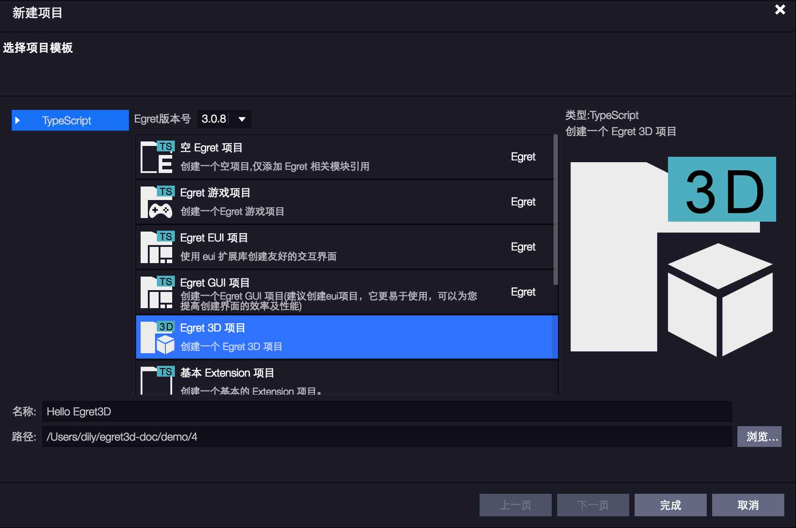
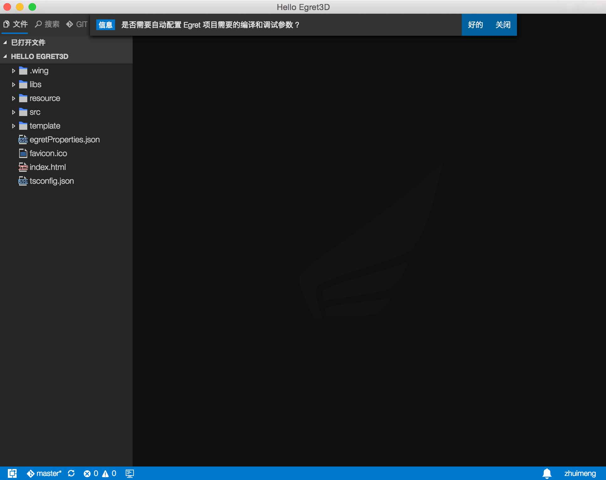
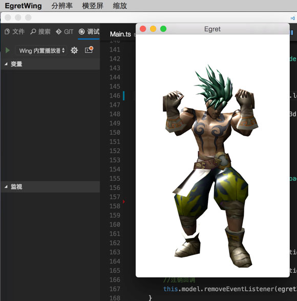

我们Egret为大家提供了可视化创建工具Wing，它可以方便的创建、编译、修改`Egret3D`项目，接下来我们一起来学习创建一个简单的`Egret3D`项目。

首先使用Wing创建一个`Egret3D`项目，然后详细介绍一下Wing工具的用法，和`Egret3D`的文档结构。

## 1、Wing创建Hello Egret3D项目

启动Wing 3.0应用程序，点击文件-->创建项目显示界面如下图所示。

选择`Egret3D`项目，输入项目名称为`Hello Egret3D`，点击完成即可完成`Egret3D`的创建。

然后我们可以看到一个提示如下：

我们选择`好的`，一个`Egret3D`项目就创建成功了。

使用快捷键`F1`可以运行3D项目如下

## 2、Wing工作界面简介

项目创建成功，我们先简单看一下Wing的工作界面，方便以后查找各项功能。

1. `首选项`包含了用户设置、工作空间设置、快捷键、用户代码片段、主题等功能
如果你需要修改Wing自定义配置的话就需要到这里来修改，或者你要修改Wing的主题的话也需要这里的功能。
2. `文件`里包含了新建项目、新建文件之类的文件管理类功能。
3. `构建`包含了构建、清理、调试功能。
4. `视图`包含了整个Wing的视图布局功能。
5. `前往`包含了查找文件的一系列功能。
6. `窗口`包含了窗口的最大化最小化等功能。
7. `插件`包含了Wing安装的所有的插件列表。
8. `帮助`里最重要的一个功能就是`插件商城`可以下载各种各样丰富插件的商城。
9. `编辑器左侧`的位置显示了当前项目的资源目录，左上方显示了最近打开的几个文件，如果不喜欢可以在用户设置里修改显示个数或者屏蔽。
10. `编辑器右侧`就是代码编辑区域了。
11. `底部的状态栏`显示一些警告错误和用户登录情况的提示。

## 3、Egret3D项目目录说明

`Hello Egret3D`创建完毕，也和大家一起了解了Wing的界面结构，接下来大家一块了解一下Egret3D的项目结构吧。先看下图。

我们从上往下看。

1. `.wing`包含了wing编译Egret3D所需要的一些配置信息，是第一小节项目提示自动生成的文件，所以不用关心。
2. `libs`包含了所有Egret3D的核心代码。
3. `resource`包含了所有的Egret3D资源。
4. `src`存放项目的逻辑代码。
5. `template`大家一般情况下用不到所以不用关心。
6. `egretProperties.json`配置了当前项目需要包含的第三方库等其他信息。
7. `index.html`配置了当前项目的显示方式。
8. `tsconfig.json`配置了TS的编译方式。
9. `wingProperties.json`配置了Wing的一些配置信息。

