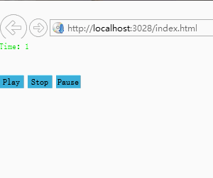

# AudioManager的使用 #

通过 AudioManager 类 加载音频并播放音频

# 函数声明 #
通过调用 createSound 方法返回 Sound 音频源 对象
> public createSound (url:string, success:Function=null, error:Function=null):Sound

通过调用 playSound 方法返回 Channel 对象  Channel 类控制应用程序中的声音
> public playSound(sound: Sound, options: any)

	AudioManager.instance.createSound("../resource/audio/1.mp3", (e) => {
		//Channel 类控制应用程序中的声音
		this._channel = AudioManager.instance.playSound(e, { "volume": 0.5, "loop": true });
		this._channel.play();
	})

# 示例 #

在以下示例中，用户可暂停并重放声音文件

       private _channel: egret3d.Channel;
       private _sound: egret3d.Sound;
       private _txt: gui.UITextField;
       private _btnPlay: gui.UILabelButton;
       private _btnStop: gui.UILabelButton;
       private _btnPause: gui.UILabelButton;
       private startTime: number = 0;
        

       public initedGui() {

           this._txt = new gui.UITextField();
           this._txt.text = "Time：" + this.startTime;

           this._btnPlay = new gui.UILabelButton();
           this._btnPlay.label = "Play";
           this._btnPlay.width = 35;
           this._btnPlay.height = 20;
           this._btnPlay.x = 0;
           this._btnPlay.y = 50;

           this._btnStop = new gui.UILabelButton();
           this._btnStop.label = "Stop";
           this._btnStop.width = 35;
           this._btnStop.height = 20;
           this._btnStop.x = 40;
           this._btnStop.y = 50;

           this._btnPause = new gui.UILabelButton();
           this._btnPause.label = "Pause";
           this._btnPause.width = 35;
           this._btnPause.height = 20;
           this._btnPause.x = 80;
           this._btnPause.y = 50;

           this._view.addGUI(this._txt);
           this._view.addGUI(this._btnPlay);
           this._view.addGUI(this._btnStop);
           this._view.addGUI(this._btnPause);

           this.initListener();

       }

注册监听事件

        private initListener() {
            var self = this;
            self._btnPlay.addEventListener(egret3d.MouseEvent3D.MOUSE_CLICK, (e) => {

                if (this._channel) {
                    if (!this._channel.isPlaying()) {
                        this._channel.unpause();//播放处于暂停状态的音频
                    }

                }
                else {
                    AudioManager.instance.createSound("../resource/audio/music.mp3", (e) => {
                        this._sound = e;
                        this._channel = AudioManager.instance.playSound(self._sound, { "volume": 0.5, "loop": true });
                        this._channel.play();
                    })
                }

            }, this);

            self._btnStop.addEventListener(egret3d.MouseEvent3D.MOUSE_CLICK, (e) => {
                this._channel.stop();
                this.startTime = 0;
                this._txt.text = "Time：" + self.startTime;
            }, this);

            self._btnPause.addEventListener(egret3d.MouseEvent3D.MOUSE_CLICK, (e) => {
                if (this._channel.isPlaying())//如果媒体文件被暂停，则返回true，否则返回false
                    this._channel.pause();//暂停处于播放状态的音频
            }, this);

            
            var drawMeter = function () {

                if (self._channel && self._channel.isPlaying()) {
                    self._txt.text = "Time：" + self.startTime++;

                }
                requestAnimationFrame(drawMeter);

            }

            requestAnimationFrame(drawMeter)

       }

运行结果如图所示

    

