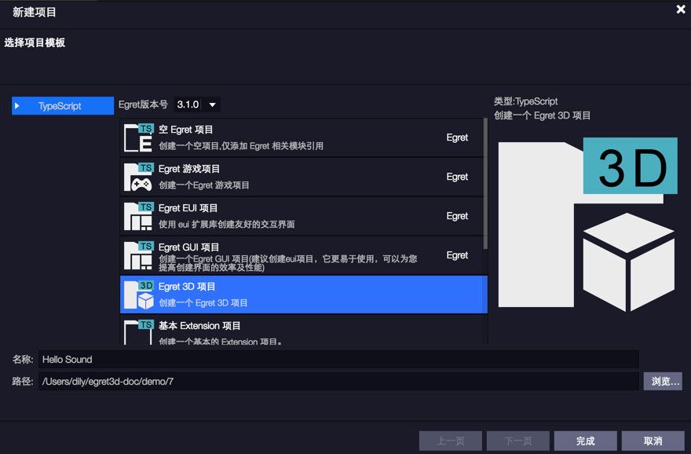

使用 `Sound` 类可以创建 `Sound` 对象、将外部 `MP3` 文件加载到该对象并播放该文件、关闭声音流，以及访问有关声音的数据，如有关流中字节数和 `ID3` 元数据的信息。

## 注意事项

声音资源的格式生成请严格按照此步骤来，不然兼容性会小很多。

1. 使用格式工厂。选择 `44100Hz`，`96kbps` 转换。其他具体的格式，测试团队还在测试中。
2. 如果还有问题，请再转一次。
3. 如果还有问题，请裁减音频再次转换。
4. 如果还有问题，请到论坛联系我们 开发者论坛，并提供对应的音频文件。
说这么多其实就是一句话，如果有问题，请多转几次。

对于更专业的转换工具比如 `audition`，在测试中发现转换后的文件并不能解决在所有的浏览器中的播放问题，所以以目前的测试结果不推荐大家使用。

在 `iOS` 系统（所有设备，包括`IPAD`）中，使用者在可能付费的网络环境中需要等待用户交互操作后才能播放媒体。为了获得在 `iOS` 系统中最大的兼容性，请避免使用自动播放音频（载入完成即播放），应添加合适的触发条件（比如播放按钮）。

## 1、创建Hello Sound项目



创建名称为`Hello Sound`的项目。

## 2、修改Hello Sound代码

我们先看一下egret3d.Sound的源码
```
        private isLoaded;
        /**
        * @language zh_CN
        * HTML音频 数据源。
        * @version Egret 3.0
        * @platform Web,Native
        */
        audio: HTMLAudioElement;
        private _buffer;
        /**
        * @language zh_CN
        * Web音频 数据源。
        * @returns {AudioBuffer}
        * @version Egret 3.0
        * @platform Web,Native
        */
        buffer: any;
        private _success;
        private _error;
        /**
        * @language zh_CN
        * 创建一个新的 Sound 对象。一旦某个 Sound 对象加载完成声音文件，就不能再将另一个声音文件加载到该 Sound 对象中。要加载另一个声音文件，请创建新的 Sound 对象。
        * @param {String}   指向外部音频文件的 URL。
        * @param {Function} 一个可选的音频文件加载成功的事件处理函数。
        * @param {Function} 一个可选的音频文件加载失败的事件处理函数。
        * @version Egret 3.0
        * @platform Web,Native
        */
        constructor(url: string, success?: Function, error?: Function);
        private xhr;
        private loadAudioFile(url);
        private audioLoadend(e);
        private decodeSuccessCallback(buffer);
        private onended(ev);
        private oncanplaythrough(ev);
```
可以看到，`Sound`类主要包含两个属性`buffer`、`audio`，和一个构造方法`constructor`
使用如下方法即可加载声音文件
> `this._sound = new egret3d.Sound("resource/ccnn.mp3",this.loadSoundSuccess);`

这样就能实例化`Sound`对象。而`Sound`没有办法自己控制声音的播放循环等功能，需要配合`Channel`类才可以使用。