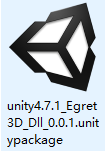
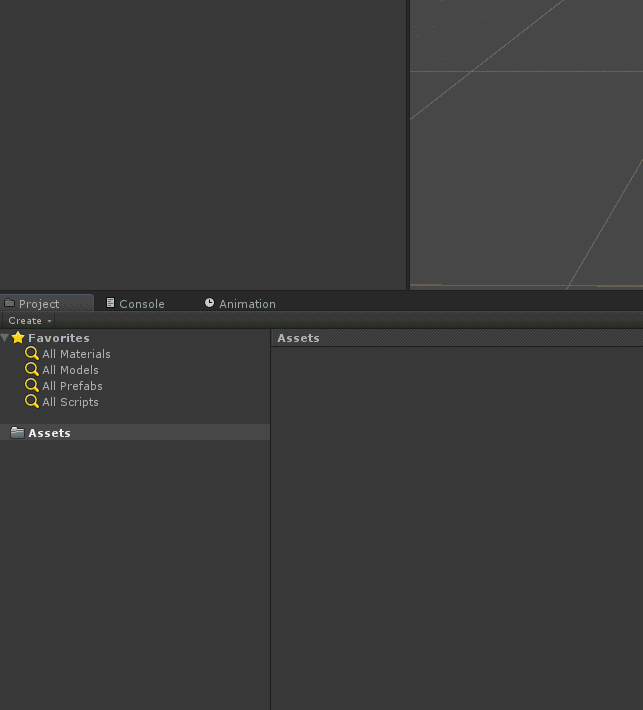
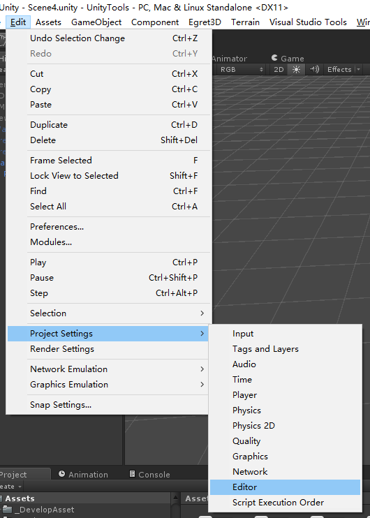
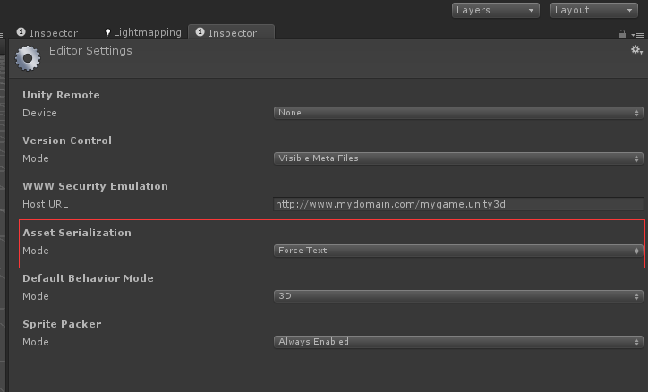
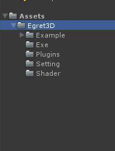
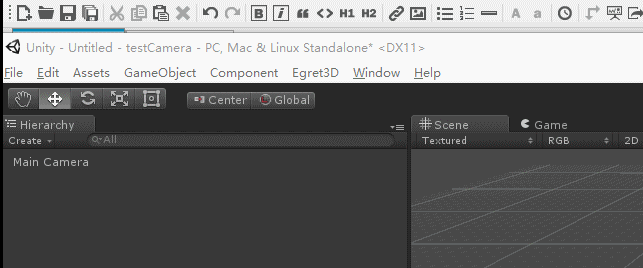

1）前往unity3D官方网站，下载版本为4.7.1或其以上windows版本的安装程序,并安装。现阶段插件尚不支持unity3d 5.x版本和Mac版本的程序，使用时需要注意。

2）下载所需导出插件[unity4.7.1_Egret3D_Dll_0.0.1.unitypackage](https://cdn.www.egret.com/20170204/589543c431dc6.zip)，下载完成后如图所示：

	3）新建一个unity工程，在Project管理器内找到Assets文件夹，右击选中Import Package-->Custom Package 选中unity4.7.1_Egret3D_Dll.unitypackage后
		导入,选择Import导入。
		a）由于unity3D 4.x版本的问题，unity4.7.1_Egret3D_Dll.unitypackage的路径不能含有中文路径，否则插件导入会失败。

	4）打开菜单栏，Edit-->Project Setting-->Editor,将Assert Serialization的Mode修改为Force Text。否则导出粒子的时候会有报错。

	5）导入后项目目录如图所示：
		a）首先打开Setting文件夹，解压缩Setting.rar内文件至C:\Windows\System32目录下，如果跳过此步骤会导出光照贴图导出出错。
		b）Example文件夹内是测试示例文件，后面的教程里我们会慢慢用到。

	6）插件安装成功后，会有菜单内容出现，详情如图所示：

  
